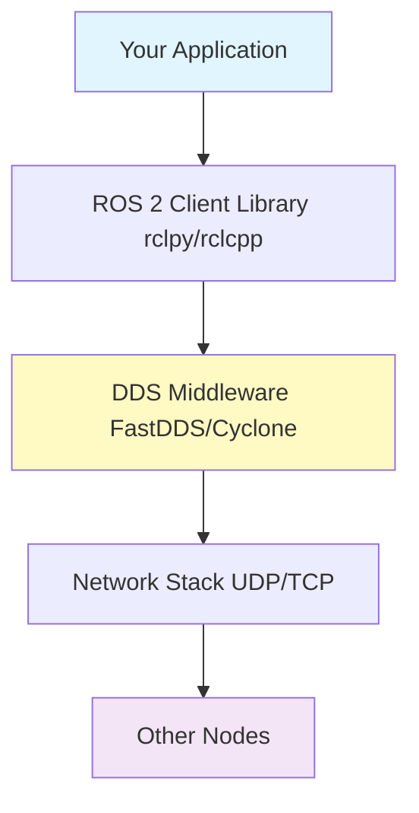

# concept-scaffolding Skill

## Purpose
Create conceptual frameworks and mental models for complex technical topics using analogies and structured explanations.

## Key Patterns

### Analogies for Technical Concepts
**ROS 2 = Nervous System**
- Nodes = Neurons
- Topics = Neural pathways
- Messages = Electrical signals
- DDS = Biological communication protocol

**Simulation = Digital Twin**
- Gazebo/Unity = Virtual reality for robots
- Physics engines = Laws of nature in simulation
- Sensor models = Robot's senses in virtual world

### Explanation Structure
1. **What**: Brief definition (1-2 sentences)
2. **Why**: Problem it solves / motivation
3. **How**: Technical implementation
4. **When**: Use cases and scenarios
5. **Where**: Position in overall architecture

### Example: Explaining DDS Middleware
```markdown
## What is DDS?

**What**: DDS (Data Distribution Service) is a middleware protocol that enables real-time, distributed communication between ROS 2 nodes.

**Why**: ROS 1's single master node was a single point of failure. DDS eliminates this by enabling peer-to-peer discovery and communication.

**How**: DDS uses multicast UDP for discovery and TCP/UDP for data exchange. It implements Quality of Service (QoS) policies for reliability.

**When**: Use DDS when building multi-robot systems, real-time applications, or distributed robotics networks.

**Where**: DDS sits between your ROS 2 application code and the operating system's network stack.
```

### Mermaid Diagrams for Mental Models


## Usage Context
- Introducing new technical concepts
- Explaining architecture decisions
- Teaching complex algorithms
- Building intuition before code examples
