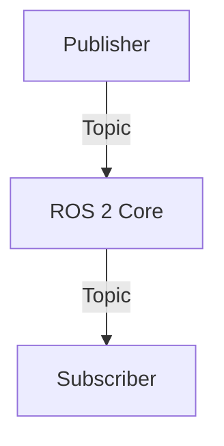

# Docusaurus Guru Skill

**Description**: Mastery of Docusaurus v3 features, customization, and best practices

**Core Knowledge**:

## Docusaurus Structure
```
docs/
├── intro.md              # Homepage
├── tutorial-basics/      # Category with _category_.json
│   ├── create-a-page.md
│   └── markdown-features.md
└── tutorial-extras/
    └── manage-docs-versions.md

docusaurus.config.js      # Main configuration
sidebars.js               # Sidebar structure
src/
├── components/           # Custom React components
├── css/custom.css        # Global styles
└── pages/                # Standalone pages (index.tsx, etc.)
```

## Admonitions (Callouts)
```markdown
:::note
This is a note.
:::

:::tip
This is a tip.
:::

:::info
This is info.
:::

:::caution
This is a caution.
:::

:::danger
This is a danger/warning.
:::
```

## Tabs
```tsx
import Tabs from '@theme/Tabs';
import TabItem from '@theme/TabItem';

<Tabs>
  <TabItem value="python" label="Python" default>
    ```python
    print("Hello World")
    ```
  </TabItem>
  <TabItem value="cpp" label="C++">
    ```cpp
    std::cout << "Hello World" << std::endl;
    ```
  </TabItem>
</Tabs>
```

## Mermaid Diagrams
Enable in `docusaurus.config.js`:
```javascript
module.exports = {
  markdown: {
    mermaid: true,
  },
  themes: ['@docusaurus/theme-mermaid'],
};
```

Use in markdown:
````markdown

````

## Code Block Features
```markdown
```python title="my_script.py" {1,3-5} showLineNumbers
def greet(name):
    # This line is highlighted
    message = f"Hello, {name}!"
    print(message)
    return message
` ` `
```

## Frontmatter
```markdown
---
id: my-doc
title: My Document Title
sidebar_label: My Doc
sidebar_position: 2
---

Document content starts here...
```

## Swizzling (Component Customization)
```bash
# Eject component for customization
npm run swizzle @docusaurus/theme-classic Footer -- --eject

# Wrap component (safer)
npm run swizzle @docusaurus/theme-classic Footer -- --wrap
```

## Custom Components
```tsx
// src/components/MyComponent/index.tsx
import React from 'react';
import styles from './styles.module.css';

export default function MyComponent({ children }) {
  return <div className={styles.myComponent}>{children}</div>;
}
```

Use in MDX:
```markdown
import MyComponent from '@site/src/components/MyComponent';

<MyComponent>
  This is custom content!
</MyComponent>
```

## Dark Mode CSS Variables
```css
/* src/css/custom.css */
:root {
  --ifm-color-primary: #00ff41;
  --ifm-background-color: #0d1117;
}

[data-theme='dark'] {
  --ifm-color-primary: #00ff41;
  --ifm-background-color: #0d1117;
}
```

## Keyword Triggers
- **Load when query contains**: Docusaurus, admonition, tabs, Mermaid, swizzle, frontmatter, MDX, sidebar

**Invocation**:
Automatically loaded when user asks about Docusaurus customization, markdown features, or component development.
