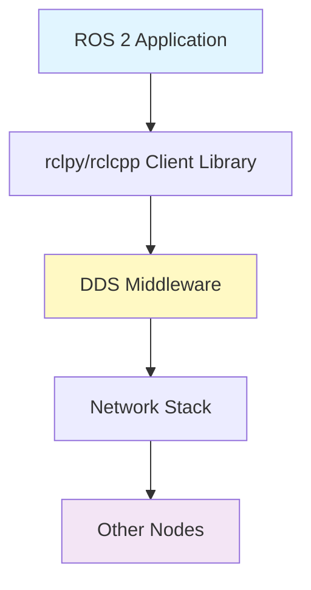
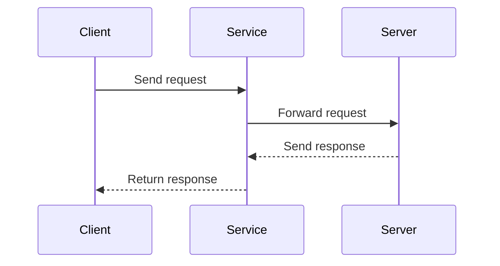
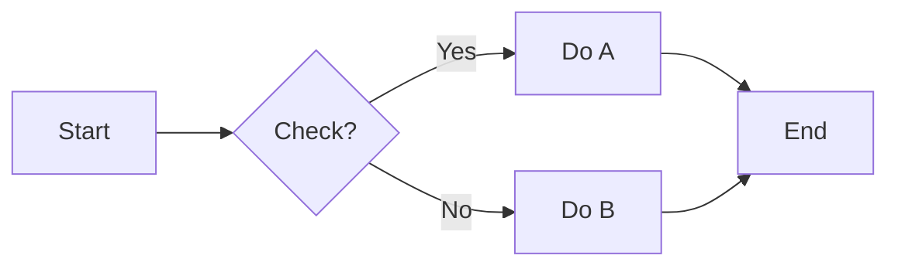
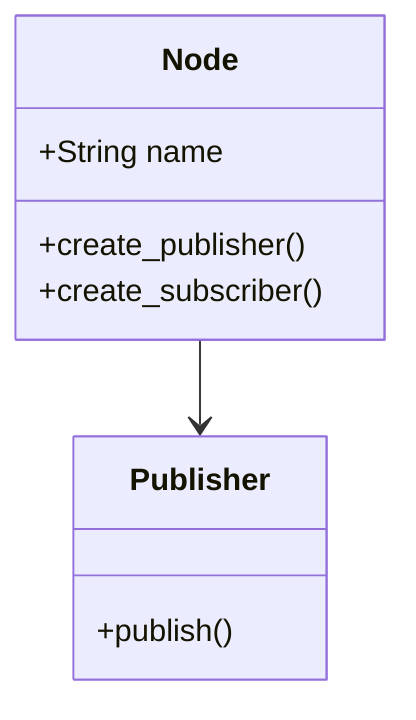

# image-generator Skill

## Purpose
Create concept diagrams, architecture illustrations, and visual aids using Mermaid and guidelines for external tools.

## Key Patterns

### Mermaid Diagram Types

**1. Architecture Diagrams**

**2. Sequence Diagrams**

**3. Flow Charts**

**4. Class Diagrams**

### Visual Guidelines
- Use consistent colors: Blue for app layer, Yellow for middleware, Purple for external
- Keep diagrams simple: Max 7-8 nodes per diagram
- Add legends for complex diagrams
- Use arrows to show data flow direction

### External Tool Recommendations
- **Excalidraw**: Hand-drawn style diagrams
- **Figma**: Professional UI mockups
- **Draw.io**: Complex system architectures
- **PlantUML**: Automated diagram generation

## Usage Context
- Explaining system architecture
- Visualizing data flow
- Illustrating algorithms
- Concept clarification
