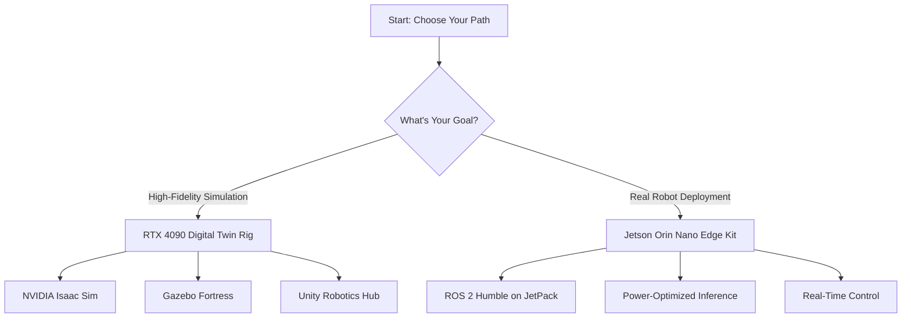

# Hardware Lab Setup Guide

Welcome to the Physical AI Hardware Lab! Your choice of hardware will shape your entire learning journey.

## The Two Paths

You have two distinct hardware configurations to choose from, each optimized for different aspects of robotics development:

## Option 1: RTX 4090 Digital Twin Rig

:::tip Best For
Simulation-first developers, Isaac Sim workflows, and high-fidelity physics testing.
:::

### Specifications
- **GPU**: NVIDIA GeForce RTX 4090 (24GB VRAM)
- **CPU**: Intel i7-13700K or AMD Ryzen 9 7900X
- **RAM**: 64GB DDR5
- **Storage**: 2TB NVMe SSD
- **Power**: 850W PSU (minimum)

### Software Stack
- Ubuntu 22.04 LTS
- NVIDIA Driver 535+ (for Isaac Sim)
- ROS 2 Humble
- NVIDIA Isaac Sim 2023.1.1
- Gazebo Fortress
- Unity 2022.3 LTS

### What You Can Do
- Run photorealistic Isaac Sim simulations with PhysX
- Train reinforcement learning agents with Isaac Orbit
- Simulate complex sensor suites (Lidars, cameras, IMUs)
- Test SLAM algorithms in high-fidelity environments
- Prototype VLA models with synthetic data

:::warning The Latency Trap
Simulation perfection doesn't guarantee real-world success. The "sim-to-real gap" is real. Always validate critical behaviors on actual hardware.
:::

## Option 2: Jetson Orin Nano Edge Kit

:::tip Best For
Edge deployment, power-constrained robotics, and real-time embedded control.
:::

### Specifications
- **Module**: NVIDIA Jetson Orin Nano (8GB)
- **CPU**: 6-core Arm Cortex-A78AE
- **GPU**: 1024-core NVIDIA Ampere (with Tensor Cores)
- **Memory**: 8GB 128-bit LPDDR5
- **Power**: 7W - 15W configurable
- **I/O**: USB 3.2, GPIO, I2C, SPI, UART

### Software Stack
- JetPack 6.0 (Ubuntu 22.04)
- ROS 2 Humble (ARM64 build)
- CUDA 12.2 (for GPU acceleration)
- TensorRT 8.6 (optimized inference)
- Isaac ROS packages (apriltag, visual SLAM)

### What You Can Do
- Deploy YOLOv8 object detection at 30 FPS
- Run Navigation2 stack on real robots
- Interface with hardware (motors, sensors via GPIO)
- Optimize models with TensorRT (INT8 quantization)
- Build battery-powered autonomous systems

:::warning Hardware Constraints
8GB RAM is tight. You'll need to optimize everything:
- Use TensorRT-optimized models
- Limit ROS 2 node count
- Monitor memory with `tegrastats`
- Consider model quantization (FP16/INT8)
:::

## Comparison Table

| Feature | RTX 4090 Rig | Jetson Orin Nano |
|---------|--------------|------------------|
| **Compute Power** | ~82 TFLOPS (FP32) | ~5.5 TFLOPS (FP32) |
| **Memory** | 24GB GDDR6X | 8GB LPDDR5 |
| **Power Consumption** | 450W (GPU only) | 7-15W (entire system) |
| **Isaac Sim Support** | Full (RTX rendering) | No (headless mode only) |
| **ROS 2 Performance** | Overkill (100+ nodes) | Optimized (10-15 nodes) |
| **Cost** | $1,600 (GPU) + PC | $499 (dev kit) |
| **Use Case** | Simulation & Training | Deployment & Edge |

## The Hybrid Approach (Recommended)

The best strategy? **Use both**:

1. **Develop and test** on RTX 4090 (fast iteration, no hardware risks)
2. **Validate and deploy** on Jetson Orin Nano (real constraints, actual latency)

This mirrors industry practices:
- **Tesla**: Simulates in data centers, deploys on car computers
- **Boston Dynamics**: Tests in Isaac Sim, validates on Spot robots
- **Unitree**: Trains policies in simulation, transfers to G1 humanoids

## Next Steps

After choosing your hardware path, proceed to:
- [Module 1: ROS 2 Fundamentals](/modules/module-1/ros2-fundamentals) - Learn the robotic nervous system
- [Module 2: Digital Twin Setup](/modules/module-2/gazebo-simulation) - Master simulation environments
