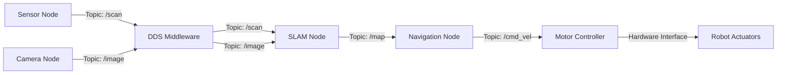

# ROS 2 Fundamentals: The Robotic Nervous System

ROS 2 (Robot Operating System 2) is not an operating system—it's a **middleware framework** for building distributed robotic applications. Think of it as the "nervous system" of your robot, coordinating communication between sensors, actuators, and decision-making algorithms.

## Why ROS 2 Over ROS 1?

ROS 2 was designed from the ground up to address ROS 1's limitations:

| Feature | ROS 1 | ROS 2 |
|---------|-------|-------|
| **Real-Time Support** | ❌ None | ✅ DDS with QoS policies |
| **Security** | ❌ No encryption | ✅ DDS Security |
| **Multi-Robot** | ⚠️ Difficult | ✅ Native support |
| **Windows/macOS** | ⚠️ Limited | ✅ Full support |
| **Production Ready** | ⚠️ Fragile | ✅ Industrial-grade |

## Core Architecture



### The DDS Layer

ROS 2 uses **Data Distribution Service (DDS)** as its communication backbone:

- **Publisher-Subscriber Pattern**: Nodes publish data to topics; other nodes subscribe
- **Quality of Service (QoS)**: Configure reliability, durability, and history
- **Discovery**: Nodes find each other automatically (no roscore!)

## Key Concepts

### 1. Nodes

A **node** is an executable that performs a specific task (e.g., reading a sensor, planning a path).

import Tabs from '@theme/Tabs';
import TabItem from '@theme/TabItem';

<Tabs>
  <TabItem value="python" label="Python" default>

```python
import rclpy
from rclpy.node import Node
from std_msgs.msg import String

class MinimalPublisher(Node):
    def __init__(self):
        super().__init__('minimal_publisher')
        self.publisher_ = self.create_publisher(String, 'topic', 10)
        self.timer = self.create_timer(1.0, self.timer_callback)

    def timer_callback(self):
        msg = String()
        msg.data = 'Hello ROS 2!'
        self.publisher_.publish(msg)
        self.get_logger().info(f'Publishing: "{msg.data}"')

def main(args=None):
    rclpy.init(args=args)
    node = MinimalPublisher()
    rclpy.spin(node)
    node.destroy_node()
    rclpy.shutdown()
```

  </TabItem>
  <TabItem value="cpp" label="C++">

```cpp
#include "rclcpp/rclcpp.hpp"
#include "std_msgs/msg/string.hpp"

class MinimalPublisher : public rclcpp::Node {
public:
  MinimalPublisher() : Node("minimal_publisher") {
    publisher_ = this->create_publisher<std_msgs::msg::String>("topic", 10);
    timer_ = this->create_wall_timer(
      std::chrono::seconds(1),
      std::bind(&MinimalPublisher::timer_callback, this));
  }

private:
  void timer_callback() {
    auto message = std_msgs::msg::String();
    message.data = "Hello ROS 2!";
    RCLCPP_INFO(this->get_logger(), "Publishing: '%s'", message.data.c_str());
    publisher_->publish(message);
  }

  rclcpp::Publisher<std_msgs::msg::String>::SharedPtr publisher_;
  rclcpp::TimerBase::SharedPtr timer_;
};

int main(int argc, char ** argv) {
  rclcpp::init(argc, argv);
  rclcpp::spin(std::make_shared<MinimalPublisher>());
  rclcpp::shutdown();
  return 0;
}
```

  </TabItem>
</Tabs>

### 2. Topics

Topics are **named buses** for asynchronous message passing:

```bash
# List active topics
ros2 topic list

# Echo messages (real-time monitoring)
ros2 topic echo /scan

# Publish manually (testing)
ros2 topic pub /cmd_vel geometry_msgs/msg/Twist "{linear: {x: 0.5}}"
```

### 3. Quality of Service (QoS)

QoS policies define message delivery guarantees:

```python
from rclpy.qos import QoSProfile, ReliabilityPolicy, DurabilityPolicy

# Best-effort (UDP-like, fast but lossy)
qos_best_effort = QoSProfile(
    reliability=ReliabilityPolicy.BEST_EFFORT,
    durability=DurabilityPolicy.VOLATILE,
    depth=10
)

# Reliable (TCP-like, slow but guaranteed)
qos_reliable = QoSProfile(
    reliability=ReliabilityPolicy.RELIABLE,
    durability=DurabilityPolicy.TRANSIENT_LOCAL,
    depth=10
)
```

**When to use what**:
- **Best-Effort**: Sensor data (Lidar scans, camera images) - high frequency, okay to drop frames
- **Reliable**: Commands (motor control, navigation goals) - must be received

## ROS 2 Humble Installation

<Tabs>
  <TabItem value="ubuntu" label="Ubuntu 22.04" default>

```bash
# Setup sources
sudo apt update && sudo apt install -y software-properties-common
sudo add-apt-repository universe
sudo curl -sSL https://raw.githubusercontent.com/ros/rosdistro/master/ros.key \
  -o /usr/share/keyrings/ros-archive-keyring.gpg

# Install ROS 2 Humble Desktop
sudo apt update
sudo apt install -y ros-humble-desktop

# Source setup
echo "source /opt/ros/humble/setup.bash" >> ~/.bashrc
source ~/.bashrc

# Verify installation
ros2 --version
```

  </TabItem>
  <TabItem value="jetson" label="Jetson (ARM64)">

```bash
# JetPack 6.0 already includes ROS 2 Humble repos
sudo apt update
sudo apt install -y ros-humble-ros-base

# For headless systems (no GUI tools)
sudo apt install -y ros-humble-demo-nodes-cpp

# Source and verify
source /opt/ros/humble/setup.bash
ros2 --version
```

  </TabItem>
</Tabs>

:::warning Common Pitfall
Always `source /opt/ros/humble/setup.bash` in every new terminal, or add it to `~/.bashrc`. Forgetting this causes "command not found" errors.
:::

## Your First ROS 2 Application

Let's build a simple "talker-listener" demo:

```bash
# Create workspace
mkdir -p ~/ros2_ws/src
cd ~/ros2_ws/src

# Create package
ros2 pkg create --build-type ament_python my_first_node

# Build
cd ~/ros2_ws
colcon build

# Source workspace
source install/setup.bash

# Run nodes (in separate terminals)
ros2 run my_first_node talker
ros2 run my_first_node listener
```

## Next Steps

Now that you understand the basics, proceed to:
- [Nodes and Topics Deep Dive](/modules/module-1/nodes-and-topics) - Master inter-node communication
- [Module 2: Gazebo Simulation](/modules/module-2/gazebo-simulation) - Test your nodes in simulation

## Further Reading

- [Official ROS 2 Documentation](https://docs.ros.org/en/humble/)
- [ROS 2 Design Principles](https://design.ros2.org/)
- [DDS Specification](https://www.omg.org/spec/DDS/)
