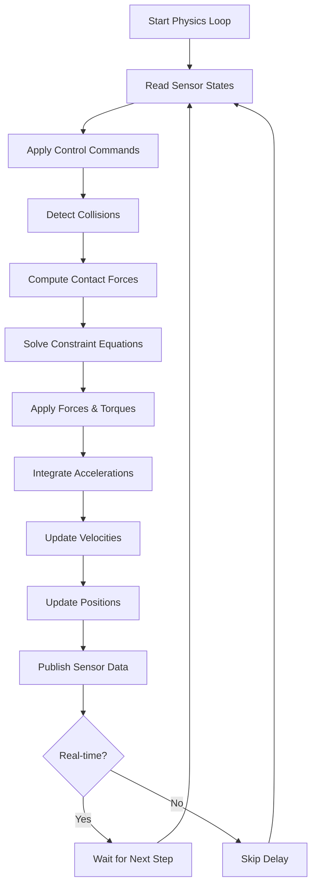
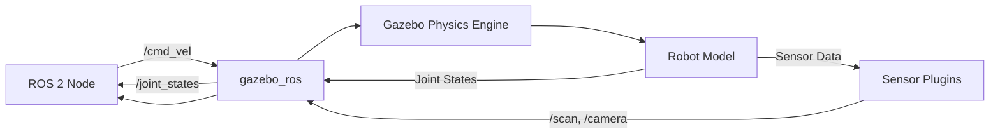

# Gazebo Simulation: Building Your Digital Twin

Gazebo is the industry-standard robotics simulator that allows you to test your robot in a virtual environment before deploying to hardware. Understanding Gazebo's physics engine, world configuration, and URDF integration is essential for developing reliable robotic systems.

## World File Configuration

Gazebo worlds are defined using SDF (Simulation Description Format), which describes the complete simulation environment including lighting, physics parameters, and static objects.

### Basic World Structure

```xml
<?xml version="1.0"?>
<sdf version="1.6">
  <world name="warehouse_world">
    <!-- Physics Engine Configuration -->
    <physics name="default_physics" type="ode">
      <max_step_size>0.001</max_step_size>
      <real_time_factor>1.0</real_time_factor>
      <real_time_update_rate>1000</real_time_update_rate>

      <!-- Gravity -->
      <gravity>0 0 -9.81</gravity>

      <!-- Solver Parameters -->
      <ode>
        <solver>
          <type>quick</type>
          <iters>50</iters>
          <sor>1.3</sor>
        </solver>
        <constraints>
          <cfm>0.0</cfm>
          <erp>0.2</erp>
          <contact_max_correcting_vel>100.0</contact_max_correcting_vel>
          <contact_surface_layer>0.001</contact_surface_layer>
        </constraints>
      </ode>
    </physics>

    <!-- Lighting -->
    <light name="sun" type="directional">
      <cast_shadows>true</cast_shadows>
      <pose>0 0 10 0 0 0</pose>
      <diffuse>0.8 0.8 0.8 1</diffuse>
      <specular>0.2 0.2 0.2 1</specular>
      <direction>-0.5 0.1 -0.9</direction>
    </light>

    <!-- Ground Plane -->
    <include>
      <uri>model://ground_plane</uri>
    </include>

    <!-- Static Obstacles -->
    <model name="warehouse_wall">
      <static>true</static>
      <pose>5 0 1 0 0 0</pose>
      <link name="wall_link">
        <collision name="collision">
          <geometry>
            <box>
              <size>0.2 10 2</size>
            </box>
          </geometry>
        </collision>
        <visual name="visual">
          <geometry>
            <box>
              <size>0.2 10 2</size>
            </box>
          </geometry>
          <material>
            <ambient>0.7 0.7 0.7 1</ambient>
          </material>
        </visual>
      </link>
    </model>
  </world>
</sdf>
```

### Physics Engine Parameters

The physics engine is the heart of Gazebo simulation. Key parameters include:

- **max_step_size**: Time increment for each physics update (smaller = more accurate but slower)
- **real_time_factor**: Target ratio of simulation time to real time (1.0 = real-time)
- **real_time_update_rate**: Physics updates per second (1000 Hz is typical)
- **iters**: Number of solver iterations (higher = more stable contacts)
- **erp (Error Reduction Parameter)**: How quickly constraint violations are corrected (0-1 range)
- **cfm (Constraint Force Mixing)**: Adds compliance to constraints (0 = hard constraints)

## URDF: Friction and Inertia Properties

The URDF (Unified Robot Description Format) defines your robot's physical properties. Accurate friction and inertia parameters are critical for realistic simulation behavior.

### Friction Configuration

Friction is defined in the `<collision>` element using Gazebo-specific tags:

```xml
<link name="wheel_link">
  <collision name="wheel_collision">
    <geometry>
      <cylinder>
        <radius>0.1</radius>
        <length>0.05</length>
      </cylinder>
    </geometry>
    <surface>
      <friction>
        <ode>
          <!-- Coefficient of friction (mu) -->
          <mu>1.0</mu>
          <mu2>1.0</mu2>

          <!-- Slip parameters for rolling friction -->
          <slip1>0.0</slip1>
          <slip2>0.0</slip2>

          <!-- Force-dependent slip -->
          <fdir1>1 0 0</fdir1>
        </ode>
      </friction>
      <contact>
        <ode>
          <!-- Contact stiffness and damping -->
          <kp>1000000.0</kp>
          <kd>100.0</kd>

          <!-- Maximum contact force -->
          <max_vel>0.01</max_vel>
          <min_depth>0.001</min_depth>
        </ode>
      </contact>
    </surface>
  </collision>
</link>
```

**Friction Parameters Explained:**
- **mu/mu2**: Coulomb friction coefficients (0 = frictionless, 1+ = high friction)
- **slip1/slip2**: Slip compliance in primary/secondary directions
- **fdir1**: Primary friction direction (for anisotropic friction)
- **kp/kd**: Contact stiffness and damping (affects collision response)

### Inertia Properties

Accurate inertia tensors prevent unrealistic motion and instability:

```xml
<link name="base_link">
  <inertial>
    <!-- Center of mass offset -->
    <origin xyz="0 0 0.05" rpy="0 0 0"/>

    <!-- Mass in kilograms -->
    <mass value="15.0"/>

    <!-- Inertia tensor (moment of inertia) -->
    <inertia
      ixx="0.347563" ixy="0.0" ixz="0.0"
      iyy="0.458929" iyz="0.0"
      izz="0.977"/>
  </inertial>

  <visual name="base_visual">
    <geometry>
      <box size="0.6 0.4 0.2"/>
    </geometry>
  </visual>

  <collision name="base_collision">
    <geometry>
      <box size="0.6 0.4 0.2"/>
    </geometry>
  </collision>
</link>
```

**Computing Inertia Tensors:**

For a solid box with dimensions (x, y, z) and mass m:
- ixx = (1/12) × m × (y² + z²)
- iyy = (1/12) × m × (x² + z²)
- izz = (1/12) × m × (x² + y²)

For a solid cylinder with radius r, height h, and mass m:
- ixx = iyy = (1/12) × m × (3r² + h²)
- izz = (1/2) × m × r²

## The Physics Engine Loop

Gazebo's physics engine operates in a continuous loop that updates the simulation state:



### Physics Loop Stages

1. **Sensor State Reading**: Query current joint positions, velocities, and sensor readings
2. **Control Command Application**: Apply forces/torques from ROS 2 topics or plugins
3. **Collision Detection**: Broad-phase and narrow-phase collision detection using spatial hashing
4. **Contact Force Computation**: Calculate normal and friction forces at contact points
5. **Constraint Solving**: Solve joint constraints and contact constraints using iterative LCP solver
6. **Force Integration**: Apply gravity, motor forces, and constraint forces
7. **Numerical Integration**: Update velocities and positions using semi-implicit Euler or Runge-Kutta
8. **Sensor Publishing**: Generate sensor data (camera images, LiDAR scans) and publish to ROS 2

### Optimizing Physics Performance

```python
#!/usr/bin/env python3
"""
Example: Tuning Gazebo Physics for Real-Time Performance
"""
import rclpy
from rclpy.node import Node
from gazebo_msgs.srv import SetPhysicsProperties
from gazebo_msgs.msg import ODEPhysics

class PhysicsTuner(Node):
    def __init__(self):
        super().__init__('physics_tuner')

        self.client = self.create_client(
            SetPhysicsProperties,
            '/gazebo/set_physics_properties'
        )

        while not self.client.wait_for_service(timeout_sec=1.0):
            self.get_logger().info('Waiting for physics service...')

        self.tune_physics()

    def tune_physics(self):
        request = SetPhysicsProperties.Request()

        # Time step configuration
        request.time_step = 0.001  # 1ms per step
        request.max_update_rate = 1000.0  # 1000 Hz

        # ODE solver parameters
        request.ode_config.auto_disable_bodies = True
        request.ode_config.sor_pgs_precon_iters = 0
        request.ode_config.sor_pgs_iters = 50
        request.ode_config.sor_pgs_w = 1.3
        request.ode_config.contact_surface_layer = 0.001
        request.ode_config.contact_max_correcting_vel = 100.0
        request.ode_config.cfm = 0.0
        request.ode_config.erp = 0.2

        # Send request
        future = self.client.call_async(request)
        rclpy.spin_until_future_complete(self, future)

        if future.result().success:
            self.get_logger().info('Physics tuned successfully')
        else:
            self.get_logger().error(f'Failed: {future.result().status_message}')

def main():
    rclpy.init()
    tuner = PhysicsTuner()
    rclpy.shutdown()

if __name__ == '__main__':
    main()
```

## Integration with ROS 2

Gazebo integrates with ROS 2 through the `gazebo_ros_pkgs` bridge:



### Key Gazebo-ROS 2 Plugins

- **gazebo_ros_diff_drive**: Differential drive controller
- **gazebo_ros_joint_state_publisher**: Publishes joint states
- **gazebo_ros_ray_sensor**: LiDAR simulation
- **gazebo_ros_camera**: Camera simulation
- **gazebo_ros_imu_sensor**: IMU simulation

## Best Practices

1. **Start Simple**: Begin with default physics parameters and tune incrementally
2. **Match Reality**: Measure real robot mass and dimensions, don't guess
3. **Use Auto-Disable**: Enable auto_disable_bodies to pause idle objects (saves CPU)
4. **Profile Performance**: Use `gz stats` to monitor real-time factor
5. **Validate Contacts**: Visualize contact points to debug friction issues

## Next Steps

Now that you understand Gazebo's simulation fundamentals, you can add realistic sensors to your robot. Proceed to [Sensors & Perception](./sensors.md) to integrate LiDAR and cameras into your digital twin.
