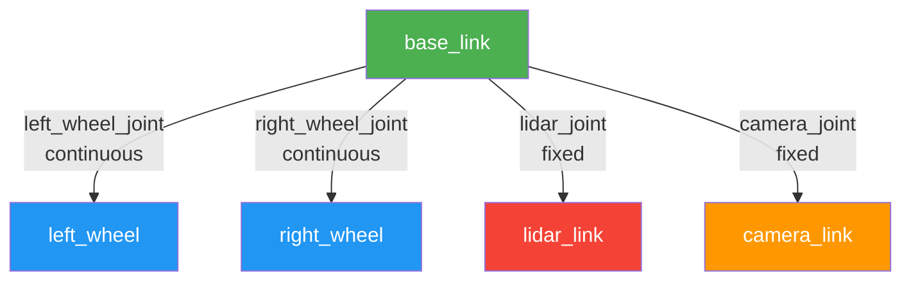
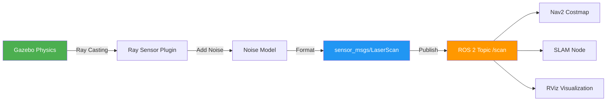

# URDF & Sensor Integration: Adding Eyes to Your Robot

URDF (Unified Robot Description Format) is the standard XML format for describing robot hardware in ROS 2. Beyond defining links and joints, URDF allows you to integrate sensors like LiDAR, cameras, and IMUs that are critical for autonomous navigation.

## URDF Structure Fundamentals

### Complete Robot Model Example

```xml
<?xml version="1.0"?>
<robot name="mobile_robot" xmlns:xacro="http://www.ros.org/wiki/xacro">

  <!-- Base Link -->
  <link name="base_link">
    <inertial>
      <origin xyz="0 0 0.1" rpy="0 0 0"/>
      <mass value="20.0"/>
      <inertia ixx="0.5" ixy="0.0" ixz="0.0"
               iyy="0.8" iyz="0.0"
               izz="1.0"/>
    </inertial>

    <visual>
      <origin xyz="0 0 0.1" rpy="0 0 0"/>
      <geometry>
        <box size="0.6 0.4 0.2"/>
      </geometry>
      <material name="blue">
        <color rgba="0.2 0.2 0.8 1.0"/>
      </material>
    </visual>

    <collision>
      <origin xyz="0 0 0.1" rpy="0 0 0"/>
      <geometry>
        <box size="0.6 0.4 0.2"/>
      </geometry>
    </collision>
  </link>

  <!-- Left Wheel -->
  <link name="left_wheel">
    <inertial>
      <origin xyz="0 0 0" rpy="0 1.5708 0"/>
      <mass value="2.0"/>
      <inertia ixx="0.01" ixy="0.0" ixz="0.0"
               iyy="0.01" iyz="0.0"
               izz="0.01"/>
    </inertial>

    <visual>
      <origin xyz="0 0 0" rpy="0 1.5708 0"/>
      <geometry>
        <cylinder radius="0.1" length="0.05"/>
      </geometry>
      <material name="black">
        <color rgba="0.1 0.1 0.1 1.0"/>
      </material>
    </visual>

    <collision>
      <origin xyz="0 0 0" rpy="0 1.5708 0"/>
      <geometry>
        <cylinder radius="0.1" length="0.05"/>
      </geometry>
    </collision>
  </link>

  <!-- Left Wheel Joint -->
  <joint name="left_wheel_joint" type="continuous">
    <parent link="base_link"/>
    <child link="left_wheel"/>
    <origin xyz="0.2 0.25 0" rpy="0 0 0"/>
    <axis xyz="0 1 0"/>
    <limit effort="10.0" velocity="10.0"/>
    <dynamics damping="0.1" friction="0.1"/>
  </joint>

  <!-- LiDAR Link (Sensor Mount) -->
  <link name="lidar_link">
    <inertial>
      <origin xyz="0 0 0" rpy="0 0 0"/>
      <mass value="0.3"/>
      <inertia ixx="0.001" ixy="0.0" ixz="0.0"
               iyy="0.001" iyz="0.0"
               izz="0.001"/>
    </inertial>

    <visual>
      <origin xyz="0 0 0" rpy="0 0 0"/>
      <geometry>
        <cylinder radius="0.05" length="0.07"/>
      </geometry>
      <material name="red">
        <color rgba="0.8 0.1 0.1 1.0"/>
      </material>
    </visual>

    <collision>
      <origin xyz="0 0 0" rpy="0 0 0"/>
      <geometry>
        <cylinder radius="0.05" length="0.07"/>
      </geometry>
    </collision>
  </link>

  <!-- LiDAR Joint -->
  <joint name="lidar_joint" type="fixed">
    <parent link="base_link"/>
    <child link="lidar_link"/>
    <origin xyz="0 0 0.25" rpy="0 0 0"/>
  </joint>

</robot>
```

## Link and Joint Architecture



### Joint Types Explained

- **fixed**: No movement (sensors, static parts)
- **revolute**: Rotation with limits (servo motors)
- **continuous**: Unlimited rotation (wheels)
- **prismatic**: Linear motion (linear actuators)
- **planar**: 2D plane motion
- **floating**: 6-DOF free movement

## LiDAR Integration with Gazebo SDF

To simulate LiDAR in Gazebo, you need to add a Gazebo plugin using SDF format within your URDF:

### Complete LiDAR Plugin Configuration

```xml
<robot name="mobile_robot" xmlns:xacro="http://www.ros.org/wiki/xacro">

  <!-- ... (links and joints from above) ... -->

  <!-- Gazebo-specific LiDAR Plugin -->
  <gazebo reference="lidar_link">
    <sensor name="lidar_sensor" type="ray">
      <pose>0 0 0 0 0 0</pose>
      <visualize>true</visualize>
      <update_rate>10.0</update_rate>

      <!-- Ray Configuration -->
      <ray>
        <scan>
          <horizontal>
            <!-- 360-degree scan with 720 samples (0.5° resolution) -->
            <samples>720</samples>
            <resolution>1.0</resolution>
            <min_angle>-3.14159</min_angle>  <!-- -180° -->
            <max_angle>3.14159</max_angle>   <!-- +180° -->
          </horizontal>
        </scan>

        <range>
          <min>0.1</min>         <!-- Minimum detection distance -->
          <max>30.0</max>        <!-- Maximum range (meters) -->
          <resolution>0.01</resolution>  <!-- 1cm precision -->
        </range>

        <!-- Noise Model (Realistic sensor noise) -->
        <noise>
          <type>gaussian</type>
          <mean>0.0</mean>
          <stddev>0.01</stddev>  <!-- 1cm standard deviation -->
        </noise>
      </ray>

      <!-- ROS 2 Plugin -->
      <plugin name="gazebo_ros_lidar" filename="libgazebo_ros_ray_sensor.so">
        <ros>
          <namespace>/robot</namespace>
          <remapping>~/out:=scan</remapping>  <!-- Publish to /robot/scan -->
        </ros>

        <output_type>sensor_msgs/LaserScan</output_type>
        <frame_name>lidar_link</frame_name>
      </plugin>
    </sensor>
  </gazebo>

</robot>
```

### LiDAR Plugin Parameters Explained

**Scan Configuration:**
- **samples**: Number of rays per scan (higher = more detail, slower)
- **resolution**: Sub-sampling multiplier (1.0 = use all samples)
- **min_angle/max_angle**: Scan field of view in radians

**Range Configuration:**
- **min**: Minimum valid distance (objects closer are ignored)
- **max**: Maximum detection range
- **resolution**: Distance measurement precision

**Noise Model:**
- **type**: gaussian (most realistic), uniform, or none
- **mean**: Bias in measurements (typically 0.0)
- **stddev**: Measurement uncertainty (typical LiDAR: 0.01-0.03m)

## Multi-Layer LiDAR (3D Point Cloud)

For vertical scanning (e.g., Velodyne VLP-16):

```xml
<gazebo reference="lidar_3d_link">
  <sensor name="velodyne_sensor" type="ray">
    <visualize>true</visualize>
    <update_rate>10.0</update_rate>

    <ray>
      <scan>
        <horizontal>
          <samples>1800</samples>  <!-- 0.2° resolution -->
          <resolution>1.0</resolution>
          <min_angle>-3.14159</min_angle>
          <max_angle>3.14159</max_angle>
        </horizontal>

        <!-- Vertical Scan (16 layers) -->
        <vertical>
          <samples>16</samples>
          <resolution>1.0</resolution>
          <min_angle>-0.2618</min_angle>  <!-- -15° -->
          <max_angle>0.2618</max_angle>   <!-- +15° -->
        </vertical>
      </scan>

      <range>
        <min>0.9</min>
        <max>100.0</max>
        <resolution>0.03</resolution>
      </range>

      <noise>
        <type>gaussian</type>
        <mean>0.0</mean>
        <stddev>0.03</stddev>
      </noise>
    </ray>

    <!-- Publish as PointCloud2 -->
    <plugin name="gazebo_ros_velodyne" filename="libgazebo_ros_ray_sensor.so">
      <ros>
        <namespace>/robot</namespace>
        <remapping>~/out:=velodyne_points</remapping>
      </ros>

      <output_type>sensor_msgs/PointCloud2</output_type>
      <frame_name>lidar_3d_link</frame_name>
    </plugin>
  </sensor>
</gazebo>
```

## Using Xacro for Modular Sensors

Xacro (XML Macros) allows reusable sensor definitions:

```xml
<?xml version="1.0"?>
<robot xmlns:xacro="http://www.ros.org/wiki/xacro">

  <!-- Macro: 2D LiDAR Sensor -->
  <xacro:macro name="lidar_2d" params="parent_link xyz rpy namespace topic">

    <link name="${namespace}_lidar_link">
      <inertial>
        <origin xyz="0 0 0" rpy="0 0 0"/>
        <mass value="0.3"/>
        <inertia ixx="0.001" ixy="0.0" ixz="0.0"
                 iyy="0.001" iyz="0.0"
                 izz="0.001"/>
      </inertial>

      <visual>
        <geometry>
          <cylinder radius="0.05" length="0.07"/>
        </geometry>
        <material name="lidar_red">
          <color rgba="0.8 0.1 0.1 1.0"/>
        </material>
      </visual>

      <collision>
        <geometry>
          <cylinder radius="0.05" length="0.07"/>
        </geometry>
      </collision>
    </link>

    <joint name="${namespace}_lidar_joint" type="fixed">
      <parent link="${parent_link}"/>
      <child link="${namespace}_lidar_link"/>
      <origin xyz="${xyz}" rpy="${rpy}"/>
    </joint>

    <gazebo reference="${namespace}_lidar_link">
      <sensor name="${namespace}_lidar" type="ray">
        <visualize>true</visualize>
        <update_rate>10.0</update_rate>

        <ray>
          <scan>
            <horizontal>
              <samples>720</samples>
              <resolution>1.0</resolution>
              <min_angle>-3.14159</min_angle>
              <max_angle>3.14159</max_angle>
            </horizontal>
          </scan>

          <range>
            <min>0.1</min>
            <max>30.0</max>
            <resolution>0.01</resolution>
          </range>

          <noise>
            <type>gaussian</type>
            <mean>0.0</mean>
            <stddev>0.01</stddev>
          </noise>
        </ray>

        <plugin name="gazebo_ros_${namespace}_lidar" filename="libgazebo_ros_ray_sensor.so">
          <ros>
            <namespace>/${namespace}</namespace>
            <remapping>~/out:=${topic}</remapping>
          </ros>

          <output_type>sensor_msgs/LaserScan</output_type>
          <frame_name>${namespace}_lidar_link</frame_name>
        </plugin>
      </sensor>
    </gazebo>

  </xacro:macro>

  <!-- Usage: Add LiDAR to robot base -->
  <xacro:lidar_2d
    parent_link="base_link"
    xyz="0 0 0.25"
    rpy="0 0 0"
    namespace="robot"
    topic="scan"/>

</robot>
```

## Visualizing Sensors in RViz

After launching Gazebo with your robot, visualize sensor data in RViz:

```python
#!/usr/bin/env python3
"""
RViz Configuration Example for LiDAR Visualization
"""
import rclpy
from rclpy.node import Node
from sensor_msgs.msg import LaserScan

class LidarVisualizer(Node):
    def __init__(self):
        super().__init__('lidar_visualizer')

        self.subscription = self.create_subscription(
            LaserScan,
            '/robot/scan',
            self.scan_callback,
            10
        )

        self.get_logger().info('LiDAR Visualizer started. Publishing to /robot/scan')

    def scan_callback(self, msg):
        # Log scan statistics
        valid_ranges = [r for r in msg.ranges if msg.range_min < r < msg.range_max]

        if valid_ranges:
            min_dist = min(valid_ranges)
            max_dist = max(valid_ranges)
            avg_dist = sum(valid_ranges) / len(valid_ranges)

            self.get_logger().info(
                f'Scan: {len(valid_ranges)} points | '
                f'Min: {min_dist:.2f}m | Max: {max_dist:.2f}m | Avg: {avg_dist:.2f}m',
                throttle_duration_sec=2.0  # Log every 2 seconds
            )

def main():
    rclpy.init()
    node = LidarVisualizer()
    rclpy.spin(node)
    node.destroy_node()
    rclpy.shutdown()

if __name__ == '__main__':
    main()
```

## RViz Configuration for LiDAR

```yaml
# rviz_config.yaml
Displays:
  - Class: rviz_default_plugins/LaserScan
    Name: LiDAR Scan
    Topic:
      Depth: 5
      Durability Policy: Volatile
      History Policy: Keep Last
      Reliability Policy: Best Effort
      Value: /robot/scan
    Color: 255; 0; 0  # Red
    Size (m): 0.05
    Style: Points
    Enabled: true

  - Class: rviz_default_plugins/TF
    Name: TF
    Enabled: true
    Marker Scale: 1.0
    Show Axes: true
    Show Names: true

Global Options:
  Fixed Frame: base_link
  Frame Rate: 30
```

## LiDAR Data Processing Pipeline



## Best Practices for Sensor Integration

1. **Frame Naming Convention**: Use `{robot_name}_{sensor_type}_link` (e.g., `robot_lidar_link`)
2. **Update Rates**: Match real hardware (10-40 Hz for LiDAR)
3. **Realistic Noise**: Add gaussian noise to simulate real sensor imperfections
4. **TF Frames**: Ensure all sensor frames are properly linked in the TF tree
5. **Collision Geometry**: Keep sensor collision simple (small cylinders/boxes)
6. **Visualization**: Enable `<visualize>true</visualize>` during development

## Common LiDAR Issues and Solutions

| Issue | Cause | Solution |
|-------|-------|----------|
| No scan data | Topic mismatch | Check remapping in plugin |
| Scan through walls | No collision geometry | Add collision tags to world objects |
| Noisy scans | Unstable physics | Increase physics update rate |
| Missing points | `samples` too low | Increase to 720+ for 0.5° resolution |
| Range errors | `min`/`max` misconfigured | Match real sensor specs (e.g., 0.1-30m) |

## Next Steps

With sensors integrated, your robot can now perceive its environment. Move on to [Module 3: Isaac Sim](../module-3/isaac-sim-setup.md) to learn advanced simulation techniques with NVIDIA's photorealistic simulator.
