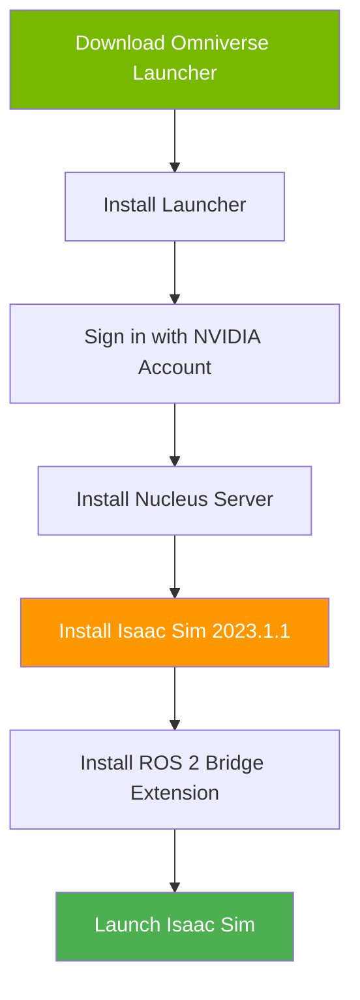
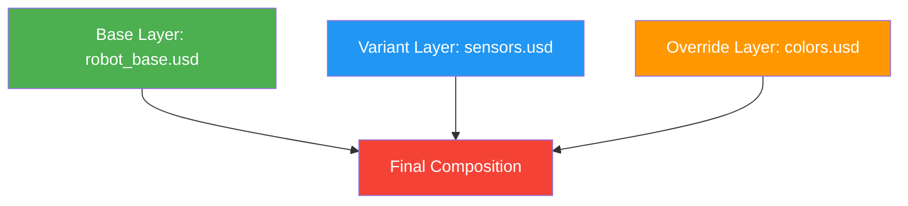

# NVIDIA Isaac Sim: Photorealistic Robot Simulation

NVIDIA Isaac Sim is the industry's most advanced robot simulator, leveraging RTX ray tracing and PhysX 5 for photorealistic rendering and accurate physics. Built on Omniverse, it uses USD (Universal Scene Description) for collaborative robotics workflows.

## Why Isaac Sim Over Gazebo?

| Feature | Gazebo | Isaac Sim |
|---------|--------|-----------|
| **Graphics** | OpenGL (basic) | RTX ray tracing (photorealistic) |
| **Physics** | ODE/Bullet | NVIDIA PhysX 5 (GPU-accelerated) |
| **Sensors** | Simulated cameras | Real-time ray-traced cameras, LiDAR |
| **File Format** | URDF/SDF | USD (Universal Scene Description) |
| **AI Integration** | Limited | NVIDIA Omniverse Replicator (synthetic data) |
| **Multi-Robot** | Limited scaling | Distributed simulation (100+ robots) |
| **Hardware Acceleration** | CPU-only physics | GPU-accelerated everything |

**Use Isaac Sim when:**
- Training vision-based AI models (need photorealistic synthetic data)
- Simulating large-scale multi-robot systems
- Requiring RTX GPU acceleration for real-time performance
- Developing for NVIDIA Jetson hardware (seamless deployment)

## Installation Prerequisites

### Hardware Requirements

- **GPU**: NVIDIA RTX 2060 or higher (RTX 4090 recommended)
- **VRAM**: Minimum 8GB, 24GB+ for complex scenes
- **RAM**: 32GB recommended
- **Storage**: 100GB free space (SSD recommended)
- **OS**: Ubuntu 20.04/22.04 or Windows 10/11

### Software Prerequisites

```bash
# Ubuntu: Install NVIDIA Driver 525+
sudo apt update
sudo apt install nvidia-driver-525

# Verify GPU and driver
nvidia-smi

# Expected output:
# +-----------------------------------------------------------------------------+
# | NVIDIA-SMI 525.147.05   Driver Version: 525.147.05   CUDA Version: 12.0   |
# +-----------------------------------------------------------------------------+
```

## Installing NVIDIA Omniverse

Isaac Sim runs on the Omniverse platform. Follow this workflow:



### Step 1: Download Omniverse Launcher

```bash
# Ubuntu installation
wget https://install.launcher.omniverse.nvidia.com/installers/omniverse-launcher-linux.AppImage

chmod +x omniverse-launcher-linux.AppImage
./omniverse-launcher-linux.AppImage
```

### Step 2: Install Nucleus Server (Local Asset Server)

Nucleus is Omniverse's collaboration server for USD assets.

```bash
# Within Omniverse Launcher:
# 1. Go to "Nucleus" tab
# 2. Click "Install Nucleus"
# 3. Choose "Local Installation" for development
# 4. Set password for 'admin' user
# 5. Verify server at: http://localhost:3080/omni/web/admin
```

**Nucleus Directory Structure:**
```
localhost/
├── NVIDIA/
│   ├── Assets/           # Pre-built 3D models
│   ├── Materials/        # PBR materials
│   └── Environments/     # HDR environments
└── Projects/
    └── my_robot/         # Your custom USD files
```

### Step 3: Install Isaac Sim

```bash
# Within Omniverse Launcher:
# 1. Go to "Exchange" tab
# 2. Search "Isaac Sim"
# 3. Install version 2023.1.1
# 4. Installation path: ~/.local/share/ov/pkg/isaac_sim-2023.1.1/
```

### Step 4: Install ROS 2 Bridge Extension

```bash
# Launch Isaac Sim
# Window → Extensions
# Search: "ROS2 Bridge"
# Enable: omni.isaac.ros2_bridge

# Verify ROS 2 installation (must have ROS 2 Humble)
source /opt/ros/humble/setup.bash
ros2 topic list  # Should show Isaac Sim topics after connection
```

## Understanding USD (Universal Scene Description)

USD is Pixar's open-source file format for 3D content pipelines. Isaac Sim uses USD as the native scene format.

### USD File Structure

```
my_robot.usd
├── /World                    # Root prim
│   ├── /GroundPlane         # Static geometry
│   ├── /Lighting            # Light sources
│   └── /Robot               # Robot hierarchy
│       ├── /base_link       # Base geometry
│       ├── /left_wheel      # Wheel geometry
│       └── /lidar_link      # Sensor mount
```

### Creating a Simple USD Scene (Python API)

```python
#!/usr/bin/env python3
"""
Example: Create a basic USD scene in Isaac Sim
"""
from pxr import Usd, UsdGeom, Gf

# Create new USD stage
stage = Usd.Stage.CreateNew("my_scene.usd")

# Define root prim
UsdGeom.Xform.Define(stage, "/World")

# Add ground plane
ground_prim = UsdGeom.Mesh.Define(stage, "/World/GroundPlane")
ground_prim.CreatePointsAttr([
    (-10, -10, 0), (10, -10, 0), (10, 10, 0), (-10, 10, 0)
])
ground_prim.CreateFaceVertexCountsAttr([4])
ground_prim.CreateFaceVertexIndicesAttr([0, 1, 2, 3])

# Add box (robot proxy)
box_prim = UsdGeom.Cube.Define(stage, "/World/Robot")
box_prim.CreateSizeAttr(1.0)
box_prim.AddTranslateOp().Set(Gf.Vec3d(0, 0, 0.5))

# Add sphere (wheel proxy)
wheel_prim = UsdGeom.Sphere.Define(stage, "/World/Robot/Wheel")
wheel_prim.CreateRadiusAttr(0.2)
wheel_prim.AddTranslateOp().Set(Gf.Vec3d(0.5, 0, -0.3))

# Save stage
stage.Save()
print("USD scene saved to my_scene.usd")
```

### USD Layer Composition

USD uses layers to enable non-destructive editing:



**Layer Types:**
- **Base Layer**: Core robot geometry and structure
- **Reference Layer**: Reusable components (sensors, actuators)
- **Override Layer**: Scene-specific changes (positions, colors)
- **Variant Layer**: Multiple configurations (e.g., with/without LiDAR)

## Importing URDF into Isaac Sim

Convert existing ROS 2 URDF models to USD:

```python
#!/usr/bin/env python3
"""
Example: Import URDF into Isaac Sim
"""
import omni
from omni.isaac.core.utils.extensions import enable_extension

# Enable URDF importer extension
enable_extension("omni.isaac.urdf")

from omni.isaac.urdf import _urdf

# Import URDF file
urdf_path = "/path/to/my_robot.urdf"
usd_path = "/World/Robot"

import_config = _urdf.ImportConfig()
import_config.merge_fixed_joints = False
import_config.convex_decompose = True  # For collision meshes
import_config.import_inertia_tensor = True
import_config.fix_base = False  # True for fixed-base robots

# Perform import
success, usd_prim_path = omni.kit.commands.execute(
    "URDFParseAndImportFile",
    urdf_path=urdf_path,
    import_config=import_config,
    dest_path=usd_path
)

if success:
    print(f"URDF imported successfully to {usd_prim_path}")
else:
    print("URDF import failed")
```

### URDF to USD Mapping

| URDF Element | USD Equivalent | Notes |
|--------------|----------------|-------|
| `<link>` | UsdGeom.Xform | Transformed prim |
| `<joint>` | UsdPhysics.Joint | Physics-aware joint |
| `<visual>` | UsdGeom.Mesh | Renderable geometry |
| `<collision>` | UsdPhysics.CollisionAPI | Physics collision shape |
| `<inertial>` | UsdPhysics.MassAPI | Mass and inertia tensor |
| `<gazebo>` (sensor) | Isaac Sensor Schema | Converted to Isaac sensor |

## PhysX 5 Simulation Engine

Isaac Sim uses NVIDIA PhysX 5 for GPU-accelerated rigid body physics.

### Configuring PhysX Scene

```python
#!/usr/bin/env python3
"""
Example: Configure PhysX parameters in Isaac Sim
"""
from omni.isaac.core import World
from pxr import PhysxSchema

# Create simulation world
world = World(stage_units_in_meters=1.0)

# Get PhysX scene API
stage = world.stage
scene = PhysxSchema.PhysxSceneAPI.Apply(stage.GetPrimAtPath("/World"))

# Set physics parameters
scene.CreateGravityDirectionAttr().Set((0.0, 0.0, -1.0))
scene.CreateGravityMagnitudeAttr().Set(9.81)

# Solver settings
scene.CreateEnableCCDAttr().Set(True)  # Continuous Collision Detection
scene.CreateEnableGPUDynamicsAttr().Set(True)  # GPU acceleration
scene.CreateBroadphaseTypeAttr().Set("GPU")
scene.CreateSolverTypeAttr().Set("TGS")  # Temporal Gauss-Seidel

# Timestep configuration
scene.CreateTimeStepsPerSecondAttr().Set(60.0)  # 60 Hz physics

world.reset()
print("PhysX scene configured")
```

### PhysX Performance Settings

```python
# High-accuracy mode (slower, more stable)
scene.CreateSolverPositionIterationCountAttr().Set(16)
scene.CreateSolverVelocityIterationCountAttr().Set(8)

# Real-time mode (faster, less stable)
scene.CreateSolverPositionIterationCountAttr().Set(4)
scene.CreateSolverVelocityIterationCountAttr().Set(1)

# GPU particle simulation (for granular materials)
scene.CreateEnableGPUDynamicsAttr().Set(True)
scene.CreateGpuMaxRigidContactCountAttr().Set(1024 * 1024)
scene.CreateGpuMaxRigidPatchCountAttr().Set(1024 * 512)
```

## Running Isaac Sim Headless (Docker)

For cloud simulation and CI/CD pipelines:

```bash
# Pull Isaac Sim container
docker pull nvcr.io/nvidia/isaac-sim:2023.1.1

# Run headless with ROS 2
docker run --gpus all -it \
  --network=host \
  -v ~/isaac_sim_data:/data \
  -e "ACCEPT_EULA=Y" \
  nvcr.io/nvidia/isaac-sim:2023.1.1 \
  ./python.sh /isaac-sim/standalone_examples/api/omni.isaac.ros2_bridge/simple_publisher.py

# Expected output:
# [Info] [omni.isaac.ros2_bridge] ROS2 Bridge initialized
# [Info] Publishing to /clock at 60 Hz
```

## Isaac Sim ROS 2 Integration

Publish and subscribe to ROS 2 topics directly from Isaac Sim:

```python
#!/usr/bin/env python3
"""
Example: Publish camera and LiDAR data to ROS 2
"""
import omni
from omni.isaac.core import World
from omni.isaac.core.utils.nucleus import get_assets_root_path
from omni.isaac.sensor import Camera, RotatingLidarPhysX
import omni.graph.core as og

# Create world
world = World()

# Add camera sensor
camera = Camera(
    prim_path="/World/Camera",
    position=[2.0, 0.0, 1.5],
    orientation=[0.0, 0.0, 0.707, 0.707],  # Looking at origin
    resolution=(1280, 720),
    frequency=30  # 30 FPS
)

# Add LiDAR sensor
lidar = RotatingLidarPhysX(
    prim_path="/World/Lidar",
    position=[0.0, 0.0, 1.0],
    rotation_frequency=20,  # 20 Hz
    num_rows=16,  # Velodyne VLP-16
    num_cols=1800,  # 0.2° resolution
    max_range=100.0
)

# Create ROS 2 publishers using OmniGraph
keys = og.Controller.Keys
(graph_handle, _, _, _) = og.Controller.edit(
    {
        "graph_path": "/ActionGraph",
        "evaluator_name": "execution",
    },
    {
        keys.CREATE_NODES: [
            ("OnPlaybackTick", "omni.graph.action.OnPlaybackTick"),
            ("CameraHelper", "omni.isaac.ros2_bridge.ROS2CameraHelper"),
            ("LidarHelper", "omni.isaac.ros2_bridge.ROS2RtxLidarHelper"),
        ],
        keys.CONNECT: [
            ("OnPlaybackTick.outputs:tick", "CameraHelper.inputs:execIn"),
            ("OnPlaybackTick.outputs:tick", "LidarHelper.inputs:execIn"),
        ],
        keys.SET_VALUES: [
            ("CameraHelper.inputs:type", "rgb"),
            ("CameraHelper.inputs:topicName", "rgb"),
            ("CameraHelper.inputs:frameId", "camera_link"),
            ("LidarHelper.inputs:topicName", "scan"),
            ("LidarHelper.inputs:frameId", "lidar_link"),
        ],
    },
)

# Run simulation
world.reset()

for i in range(1000):
    world.step(render=True)
    if i % 60 == 0:
        print(f"Simulation step: {i}")
```

## Best Practices

1. **Use Nucleus for Asset Management**: Store USD files on Nucleus for version control
2. **Enable GPU Dynamics**: Always use `enableGPUDynamics=True` on RTX GPUs
3. **Optimize Collision Meshes**: Use convex decomposition for complex shapes
4. **Cache Simulations**: Use USD caching for repetitive scenarios
5. **Monitor GPU Memory**: Use `nvidia-smi` to track VRAM usage during large scenes

## Next Steps

With Isaac Sim configured, you're ready to implement autonomous navigation. Proceed to [Nav2 Planning](./nav2-planning.md) to integrate the ROS 2 Navigation Stack with your simulated robot.
