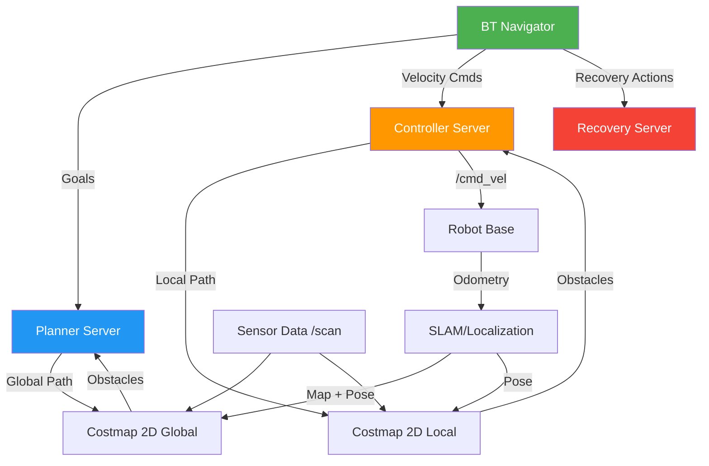
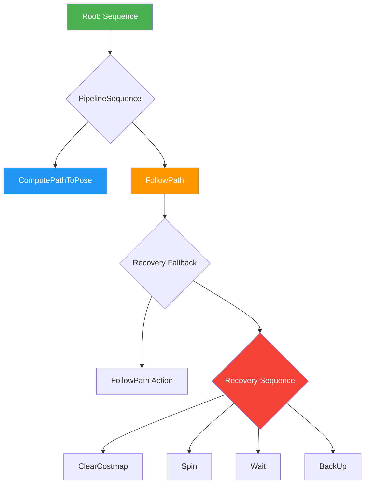

# Navigation2: Autonomous Robot Navigation

Nav2 (Navigation2) is the ROS 2 navigation stack that enables robots to autonomously navigate from point A to B while avoiding obstacles. It integrates SLAM, path planning, and local control into a unified behavior tree architecture.

## Nav2 Architecture Overview

Nav2 consists of several independent servers coordinated by a behavior tree:



### Core Components

1. **BT Navigator**: Executes behavior trees for mission logic
2. **Planner Server**: Computes global paths (Dijkstra, A*, Hybrid A*)
3. **Controller Server**: Follows paths with local obstacle avoidance (DWB, TEB, MPPI)
4. **Recovery Server**: Handles failures (spin, backup, wait)
5. **Costmap 2D**: Maintains obstacle maps (global and local)
6. **Lifecycle Manager**: Manages node startup/shutdown

## Costmap 2D: The Foundation

Costmaps represent the world as a 2D occupancy grid with obstacle costs (0-255).

### Global Costmap Configuration

```yaml
# global_costmap_params.yaml
global_costmap:
  global_frame: map
  robot_base_frame: base_link
  update_frequency: 1.0  # 1 Hz
  publish_frequency: 1.0
  resolution: 0.05  # 5cm per cell
  width: 50  # 50m x 50m
  height: 50
  origin_x: -25.0
  origin_y: -25.0

  plugins:
    - static_layer
    - obstacle_layer
    - inflation_layer

  static_layer:
    plugin: nav2_costmap_2d::StaticLayer
    map_subscribe_transient_local: true

  obstacle_layer:
    plugin: nav2_costmap_2d::ObstacleLayer
    enabled: true
    observation_sources: scan
    scan:
      topic: /scan
      sensor_frame: lidar_link
      data_type: LaserScan
      marking: true
      clearing: true
      min_obstacle_height: 0.0
      max_obstacle_height: 2.0

  inflation_layer:
    plugin: nav2_costmap_2d::InflationLayer
    inflation_radius: 0.55  # Robot radius + safety margin
    cost_scaling_factor: 3.0
```

### Local Costmap Configuration

```yaml
# local_costmap_params.yaml
local_costmap:
  global_frame: odom
  robot_base_frame: base_link
  update_frequency: 5.0  # 5 Hz for dynamic obstacles
  publish_frequency: 2.0
  resolution: 0.05
  width: 3  # 3m rolling window
  height: 3
  rolling_window: true  # Follows robot

  plugins:
    - voxel_layer
    - inflation_layer

  voxel_layer:
    plugin: nav2_costmap_2d::VoxelLayer
    enabled: true
    publish_voxel_map: true
    observation_sources: scan
    scan:
      topic: /scan
      sensor_frame: lidar_link
      data_type: LaserScan
      marking: true
      clearing: true
      min_obstacle_height: 0.0
      max_obstacle_height: 2.0

  inflation_layer:
    plugin: nav2_costmap_2d::InflationLayer
    inflation_radius: 0.55
    cost_scaling_factor: 5.0  # Higher cost near obstacles
```

### Costmap Layers Explained

**Static Layer:**
- Source: Pre-built map from SLAM
- Updates: Never (unless map reloaded)
- Use: Known obstacles (walls, furniture)

**Obstacle Layer:**
- Source: Real-time sensor data (LiDAR, depth cameras)
- Updates: High frequency (5-10 Hz)
- Use: Dynamic obstacles (people, other robots)

**Inflation Layer:**
- Source: Other layers
- Updates: When underlying layers change
- Use: Safety buffer around obstacles
- **inflation_radius**: Distance to inflate (robot radius + margin)
- **cost_scaling_factor**: How quickly cost decreases from obstacle

## Planner Server: Global Path Planning

The Planner Server computes collision-free paths from start to goal using graph search algorithms.

### NavFn Planner (Dijkstra)

```yaml
# planner_server_params.yaml
planner_server:
  ros__parameters:
    planner_plugins: ["GridBased"]

    GridBased:
      plugin: nav2_navfn_planner/NavfnPlanner
      tolerance: 0.5  # Goal tolerance (meters)
      use_astar: false  # Dijkstra (false) or A* (true)
      allow_unknown: true  # Plan through unknown space
```

**Dijkstra vs A*:**
- **Dijkstra**: Explores uniformly, guarantees shortest path
- **A***: Uses heuristic (straight-line distance), faster but may not find absolute shortest

### Hybrid A* Planner (Car-like Robots)

For robots with non-holonomic constraints (e.g., Ackermann steering):

```yaml
GridBased:
  plugin: nav2_smac_planner/SmacPlannerHybridA*
  tolerance: 0.5
  downsample_costmap: false
  downsampling_factor: 1
  allow_unknown: true
  max_iterations: 1000000

  # Motion primitives
  motion_model_for_search: "REEDS_SHEPP"  # Or "DUBIN"
  angle_quantization_bins: 72  # 5° resolution
  analytic_expansion_ratio: 3.5
  analytic_expansion_max_length: 3.0

  # Smoothing
  smooth_path: true
  smoother:
    max_iterations: 1000
    w_smooth: 0.3
    w_data: 0.2
```

**Motion Models:**
- **REEDS_SHEPP**: Forward + backward motion (parking scenarios)
- **DUBIN**: Forward-only motion (faster, no reversing)

## Controller Server: Local Path Following

The Controller Server executes the global path while avoiding dynamic obstacles.

### DWB (Dynamic Window Approach)

```yaml
# controller_server_params.yaml
controller_server:
  ros__parameters:
    controller_plugins: ["FollowPath"]

    FollowPath:
      plugin: dwb_core::DWBLocalPlanner
      debug_trajectory_details: false
      min_vel_x: 0.0
      min_vel_y: 0.0
      max_vel_x: 0.5  # m/s
      max_vel_y: 0.0  # Differential drive
      max_vel_theta: 1.0  # rad/s
      min_speed_xy: 0.0
      max_speed_xy: 0.5
      min_speed_theta: 0.0

      # Acceleration limits
      acc_lim_x: 2.5
      acc_lim_y: 0.0
      acc_lim_theta: 3.2

      # Trajectory sampling
      vx_samples: 20
      vy_samples: 0
      vtheta_samples: 40
      sim_time: 1.7  # Simulate 1.7s ahead

      # Scoring critics (weights)
      critics:
        - RotateToGoal
        - Oscillation
        - BaseObstacle
        - GoalAlign
        - PathAlign
        - PathDist
        - GoalDist

      BaseObstacle.scale: 0.02
      PathAlign.scale: 32.0
      PathAlign.forward_point_distance: 0.1
      GoalAlign.scale: 24.0
      GoalAlign.forward_point_distance: 0.1
      PathDist.scale: 32.0
      GoalDist.scale: 24.0
      RotateToGoal.scale: 32.0
```

**DWB Trajectory Scoring:**
1. Sample velocity space (vx, vy, vθ)
2. Simulate forward in time (sim_time)
3. Score each trajectory with critics:
   - **BaseObstacle**: Penalize collisions
   - **PathAlign**: Reward alignment with global path
   - **GoalAlign**: Reward alignment with goal
   - **GoalDist**: Prefer trajectories closer to goal
4. Execute highest-scoring trajectory

### TEB (Timed Elastic Band) Controller

For smoother, time-optimal trajectories:

```yaml
FollowPath:
  plugin: teb_local_planner::TebLocalPlannerROS
  teb_autosize: true
  dt_ref: 0.3
  dt_hysteresis: 0.1
  max_samples: 500
  global_plan_overwrite_orientation: true
  allow_init_with_backwards_motion: false
  max_global_plan_lookahead_dist: 3.0

  # Robot configuration
  max_vel_x: 0.5
  max_vel_x_backwards: 0.2
  max_vel_theta: 1.0
  acc_lim_x: 0.5
  acc_lim_theta: 1.0

  # Goal tolerance
  xy_goal_tolerance: 0.2
  yaw_goal_tolerance: 0.1
  free_goal_vel: false

  # Obstacles
  min_obstacle_dist: 0.5
  inflation_dist: 0.6
  include_costmap_obstacles: true
  costmap_obstacles_behind_robot_dist: 1.0

  # Optimization
  no_inner_iterations: 5
  no_outer_iterations: 4
  optimization_activate: true
  optimization_verbose: false
  penalty_epsilon: 0.1
  weight_max_vel_x: 2.0
  weight_max_vel_theta: 1.0
  weight_acc_lim_x: 1.0
  weight_acc_lim_theta: 1.0
  weight_kinematics_nh: 1000.0  # Non-holonomic constraints
  weight_kinematics_forward_drive: 1.0
  weight_kinematics_turning_radius: 1.0
  weight_optimaltime: 1.0
  weight_obstacle: 50.0
```

## Behavior Trees: Mission Logic

Nav2 uses behavior trees to coordinate navigation tasks:



### Default Behavior Tree

```xml
<!-- navigate_to_pose_w_replanning_and_recovery.xml -->
<root main_tree_to_execute="MainTree">
  <BehaviorTree ID="MainTree">
    <RecoveryNode number_of_retries="6" name="NavigateRecovery">
      <PipelineSequence name="NavigateWithReplanning">
        <!-- Compute global path -->
        <RateController hz="1.0">
          <RecoveryNode number_of_retries="1" name="ComputePathToPose">
            <ComputePathToPose goal="{goal}" path="{path}" planner_id="GridBased"/>
            <ClearEntireCostmap name="ClearGlobalCostmap-Context" service_name="global_costmap/clear_entirely_global_costmap"/>
          </RecoveryNode>
        </RateController>

        <!-- Follow path -->
        <RecoveryNode number_of_retries="1" name="FollowPath">
          <FollowPath path="{path}" controller_id="FollowPath"/>
          <ClearEntireCostmap name="ClearLocalCostmap-Context" service_name="local_costmap/clear_entirely_local_costmap"/>
        </RecoveryNode>
      </PipelineSequence>

      <!-- Recovery behaviors on failure -->
      <ReactiveFallback name="RecoveryActions">
        <Sequence name="RecoveryActionsSeq">
          <ClearEntireCostmap name="ClearLocalCostmap-Subtree" service_name="local_costmap/clear_entirely_local_costmap"/>
          <ClearEntireCostmap name="ClearGlobalCostmap-Subtree" service_name="global_costmap/clear_entirely_global_costmap"/>
          <Spin spin_dist="1.57"/>  <!-- 90° spin -->
          <Wait wait_duration="5"/>
          <BackUp backup_dist="0.3" backup_speed="0.05"/>
        </Sequence>
      </ReactiveFallback>
    </RecoveryNode>
  </BehaviorTree>
</root>
```

## Complete Nav2 Launch Example

```python
#!/usr/bin/env python3
"""
Launch Nav2 with custom parameters
"""
from launch import LaunchDescription
from launch_ros.actions import Node
from launch.actions import DeclareLaunchArgument
from launch.substitutions import LaunchConfiguration
from ament_index_python.packages import get_package_share_directory
import os

def generate_launch_description():
    pkg_dir = get_package_share_directory('my_robot_navigation')

    # Parameters
    use_sim_time = LaunchConfiguration('use_sim_time', default='true')
    autostart = LaunchConfiguration('autostart', default='true')
    params_file = LaunchConfiguration('params_file',
        default=os.path.join(pkg_dir, 'config', 'nav2_params.yaml'))
    bt_xml_file = LaunchConfiguration('bt_xml_file',
        default=os.path.join(pkg_dir, 'behavior_trees', 'navigate_w_replanning.xml'))

    return LaunchDescription([
        DeclareLaunchArgument('use_sim_time', default_value='true'),
        DeclareLaunchArgument('autostart', default_value='true'),
        DeclareLaunchArgument('params_file', default_value=params_file),

        # Controller Server
        Node(
            package='nav2_controller',
            executable='controller_server',
            output='screen',
            parameters=[params_file],
            remappings=[('/cmd_vel', '/robot/cmd_vel')]
        ),

        # Planner Server
        Node(
            package='nav2_planner',
            executable='planner_server',
            output='screen',
            parameters=[params_file]
        ),

        # Recovery Server
        Node(
            package='nav2_recoveries',
            executable='recoveries_server',
            output='screen',
            parameters=[params_file]
        ),

        # BT Navigator
        Node(
            package='nav2_bt_navigator',
            executable='bt_navigator',
            output='screen',
            parameters=[
                params_file,
                {'default_bt_xml_filename': bt_xml_file}
            ]
        ),

        # Lifecycle Manager
        Node(
            package='nav2_lifecycle_manager',
            executable='lifecycle_manager',
            output='screen',
            parameters=[{
                'use_sim_time': use_sim_time,
                'autostart': autostart,
                'node_names': [
                    'controller_server',
                    'planner_server',
                    'recoveries_server',
                    'bt_navigator'
                ]
            }]
        )
    ])
```

## Sending Navigation Goals (Python)

```python
#!/usr/bin/env python3
"""
Send navigation goal to Nav2
"""
import rclpy
from rclpy.node import Node
from geometry_msgs.msg import PoseStamped
from nav2_msgs.action import NavigateToPose
from rclpy.action import ActionClient

class Nav2GoalSender(Node):
    def __init__(self):
        super().__init__('nav2_goal_sender')
        self.action_client = ActionClient(self, NavigateToPose, 'navigate_to_pose')

    def send_goal(self, x, y, yaw):
        # Wait for action server
        self.action_client.wait_for_server()

        # Create goal pose
        goal_msg = NavigateToPose.Goal()
        goal_msg.pose.header.frame_id = 'map'
        goal_msg.pose.header.stamp = self.get_clock().now().to_msg()

        goal_msg.pose.pose.position.x = x
        goal_msg.pose.pose.position.y = y
        goal_msg.pose.pose.position.z = 0.0

        # Convert yaw to quaternion (simplified for 2D)
        import math
        goal_msg.pose.pose.orientation.z = math.sin(yaw / 2.0)
        goal_msg.pose.pose.orientation.w = math.cos(yaw / 2.0)

        # Send goal
        self.get_logger().info(f'Sending goal: x={x}, y={y}, yaw={yaw}')
        future = self.action_client.send_goal_async(
            goal_msg,
            feedback_callback=self.feedback_callback
        )
        future.add_done_callback(self.goal_response_callback)

    def goal_response_callback(self, future):
        goal_handle = future.result()
        if not goal_handle.accepted:
            self.get_logger().error('Goal rejected')
            return

        self.get_logger().info('Goal accepted')
        result_future = goal_handle.get_result_async()
        result_future.add_done_callback(self.result_callback)

    def feedback_callback(self, feedback_msg):
        # Log distance remaining
        feedback = feedback_msg.feedback
        self.get_logger().info(
            f'Distance remaining: {feedback.distance_remaining:.2f}m',
            throttle_duration_sec=5.0
        )

    def result_callback(self, future):
        result = future.result().result
        self.get_logger().info(f'Navigation result: {result}')

def main():
    rclpy.init()
    nav_sender = Nav2GoalSender()

    # Send goal: x=5.0, y=3.0, yaw=0.0
    nav_sender.send_goal(5.0, 3.0, 0.0)

    rclpy.spin(nav_sender)
    nav_sender.destroy_node()
    rclpy.shutdown()

if __name__ == '__main__':
    main()
```

## Performance Tuning Tips

1. **Costmap Resolution**: Higher resolution (smaller cells) = more accurate but slower. Use 0.05m for indoor, 0.10m for outdoor.
2. **Update Frequencies**: Global costmap 1 Hz, local costmap 5 Hz, controller 20 Hz.
3. **Inflation Radius**: robot_radius + 0.1m safety margin.
4. **Planner Tolerance**: 0.5m for rough goals, 0.1m for precise docking.
5. **Controller sim_time**: 1.5-2.0s for reactive obstacle avoidance.

## Next Steps

With Nav2 configured, you can now add AI-powered decision-making. Proceed to [Module 4: VLA & Voice Control](../module-4/vla-introduction.md) to integrate Vision-Language-Action models for natural language robot control.
