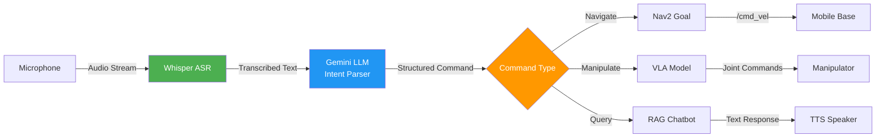

# Voice to Action: Natural Language Robot Control

Voice-controlled robots enable intuitive human-robot interaction by converting spoken commands into robot actions. This pipeline combines speech recognition (Whisper), language understanding (Gemini), and action execution (Nav2/VLA) into a seamless system.

## Voice-to-Action Architecture



## Speech Recognition with Whisper

OpenAI's Whisper is a state-of-the-art automatic speech recognition (ASR) model supporting 99 languages.

### Installing Whisper

```bash
# Install openai-whisper
pip install openai-whisper

# Download model (run once, models cached)
python -c "import whisper; whisper.load_model('base')"

# Available models (accuracy vs speed tradeoff):
# - tiny: 39M params, ~32x real-time, 5% WER
# - base: 74M params, ~16x real-time, 4% WER
# - small: 244M params, ~6x real-time, 3.5% WER
# - medium: 769M params, ~2x real-time, 2.5% WER
# - large: 1550M params, ~1x real-time, 2% WER
```

### Real-Time Whisper Transcription

```python
#!/usr/bin/env python3
"""
Real-time speech recognition using Whisper
"""
import whisper
import pyaudio
import numpy as np
import wave
import threading
import queue

class WhisperRealTime:
    def __init__(self, model_name="base"):
        # Load Whisper model
        self.model = whisper.load_model(model_name)

        # Audio configuration
        self.CHUNK = 1024
        self.FORMAT = pyaudio.paInt16
        self.CHANNELS = 1
        self.RATE = 16000  # Whisper expects 16kHz
        self.RECORD_SECONDS = 3  # Transcribe every 3 seconds

        # PyAudio instance
        self.audio = pyaudio.PyAudio()
        self.stream = None

        # Threading
        self.audio_queue = queue.Queue()
        self.is_listening = False

    def start_listening(self, callback):
        """
        Start listening to microphone and transcribe in real-time.

        Args:
            callback: Function called with transcription text
        """
        self.is_listening = True

        # Open audio stream
        self.stream = self.audio.open(
            format=self.FORMAT,
            channels=self.CHANNELS,
            rate=self.RATE,
            input=True,
            frames_per_buffer=self.CHUNK,
            stream_callback=self._audio_callback
        )

        # Start transcription thread
        transcription_thread = threading.Thread(
            target=self._transcription_loop,
            args=(callback,)
        )
        transcription_thread.start()

        self.stream.start_stream()
        print("Listening... Speak into the microphone.")

    def _audio_callback(self, in_data, frame_count, time_info, status):
        """PyAudio callback for audio stream."""
        self.audio_queue.put(in_data)
        return (in_data, pyaudio.paContinue)

    def _transcription_loop(self, callback):
        """Background thread for transcription."""
        frames = []

        while self.is_listening:
            # Collect audio for RECORD_SECONDS
            frames = []
            num_chunks = int(self.RATE / self.CHUNK * self.RECORD_SECONDS)

            for _ in range(num_chunks):
                if not self.is_listening:
                    break
                try:
                    data = self.audio_queue.get(timeout=1.0)
                    frames.append(data)
                except queue.Empty:
                    continue

            if len(frames) == 0:
                continue

            # Convert to numpy array
            audio_data = np.frombuffer(b''.join(frames), dtype=np.int16)
            audio_data = audio_data.astype(np.float32) / 32768.0  # Normalize to [-1, 1]

            # Transcribe with Whisper
            result = self.model.transcribe(
                audio_data,
                language='en',  # Force English (or None for auto-detect)
                fp16=False  # Use FP32 for CPU (FP16 requires GPU)
            )

            text = result['text'].strip()

            # Call callback with transcription
            if text:
                callback(text)

    def stop_listening(self):
        """Stop listening and clean up."""
        self.is_listening = False

        if self.stream:
            self.stream.stop_stream()
            self.stream.close()

        self.audio.terminate()

# Example usage
def on_transcription(text):
    print(f"Transcribed: {text}")

whisper_asr = WhisperRealTime(model_name="base")
whisper_asr.start_listening(callback=on_transcription)

try:
    input("Press Enter to stop...\n")
except KeyboardInterrupt:
    pass

whisper_asr.stop_listening()
```

## Intent Parsing with Gemini

Raw speech transcriptions need to be parsed into structured robot commands.

### Intent Parser

```python
#!/usr/bin/env python3
"""
Parse voice commands into structured robot actions using Gemini
"""
import google.generativeai as genai
import json

genai.configure(api_key="YOUR_GEMINI_API_KEY")

class VoiceCommandParser:
    def __init__(self):
        self.model = genai.GenerativeModel('gemini-2.0-flash-exp')

        # Define command schema
        self.schema_prompt = """
You are a robot command parser. Given a voice command, extract structured information.

Output JSON with this schema:
{
  "intent": "navigate" | "manipulate" | "query" | "stop",
  "parameters": {
    // For navigate:
    "location": "kitchen" | "bedroom" | "charging_station",
    "x": float,  // meters
    "y": float,  // meters
    "yaw": float,  // radians

    // For manipulate:
    "action": "pick" | "place" | "open" | "close",
    "object": "cup" | "bottle" | "door",

    // For query:
    "question": string
  }
}

Examples:
- "Go to the kitchen" → {"intent": "navigate", "parameters": {"location": "kitchen"}}
- "Move forward 2 meters" → {"intent": "navigate", "parameters": {"x": 2.0, "y": 0.0, "yaw": 0.0}}
- "Pick up the red cup" → {"intent": "manipulate", "parameters": {"action": "pick", "object": "cup"}}
- "What is ROS 2?" → {"intent": "query", "parameters": {"question": "What is ROS 2?"}}
- "Stop" → {"intent": "stop", "parameters": {}}

Now parse this command:
"""

    def parse_command(self, voice_text):
        """
        Parse voice command into structured JSON.

        Args:
            voice_text: Transcribed speech text

        Returns:
            dict: Structured command
        """
        # Generate prompt
        prompt = self.schema_prompt + f'"{voice_text}"'

        # Call Gemini
        response = self.model.generate_content(prompt)

        # Extract JSON from response
        try:
            # Find JSON block in response
            text = response.text.strip()

            # Remove markdown code fences if present
            if text.startswith("```json"):
                text = text[7:]
            if text.startswith("```"):
                text = text[3:]
            if text.endswith("```"):
                text = text[:-3]

            text = text.strip()

            # Parse JSON
            command = json.loads(text)

            return command

        except Exception as e:
            print(f"Failed to parse command: {e}")
            print(f"Raw response: {response.text}")
            return {"intent": "unknown", "parameters": {}}

# Example usage
parser = VoiceCommandParser()

commands = [
    "Go to the charging station",
    "Move forward 3 meters",
    "Pick up the blue bottle",
    "What is SLAM?",
    "Stop moving"
]

for cmd in commands:
    parsed = parser.parse_command(cmd)
    print(f"\nVoice: {cmd}")
    print(f"Parsed: {json.dumps(parsed, indent=2)}")
```

## ROS 2 Integration: Voice Command Node

```python
#!/usr/bin/env python3
"""
ROS 2 node for voice-controlled robot
"""
import rclpy
from rclpy.node import Node
from geometry_msgs.msg import PoseStamped
from std_msgs.msg import String
from nav2_msgs.action import NavigateToPose
from rclpy.action import ActionClient
import whisper
import google.generativeai as genai
import json
import math

genai.configure(api_key="YOUR_GEMINI_API_KEY")

class VoiceControlNode(Node):
    def __init__(self):
        super().__init__('voice_control_node')

        # Whisper ASR
        self.whisper_model = whisper.load_model("base")

        # Gemini intent parser
        self.gemini_model = genai.GenerativeModel('gemini-2.0-flash-exp')

        # Nav2 action client
        self.nav_client = ActionClient(self, NavigateToPose, 'navigate_to_pose')

        # VLA command publisher (for manipulation)
        self.vla_pub = self.create_publisher(String, '/vla_command', 10)

        # Voice transcription subscriber (from external mic node)
        self.voice_sub = self.create_subscription(
            String,
            '/voice_transcription',
            self.voice_callback,
            10
        )

        # Known locations (hardcoded map)
        self.locations = {
            "kitchen": {"x": 5.0, "y": 3.0, "yaw": 0.0},
            "bedroom": {"x": -2.0, "y": 4.0, "yaw": 1.57},
            "charging_station": {"x": 0.0, "y": 0.0, "yaw": 0.0}
        }

        self.get_logger().info('Voice control node started')

    def voice_callback(self, msg):
        """Handle incoming voice transcriptions."""
        voice_text = msg.data
        self.get_logger().info(f'Voice: "{voice_text}"')

        # Parse command with Gemini
        command = self.parse_command(voice_text)

        # Execute command
        self.execute_command(command)

    def parse_command(self, voice_text):
        """Parse voice text into structured command using Gemini."""
        prompt = f"""
Parse this robot command into JSON:
"{voice_text}"

Output format:
{{"intent": "navigate|manipulate|query|stop", "parameters": {{...}}}}
"""

        response = self.gemini_model.generate_content(prompt)

        try:
            text = response.text.strip()
            if text.startswith("```json"):
                text = text[7:-3].strip()
            elif text.startswith("```"):
                text = text[3:-3].strip()

            command = json.loads(text)
            return command

        except Exception as e:
            self.get_logger().error(f'Parse failed: {e}')
            return {"intent": "unknown", "parameters": {}}

    def execute_command(self, command):
        """Execute parsed command."""
        intent = command.get("intent")
        params = command.get("parameters", {})

        if intent == "navigate":
            self.execute_navigate(params)

        elif intent == "manipulate":
            self.execute_manipulate(params)

        elif intent == "query":
            self.get_logger().info(f'Query: {params.get("question")}')
            # TODO: Send to RAG chatbot

        elif intent == "stop":
            self.get_logger().info('Stopping robot')
            # TODO: Cancel current actions

        else:
            self.get_logger().warn(f'Unknown intent: {intent}')

    def execute_navigate(self, params):
        """Send navigation goal to Nav2."""
        # Check for named location
        if "location" in params:
            location_name = params["location"]
            if location_name in self.locations:
                loc = self.locations[location_name]
                x, y, yaw = loc["x"], loc["y"], loc["yaw"]
            else:
                self.get_logger().error(f'Unknown location: {location_name}')
                return
        else:
            # Use explicit coordinates
            x = params.get("x", 0.0)
            y = params.get("y", 0.0)
            yaw = params.get("yaw", 0.0)

        # Create Nav2 goal
        goal_msg = NavigateToPose.Goal()
        goal_msg.pose.header.frame_id = 'map'
        goal_msg.pose.header.stamp = self.get_clock().now().to_msg()

        goal_msg.pose.pose.position.x = x
        goal_msg.pose.pose.position.y = y
        goal_msg.pose.pose.position.z = 0.0

        # Convert yaw to quaternion
        goal_msg.pose.pose.orientation.z = math.sin(yaw / 2.0)
        goal_msg.pose.pose.orientation.w = math.cos(yaw / 2.0)

        # Send goal
        self.get_logger().info(f'Navigating to: x={x}, y={y}, yaw={yaw}')
        self.nav_client.wait_for_server()
        self.nav_client.send_goal_async(goal_msg)

    def execute_manipulate(self, params):
        """Send manipulation command to VLA model."""
        action = params.get("action", "unknown")
        obj = params.get("object", "unknown")

        command_text = f"{action} {obj}"
        self.get_logger().info(f'VLA command: {command_text}')

        # Publish to VLA topic
        msg = String()
        msg.data = command_text
        self.vla_pub.publish(msg)

def main():
    rclpy.init()
    node = VoiceControlNode()
    rclpy.spin(node)
    node.destroy_node()
    rclpy.shutdown()

if __name__ == '__main__':
    main()
```

## Safety Constraints and Validation

Before executing voice commands, validate safety constraints:

```python
class SafetyValidator:
    def __init__(self, max_velocity=1.0, workspace_bounds=None):
        self.max_velocity = max_velocity
        self.workspace_bounds = workspace_bounds or {
            "x_min": -10.0, "x_max": 10.0,
            "y_min": -10.0, "y_max": 10.0
        }

    def validate_navigate(self, params):
        """
        Validate navigation command for safety.

        Returns:
            (is_safe: bool, reason: str)
        """
        x = params.get("x", 0.0)
        y = params.get("y", 0.0)

        # Check workspace bounds
        if not (self.workspace_bounds["x_min"] <= x <= self.workspace_bounds["x_max"]):
            return False, f"X coordinate {x} out of bounds"

        if not (self.workspace_bounds["y_min"] <= y <= self.workspace_bounds["y_max"]):
            return False, f"Y coordinate {y} out of bounds"

        # Check velocity limits (if specified)
        velocity = params.get("velocity", 0.5)
        if velocity > self.max_velocity:
            return False, f"Velocity {velocity} exceeds max {self.max_velocity}"

        return True, "Safe"

    def validate_manipulate(self, params):
        """
        Validate manipulation command for safety.

        Returns:
            (is_safe: bool, reason: str)
        """
        action = params.get("action")

        # Forbidden actions
        forbidden_actions = ["throw", "strike", "damage"]
        if action in forbidden_actions:
            return False, f"Action '{action}' is forbidden"

        return True, "Safe"

# Example usage in voice control node
def execute_command(self, command):
    validator = SafetyValidator()

    intent = command.get("intent")
    params = command.get("parameters", {})

    if intent == "navigate":
        is_safe, reason = validator.validate_navigate(params)
        if not is_safe:
            self.get_logger().error(f'Navigation rejected: {reason}')
            return

        self.execute_navigate(params)

    elif intent == "manipulate":
        is_safe, reason = validator.validate_manipulate(params)
        if not is_safe:
            self.get_logger().error(f'Manipulation rejected: {reason}')
            return

        self.execute_manipulate(params)
```

## Publishing to /cmd_vel from Voice

For direct velocity control via voice:

```python
#!/usr/bin/env python3
"""
Voice control for /cmd_vel (Twist messages)
"""
import rclpy
from rclpy.node import Node
from geometry_msgs.msg import Twist
from std_msgs.msg import String

class VoiceVelocityController(Node):
    def __init__(self):
        super().__init__('voice_velocity_controller')

        # Publishers
        self.cmd_vel_pub = self.create_publisher(Twist, '/cmd_vel', 10)

        # Subscribers
        self.voice_sub = self.create_subscription(
            String,
            '/voice_transcription',
            self.voice_callback,
            10
        )

        self.get_logger().info('Voice velocity controller started')

    def voice_callback(self, msg):
        voice_text = msg.data.lower()

        # Parse simple velocity commands
        twist = Twist()

        if "forward" in voice_text or "go" in voice_text:
            twist.linear.x = 0.3  # m/s

        elif "backward" in voice_text or "back" in voice_text:
            twist.linear.x = -0.3

        elif "left" in voice_text or "turn left" in voice_text:
            twist.angular.z = 0.5  # rad/s

        elif "right" in voice_text or "turn right" in voice_text:
            twist.angular.z = -0.5

        elif "stop" in voice_text or "halt" in voice_text:
            twist.linear.x = 0.0
            twist.angular.z = 0.0

        else:
            self.get_logger().warn(f'Unknown voice command: {voice_text}')
            return

        # Publish velocity
        self.cmd_vel_pub.publish(twist)
        self.get_logger().info(f'Published cmd_vel: linear.x={twist.linear.x}, angular.z={twist.angular.z}')

def main():
    rclpy.init()
    node = VoiceVelocityController()
    rclpy.spin(node)
    node.destroy_node()
    rclpy.shutdown()

if __name__ == '__main__':
    main()
```

## Complete Voice Pipeline Launch

```bash
# Terminal 1: Launch robot simulation
ros2 launch my_robot gazebo.launch.py

# Terminal 2: Launch Nav2
ros2 launch my_robot navigation.launch.py

# Terminal 3: Launch Whisper microphone node (continuously transcribes)
python3 whisper_microphone_node.py

# Terminal 4: Launch voice control node
ros2 run my_robot voice_control_node

# Now speak commands:
# - "Go to the kitchen"
# - "Move forward 2 meters"
# - "Pick up the blue cup"
# - "Stop"
```

## Best Practices

1. **Wake Word Detection**: Use Porcupine or Snowboy to activate listening only when user says "Hey Robot"
2. **Confirmation Prompts**: Echo back parsed commands before execution ("I will navigate to the kitchen. Confirm?")
3. **Timeout Handling**: Cancel actions if they take too long (use Nav2 timeouts)
4. **Multi-Language Support**: Whisper supports 99 languages - set `language=None` for auto-detection
5. **Low-Latency ASR**: Use Whisper `tiny` model (39M params, 5% WER) for real-time applications

## Next Steps

Congratulations! You've completed the Physical AI & Humanoid Robotics course. You now know how to:
- Simulate robots in Gazebo and Isaac Sim
- Implement autonomous navigation with Nav2
- Build VLA models for manipulation
- Control robots with natural language

**Continue Learning:**
- Deploy on real hardware (NVIDIA Jetson Orin Nano)
- Collect your own robot demonstration data
- Fine-tune VLA models for custom tasks
- Contribute to open-source robotics (ROS 2, Nav2, Isaac Sim)
