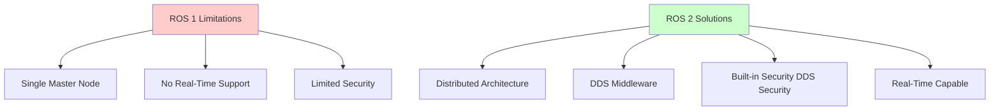

# Week 1: ROS 2 Basics - The Nervous System

## Learning Objectives

By the end of this week, you will be able to:
- ✅ Understand the fundamental concepts of ROS 2 (Robot Operating System 2)
- ✅ Install ROS 2 Humble on Ubuntu 22.04 or via Docker
- ✅ Create your first "Hello Robot" publisher and subscriber nodes
- ✅ Navigate the ROS 2 workspace structure
- ✅ Use basic ROS 2 command-line tools (ros2 node, ros2 topic, ros2 run)

## Introduction to ROS 2

ROS 2 (Robot Operating System 2) is the next generation of ROS, designed for production robotics systems. Unlike ROS 1, ROS 2 uses DDS (Data Distribution Service) for real-time communication and supports multi-robot systems, embedded platforms, and industrial applications.

### Why ROS 2?



### Key Concepts

1. **Nodes**: Independent processes that perform computation
2. **Topics**: Named buses for publishing/subscribing to messages
3. **Messages**: Data structures for communication between nodes
4. **QoS (Quality of Service)**: Reliability and performance policies

## Installation

import Tabs from '@theme/Tabs';
import TabItem from '@theme/TabItem';

<Tabs>
  <TabItem value="ubuntu" label="Ubuntu 22.04 (Native)" default>

### Prerequisites
```bash
# Ensure Ubuntu 22.04 (Jammy Jellyfish)
lsb_release -a

# Set locale
sudo apt update && sudo apt install locales
sudo locale-gen en_US en_US.UTF-8
sudo update-locale LC_ALL=en_US.UTF-8 LANG=en_US.UTF-8
export LANG=en_US.UTF-8
```

### Add ROS 2 Repository
```bash
# Add ROS 2 GPG key
sudo apt install software-properties-common
sudo add-apt-repository universe

sudo apt update && sudo apt install curl -y
sudo curl -sSL https://raw.githubusercontent.com/ros/rosdistro/master/ros.key -o /usr/share/keyrings/ros-archive-keyring.gpg

# Add repository to sources list
echo "deb [arch=$(dpkg --print-architecture) signed-by=/usr/share/keyrings/ros-archive-keyring.gpg] http://packages.ros.org/ros2/ubuntu $(. /etc/os-release && echo $UBUNTU_CODENAME) main" | sudo tee /etc/apt/sources.list.d/ros2.list > /dev/null
```

### Install ROS 2 Humble
```bash
# Update package list
sudo apt update
sudo apt upgrade

# Install ROS 2 Desktop (Recommended)
sudo apt install ros-humble-desktop

# Install development tools
sudo apt install ros-dev-tools
```

### Environment Setup
```bash
# Source ROS 2 environment
source /opt/ros/humble/setup.bash

# Add to .bashrc for automatic sourcing
echo "source /opt/ros/humble/setup.bash" >> ~/.bashrc
source ~/.bashrc
```

  </TabItem>
  <TabItem value="docker" label="Docker (Cross-Platform)">

### Dockerfile for ROS 2 Humble

Create a `Dockerfile`:

```dockerfile
FROM osrf/ros:humble-desktop

# Install additional tools
RUN apt-get update && apt-get install -y \\
    python3-pip \\
    vim \\
    tmux \\
    && rm -rf /var/lib/apt/lists/*

# Create workspace
RUN mkdir -p /ros2_ws/src
WORKDIR /ros2_ws

# Source ROS 2 in bashrc
RUN echo "source /opt/ros/humble/setup.bash" >> /root/.bashrc

CMD ["/bin/bash"]
```

### Build and Run

```bash
# Build image
docker build -t ros2-humble-dev .

# Run container with GUI support (Linux)
docker run -it --rm \\
  --net=host \\
  --env DISPLAY=$DISPLAY \\
  --volume /tmp/.X11-unix:/tmp/.X11-unix \\
  --volume $(pwd)/ros2_ws:/ros2_ws \\
  ros2-humble-dev

# Run container (Windows/Mac - no GUI)
docker run -it --rm \\
  --volume $(pwd)/ros2_ws:/ros2_ws \\
  ros2-humble-dev
```

  </TabItem>
  <TabItem value="jetson" label="Jetson Orin Nano (Edge)">

### JetPack 5.1.1 with ROS 2 Humble

The NVIDIA Jetson Orin Nano requires JetPack 5.1.1+ which is based on Ubuntu 20.04. ROS 2 Humble is officially supported on Ubuntu 22.04, so we'll use Docker:

```bash
# On Jetson Orin Nano

# Install Docker (if not already installed)
sudo apt-get update
sudo apt-get install docker.io
sudo systemctl start docker
sudo systemctl enable docker

# Add user to docker group
sudo usermod -aG docker $USER
newgrp docker

# Pull ROS 2 Humble ARM64 image
docker pull arm64v8/ros:humble

# Run ROS 2 container
docker run -it --rm \\
  --runtime nvidia \\
  --network host \\
  --device /dev/video0 \\
  -v /tmp/.X11-unix:/tmp/.X11-unix \\
  -e DISPLAY=$DISPLAY \\
  arm64v8/ros:humble
```

**Power Optimization for Edge:**
```bash
# Set Jetson to 15W mode for balance between performance and power
sudo nvpmodel -m 2

# Monitor power usage
sudo tegrastats
```

  </TabItem>
</Tabs>

## Verification

Test your ROS 2 installation:

```bash
# Check ROS 2 version
ros2 --version

# Run demo nodes (in separate terminals)
# Terminal 1: Talker
ros2 run demo_nodes_cpp talker

# Terminal 2: Listener
ros2 run demo_nodes_cpp listener
```

You should see messages being published and received!

## Your First ROS 2 Node: "Hello Robot"

Let's create a simple publisher-subscriber pair to understand ROS 2 fundamentals.

### Step 1: Create Workspace

```bash
# Create workspace
mkdir -p ~/ros2_ws/src
cd ~/ros2_ws/src
```

### Step 2: Create Package

<Tabs>
  <TabItem value="python" label="Python" default>

```bash
# Create Python package
ros2 pkg create --build-type ament_python hello_robot

cd hello_robot/hello_robot
```

**Publisher Node (`publisher.py`):**

```python
import rclpy
from rclpy.node import Node
from std_msgs.msg import String


class HelloPublisher(Node):
    def __init__(self):
        super().__init__('hello_publisher')
        self.publisher_ = self.create_publisher(String, 'robot_says', 10)
        self.timer = self.create_timer(1.0, self.timer_callback)
        self.count = 0
        self.get_logger().info('Hello Publisher started!')

    def timer_callback(self):
        msg = String()
        msg.data = f'Hello Robot! Count: {self.count}'
        self.publisher_.publish(msg)
        self.get_logger().info(f'Publishing: "{msg.data}"')
        self.count += 1


def main(args=None):
    rclpy.init(args=args)
    node = HelloPublisher()
    try:
        rclpy.spin(node)
    except KeyboardInterrupt:
        pass
    finally:
        node.destroy_node()
        rclpy.shutdown()


if __name__ == '__main__':
    main()
```

**Subscriber Node (`subscriber.py`):**

```python
import rclpy
from rclpy.node import Node
from std_msgs.msg import String


class HelloSubscriber(Node):
    def __init__(self):
        super().__init__('hello_subscriber')
        self.subscription = self.create_subscription(
            String,
            'robot_says',
            self.listener_callback,
            10
        )
        self.get_logger().info('Hello Subscriber started!')

    def listener_callback(self, msg):
        self.get_logger().info(f'I heard: "{msg.data}"')


def main(args=None):
    rclpy.init(args=args)
    node = HelloSubscriber()
    try:
        rclpy.spin(node)
    except KeyboardInterrupt:
        pass
    finally:
        node.destroy_node()
        rclpy.shutdown()


if __name__ == '__main__':
    main()
```

**Update `setup.py`:**

```python
entry_points={
    'console_scripts': [
        'hello_publisher = hello_robot.publisher:main',
        'hello_subscriber = hello_robot.subscriber:main',
    ],
},
```

  </TabItem>
  <TabItem value="cpp" label="C++">

```bash
# Create C++ package
ros2 pkg create --build-type ament_cmake hello_robot_cpp --dependencies rclcpp std_msgs

cd hello_robot_cpp/src
```

**Publisher Node (`publisher.cpp`):**

```cpp
#include <chrono>
#include <memory>
#include "rclcpp/rclcpp.hpp"
#include "std_msgs/msg/string.hpp"

using namespace std::chrono_literals;

class HelloPublisher : public rclcpp::Node
{
public:
    HelloPublisher() : Node("hello_publisher"), count_(0)
    {
        publisher_ = this->create_publisher<std_msgs::msg::String>("robot_says", 10);
        timer_ = this->create_wall_timer(
            1000ms, std::bind(&HelloPublisher::timer_callback, this));

        RCLCPP_INFO(this->get_logger(), "Hello Publisher started!");
    }

private:
    void timer_callback()
    {
        auto message = std_msgs::msg::String();
        message.data = "Hello Robot! Count: " + std::to_string(count_++);
        publisher_->publish(message);
        RCLCPP_INFO(this->get_logger(), "Publishing: '%s'", message.data.c_str());
    }

    rclcpp::Publisher<std_msgs::msg::String>::SharedPtr publisher_;
    rclcpp::TimerBase::SharedPtr timer_;
    size_t count_;
};

int main(int argc, char * argv[])
{
    rclcpp::init(argc, argv);
    rclcpp::spin(std::make_shared<HelloPublisher>());
    rclcpp::shutdown();
    return 0;
}
```

**Subscriber Node (`subscriber.cpp`):**

```cpp
#include <memory>
#include "rclcpp/rclcpp.hpp"
#include "std_msgs/msg/string.hpp"

class HelloSubscriber : public rclcpp::Node
{
public:
    HelloSubscriber() : Node("hello_subscriber")
    {
        subscription_ = this->create_subscription<std_msgs::msg::String>(
            "robot_says", 10,
            std::bind(&HelloSubscriber::topic_callback, this, std::placeholders::_1));

        RCLCPP_INFO(this->get_logger(), "Hello Subscriber started!");
    }

private:
    void topic_callback(const std_msgs::msg::String::SharedPtr msg) const
    {
        RCLCPP_INFO(this->get_logger(), "I heard: '%s'", msg->data.c_str());
    }

    rclcpp::Subscription<std_msgs::msg::String>::SharedPtr subscription_;
};

int main(int argc, char * argv[])
{
    rclcpp::init(argc, argv);
    rclcpp::spin(std::make_shared<HelloSubscriber>());
    rclcpp::shutdown();
    return 0;
}
```

**Update `CMakeLists.txt`:**

```cmake
add_executable(hello_publisher src/publisher.cpp)
ament_target_dependencies(hello_publisher rclcpp std_msgs)

add_executable(hello_subscriber src/subscriber.cpp)
ament_target_dependencies(hello_subscriber rclcpp std_msgs)

install(TARGETS
  hello_publisher
  hello_subscriber
  DESTINATION lib/${PROJECT_NAME}
)
```

  </TabItem>
</Tabs>

### Step 3: Build and Run

```bash
# Navigate to workspace root
cd ~/ros2_ws

# Build
colcon build --packages-select hello_robot

# Source workspace
source install/setup.bash

# Run publisher (Terminal 1)
ros2 run hello_robot hello_publisher

# Run subscriber (Terminal 2)
ros2 run hello_robot hello_subscriber
```

## ROS 2 Command-Line Tools

Essential tools for debugging and monitoring:

```bash
# List active nodes
ros2 node list

# Get info about a node
ros2 node info /hello_publisher

# List topics
ros2 topic list

# Echo topic messages
ros2 topic echo /robot_says

# Show topic info
ros2 topic info /robot_says

# Visualize node graph
rqt_graph
```

## Architecture Diagram

```mermaid
graph LR
    A[hello_publisher Node] -->|publishes| B[/robot_says Topic]
    B -->|subscribes| C[hello_subscriber Node]

    style A fill:#e1f5ff
    style B fill:#fff9c4
    style C fill:#f3e5f5
```

## Hardware Considerations

<Tabs>
  <TabItem value="rtx4090" label="RTX 4090 (Simulation)" default>

**Advantages:**
- High compute power for complex simulations
- Run multiple Gazebo instances simultaneously
- Real-time rendering with graphics acceleration
- Perfect for training ML models

**ROS 2 Configuration:**
```bash
# No special configuration needed
# Full ROS 2 Desktop installation works out of the box
```

  </TabItem>
  <TabItem value="jetson" label="Jetson Orin Nano (Edge)">

**Advantages:**
- Low power consumption (5-15W)
- Portable for real robot deployment
- CUDA acceleration available
- Perfect for edge inference

**ROS 2 Optimization:**
```python
# Use QoS profiles for reliability on edge networks
from rclpy.qos import QoSProfile, ReliabilityPolicy, DurabilityPolicy

qos_profile = QoSProfile(
    reliability=ReliabilityPolicy.BEST_EFFORT,  # Lower latency
    durability=DurabilityPolicy.VOLATILE,      # No message caching
    depth=1                                     # Minimal queue
)

self.publisher_ = self.create_publisher(
    String,
    'robot_says',
    qos_profile
)
```

  </TabItem>
</Tabs>

## Key Takeaways

- ✅ ROS 2 uses a distributed architecture with DDS middleware
- ✅ Nodes communicate via topics using publish-subscribe pattern
- ✅ Python and C++ are both fully supported
- ✅ Edge hardware (Jetson) and simulation hardware (RTX) have different optimization strategies
- ✅ ROS 2 command-line tools are essential for debugging

## Next Steps

In **Week 2**, we'll dive deeper into:
- ROS 2 Topics architecture
- Custom message types
- Publisher-Subscriber patterns
- Topic remapping and namespaces

## Resources

- [ROS 2 Humble Documentation](https://docs.ros.org/en/humble/)
- [ROS 2 Tutorials](https://docs.ros.org/en/humble/Tutorials.html)
- [DDS Specification](https://www.dds-foundation.org/)
- [NVIDIA Isaac ROS](https://nvidia-isaac-ros.github.io/)

---

**🎓 Quiz**: Test your understanding in the [Week 1 Quiz](./quiz.md)
**💻 Challenge**: Try the [Hello Robot Challenge](./challenge.md)
