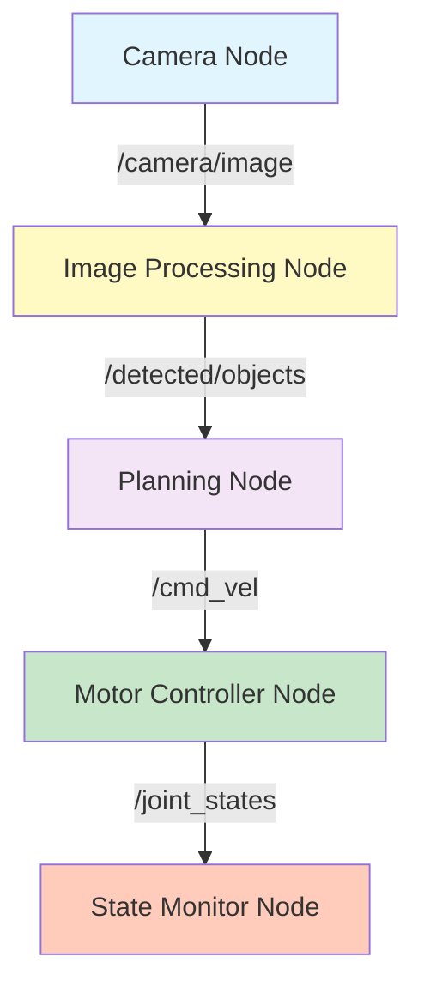
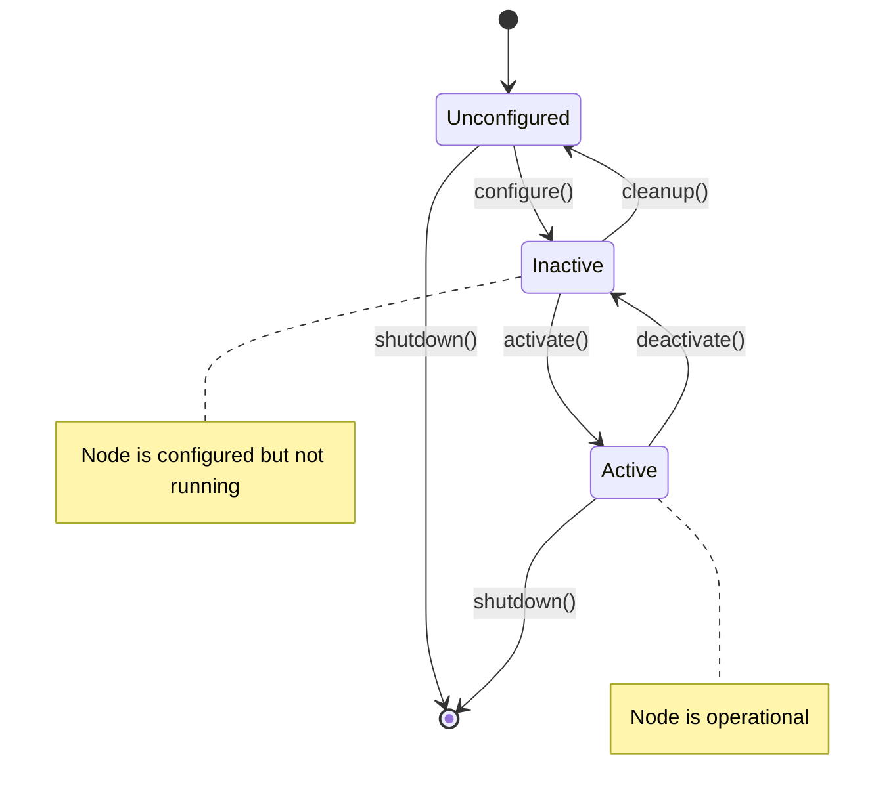

# Week 2: ROS 2 Nodes & Topics - Communication Architecture

## Learning Objectives

By the end of this week, you will be able to:
- ✅ Understand the ROS 2 node architecture and lifecycle
- ✅ Create custom message types for inter-node communication
- ✅ Implement multiple publishers and subscribers in a single node
- ✅ Use Quality of Service (QoS) policies for reliable communication
- ✅ Debug topic communication using ROS 2 command-line tools

## Introduction to Nodes & Topics

Nodes and Topics form the backbone of ROS 2's distributed communication system. A **node** is an independent process that performs computation, while **topics** are named buses over which nodes exchange messages using a publish-subscribe pattern.

### ROS 2 Communication Architecture



### Key Concepts

1. **Nodes**: Independent processes with unique names
2. **Topics**: Named channels for asynchronous message passing
3. **Messages**: Strongly-typed data structures
4. **QoS Policies**: Reliability, durability, and history settings
5. **Discovery**: Automatic peer-to-peer node discovery via DDS

## Node Lifecycle

import Tabs from '@theme/Tabs';
import TabItem from '@theme/TabItem';



## Custom Message Types

### Step 1: Define Custom Message

Create a `msg/` directory in your package:

```bash
cd ~/ros2_ws/src/my_robot_interfaces
mkdir msg
```

**msg/SensorReading.msg**:
```
# Custom message for sensor data
std_msgs/Header header
float64 temperature
float64 humidity
float64 pressure
string sensor_id
```

### Step 2: Update Package Configuration

<Tabs>
  <TabItem value="python" label="Python (setup.py)" default>

```python
from setuptools import setup

package_name = 'my_robot_interfaces'

setup(
    name=package_name,
    version='0.0.1',
    packages=[package_name],
    data_files=[
        ('share/ament_index/resource_index/packages',
            ['resource/' + package_name]),
        ('share/' + package_name, ['package.xml']),
    ],
    install_requires=['setuptools'],
    zip_safe=True,
    maintainer='Your Name',
    maintainer_email='your.email@example.com',
    description='Custom ROS 2 interfaces',
    license='Apache License 2.0',
    tests_require=['pytest'],
)
```

**package.xml** additions:
```xml
<buildtool_depend>rosidl_default_generators</buildtool_depend>
<exec_depend>rosidl_default_runtime</exec_depend>
<member_of_group>rosidl_interface_packages</member_of_group>
```

  </TabItem>
  <TabItem value="cpp" label="C++ (CMakeLists.txt)">

```cmake
cmake_minimum_required(VERSION 3.8)
project(my_robot_interfaces)

# Find dependencies
find_package(ament_cmake REQUIRED)
find_package(std_msgs REQUIRED)
find_package(rosidl_default_generators REQUIRED)

# Generate interfaces
rosidl_generate_interfaces(${PROJECT_NAME}
  "msg/SensorReading.msg"
  DEPENDENCIES std_msgs
)

ament_export_dependencies(rosidl_default_runtime)
ament_package()
```

  </TabItem>
</Tabs>

### Step 3: Build and Source

```bash
cd ~/ros2_ws
colcon build --packages-select my_robot_interfaces
source install/setup.bash

# Verify message generation
ros2 interface show my_robot_interfaces/msg/SensorReading
```

## Multi-Publisher Node Example

<Tabs>
  <TabItem value="python" label="Python" default>

**multi_publisher.py**:
```python
import rclpy
from rclpy.node import Node
from std_msgs.msg import String
from my_robot_interfaces.msg import SensorReading
from builtin_interfaces.msg import Time
import random

class MultiPublisher(Node):
    def __init__(self):
        super().__init__('multi_publisher')

        # Create multiple publishers
        self.status_pub = self.create_publisher(String, 'robot_status', 10)
        self.sensor_pub = self.create_publisher(SensorReading, 'sensor_data', 10)

        # Create timers for different publish rates
        self.status_timer = self.create_timer(1.0, self.publish_status)  # 1 Hz
        self.sensor_timer = self.create_timer(0.1, self.publish_sensor)  # 10 Hz

        self.counter = 0
        self.get_logger().info('Multi-publisher node started')

    def publish_status(self):
        msg = String()
        msg.data = f'Robot operational - Cycle {self.counter}'
        self.status_pub.publish(msg)
        self.get_logger().info(f'Status: {msg.data}')
        self.counter += 1

    def publish_sensor(self):
        msg = SensorReading()
        msg.header.stamp = self.get_clock().now().to_msg()
        msg.header.frame_id = 'sensor_frame'
        msg.temperature = 25.0 + random.uniform(-2.0, 2.0)
        msg.humidity = 60.0 + random.uniform(-5.0, 5.0)
        msg.pressure = 1013.25 + random.uniform(-10.0, 10.0)
        msg.sensor_id = 'DHT22_01'

        self.sensor_pub.publish(msg)

def main(args=None):
    rclpy.init(args=args)
    node = MultiPublisher()
    try:
        rclpy.spin(node)
    except KeyboardInterrupt:
        pass
    finally:
        node.destroy_node()
        rclpy.shutdown()

if __name__ == '__main__':
    main()
```

  </TabItem>
  <TabItem value="cpp" label="C++">

**multi_publisher.cpp**:
```cpp
#include <chrono>
#include <memory>
#include <random>
#include "rclcpp/rclcpp.hpp"
#include "std_msgs/msg/string.hpp"
#include "my_robot_interfaces/msg/sensor_reading.hpp"

using namespace std::chrono_literals;

class MultiPublisher : public rclcpp::Node
{
public:
    MultiPublisher() : Node("multi_publisher"), counter_(0)
    {
        // Create multiple publishers
        status_pub_ = this->create_publisher<std_msgs::msg::String>("robot_status", 10);
        sensor_pub_ = this->create_publisher<my_robot_interfaces::msg::SensorReading>("sensor_data", 10);

        // Create timers for different publish rates
        status_timer_ = this->create_wall_timer(
            1000ms, std::bind(&MultiPublisher::publish_status, this));
        sensor_timer_ = this->create_wall_timer(
            100ms, std::bind(&MultiPublisher::publish_sensor, this));

        RCLCPP_INFO(this->get_logger(), "Multi-publisher node started");
    }

private:
    void publish_status()
    {
        auto msg = std_msgs::msg::String();
        msg.data = "Robot operational - Cycle " + std::to_string(counter_++);
        status_pub_->publish(msg);
        RCLCPP_INFO(this->get_logger(), "Status: %s", msg.data.c_str());
    }

    void publish_sensor()
    {
        auto msg = my_robot_interfaces::msg::SensorReading();
        msg.header.stamp = this->get_clock()->now();
        msg.header.frame_id = "sensor_frame";
        msg.temperature = 25.0 + random_double(-2.0, 2.0);
        msg.humidity = 60.0 + random_double(-5.0, 5.0);
        msg.pressure = 1013.25 + random_double(-10.0, 10.0);
        msg.sensor_id = "DHT22_01";

        sensor_pub_->publish(msg);
    }

    double random_double(double min, double max)
    {
        static std::random_device rd;
        static std::mt19937 gen(rd());
        std::uniform_real_distribution<> dis(min, max);
        return dis(gen);
    }

    rclcpp::Publisher<std_msgs::msg::String>::SharedPtr status_pub_;
    rclcpp::Publisher<my_robot_interfaces::msg::SensorReading>::SharedPtr sensor_pub_;
    rclcpp::TimerBase::SharedPtr status_timer_;
    rclcpp::TimerBase::SharedPtr sensor_timer_;
    size_t counter_;
};

int main(int argc, char * argv[])
{
    rclcpp::init(argc, argv);
    rclcpp::spin(std::make_shared<MultiPublisher>());
    rclcpp::shutdown();
    return 0;
}
```

  </TabItem>
</Tabs>

## Quality of Service (QoS) Policies

QoS policies control message delivery behavior for reliability and performance:

```python
from rclpy.qos import QoSProfile, ReliabilityPolicy, DurabilityPolicy, HistoryPolicy

# Sensor data QoS (best effort, volatile)
sensor_qos = QoSProfile(
    reliability=ReliabilityPolicy.BEST_EFFORT,  # Don't wait for acknowledgment
    durability=DurabilityPolicy.VOLATILE,       # No late-joiner support
    history=HistoryPolicy.KEEP_LAST,
    depth=1                                      # Only latest message
)

# Command QoS (reliable, transient local)
command_qos = QoSProfile(
    reliability=ReliabilityPolicy.RELIABLE,     # Ensure delivery
    durability=DurabilityPolicy.TRANSIENT_LOCAL, # Late-joiners get last message
    history=HistoryPolicy.KEEP_LAST,
    depth=10
)

self.sensor_pub = self.create_publisher(SensorReading, 'sensor_data', sensor_qos)
self.command_pub = self.create_publisher(String, 'robot_commands', command_qos)
```

### QoS Policy Comparison

| Policy | Sensor Data | Control Commands | Critical Safety |
|--------|-------------|------------------|-----------------|
| Reliability | BEST_EFFORT | RELIABLE | RELIABLE |
| Durability | VOLATILE | TRANSIENT_LOCAL | TRANSIENT_LOCAL |
| History | KEEP_LAST (1) | KEEP_LAST (10) | KEEP_ALL |
| Latency | Low | Medium | High |

## Debugging Tools

### Topic Inspection

```bash
# List all active topics
ros2 topic list

# Show topic info (type, publishers, subscribers)
ros2 topic info /sensor_data

# Echo messages
ros2 topic echo /sensor_data

# Show message rate
ros2 topic hz /sensor_data

# Bandwidth usage
ros2 topic bw /sensor_data

# Publish test message
ros2 topic pub /robot_commands std_msgs/msg/String "{data: 'test'}"
```

### Node Inspection

```bash
# List all nodes
ros2 node list

# Show node info
ros2 node info /multi_publisher

# Kill a node
ros2 lifecycle set /my_node shutdown
```

### Visualization

```bash
# Visualize node graph
rqt_graph

# Topic monitor
rqt_topic

# Message plot
rqt_plot /sensor_data/temperature /sensor_data/humidity
```

## Hardware Considerations

<Tabs>
  <TabItem value="rtx4090" label="RTX 4090 (Simulation)" default>

**Advantages:**
- Handle hundreds of nodes simultaneously
- Complex message types with large payloads
- High-frequency publishing (1000+ Hz possible)
- Extensive logging and debugging

**Configuration:**
```python
# No special configuration needed
# Can use default QoS with RELIABLE + KEEP_ALL
qos = QoSProfile(depth=100)  # Large history buffer
```

  </TabItem>
  <TabItem value="jetson" label="Jetson Orin Nano (Edge)">

**Advantages:**
- Low latency for real-time control
- Power-efficient for mobile robots
- Integrated GPU for sensor processing

**Optimization:**
```python
# Use BEST_EFFORT for high-frequency sensor data
from rclpy.qos import QoSProfile, ReliabilityPolicy

edge_qos = QoSProfile(
    reliability=ReliabilityPolicy.BEST_EFFORT,
    depth=1  # Minimize memory usage
)

# Reduce publish frequency for non-critical data
self.timer = self.create_timer(0.5, self.callback)  # 2 Hz instead of 10 Hz
```

**Power Management:**
```bash
# Monitor node CPU usage
top -p $(pgrep -f multi_publisher)

# Set CPU frequency scaling
sudo nvpmodel -m 2  # 15W mode for balance
```

  </TabItem>
</Tabs>

## Key Takeaways

- ✅ Nodes are independent processes with unique names in the ROS 2 graph
- ✅ Topics enable asynchronous, many-to-many communication via pub-sub pattern
- ✅ Custom messages require rosidl_default_generators and proper package configuration
- ✅ QoS policies control reliability, durability, and history behavior
- ✅ Multiple publishers/subscribers can coexist in a single node
- ✅ ROS 2 CLI tools (topic, node, interface) are essential for debugging

## Next Steps

In **Week 3**, we'll explore:
- URDF robot modeling and visualization
- TF2 coordinate frame transformations
- Robot state publisher
- Gazebo integration

## Resources

- [ROS 2 Topic Concepts](https://docs.ros.org/en/humble/Concepts/About-Topics.html)
- [Custom Message Interfaces](https://docs.ros.org/en/humble/Tutorials/Beginner-Client-Libraries/Custom-ROS2-Interfaces.html)
- [QoS Policies Guide](https://docs.ros.org/en/humble/Concepts/About-Quality-of-Service-Settings.html)
- [rclpy API Documentation](https://docs.ros2.org/humble/api/rclpy/)

---

**🎓 Quiz**: Test your understanding in the [Week 2 Quiz](./quiz.md)
**💻 Challenge**: Try the [Multi-Node System Challenge](./challenge.md)
