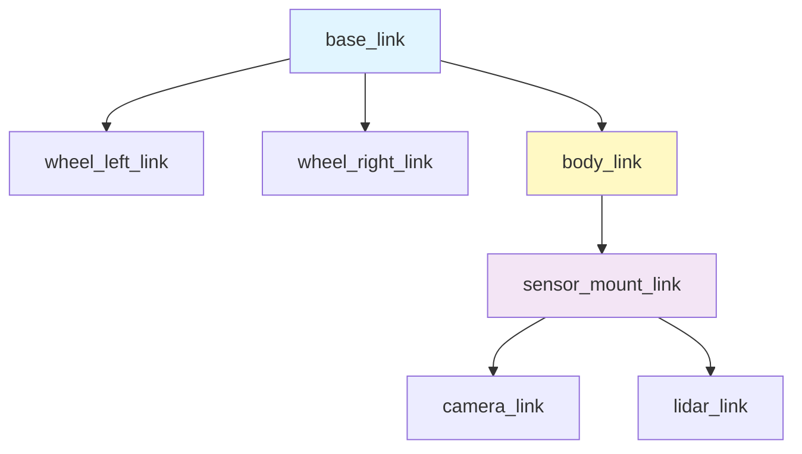

# Week 3: URDF Robot Modeling - Digital Robot Description

## Learning Objectives

By the end of this week, you will be able to:
- ✅ Understand the URDF (Unified Robot Description Format) specification
- ✅ Create robot models with links, joints, and collision/visual geometry
- ✅ Use Xacro for parametric robot descriptions
- ✅ Visualize robots in RViz2
- ✅ Publish robot state to TF2 coordinate frames

## Introduction to URDF

URDF (Unified Robot Description Format) is an XML specification for describing robot geometry, kinematics, dynamics, and visual properties. It's the standard format for defining robots in ROS.

### Robot Model Structure



## Basic URDF Example

import Tabs from '@theme/Tabs';
import TabItem from '@theme/TabItem';

### Simple Two-Wheel Robot

**my_robot.urdf**:
```xml
<?xml version="1.0"?>
<robot name="my_robot">
  <!-- Base Link -->
  <link name="base_link">
    <visual>
      <geometry>
        <box size="0.6 0.4 0.2"/>
      </geometry>
      <material name="blue">
        <color rgba="0 0 0.8 1"/>
      </material>
    </visual>
    <collision>
      <geometry>
        <box size="0.6 0.4 0.2"/>
      </geometry>
    </collision>
    <inertial>
      <mass value="10.0"/>
      <inertia ixx="0.1" ixy="0" ixz="0" iyy="0.1" iyz="0" izz="0.1"/>
    </inertial>
  </link>

  <!-- Left Wheel -->
  <link name="wheel_left">
    <visual>
      <geometry>
        <cylinder radius="0.1" length="0.05"/>
      </geometry>
      <material name="black">
        <color rgba="0 0 0 1"/>
      </material>
    </visual>
    <collision>
      <geometry>
        <cylinder radius="0.1" length="0.05"/>
      </geometry>
    </collision>
    <inertial>
      <mass value="1.0"/>
      <inertia ixx="0.01" ixy="0" ixz="0" iyy="0.01" iyz="0" izz="0.01"/>
    </inertial>
  </link>

  <!-- Joint connecting base to left wheel -->
  <joint name="base_to_wheel_left" type="continuous">
    <parent link="base_link"/>
    <child link="wheel_left"/>
    <origin xyz="0 0.25 -0.1" rpy="-1.5708 0 0"/>
    <axis xyz="0 0 1"/>
  </joint>

  <!-- Right Wheel (similar structure) -->
  <link name="wheel_right">
    <visual>
      <geometry>
        <cylinder radius="0.1" length="0.05"/>
      </geometry>
      <material name="black">
        <color rgba="0 0 0 1"/>
      </material>
    </visual>
    <collision>
      <geometry>
        <cylinder radius="0.1" length="0.05"/>
      </geometry>
    </collision>
    <inertial>
      <mass value="1.0"/>
      <inertia ixx="0.01" ixy="0" ixz="0" iyy="0.01" iyz="0" izz="0.01"/>
    </inertial>
  </link>

  <joint name="base_to_wheel_right" type="continuous">
    <parent link="base_link"/>
    <child link="wheel_right"/>
    <origin xyz="0 -0.25 -0.1" rpy="-1.5708 0 0"/>
    <axis xyz="0 0 1"/>
  </joint>
</robot>
```

## Xacro - Parametric URDF

Xacro (XML Macros) eliminates URDF redundancy through variables, math, and macros:

**my_robot.urdf.xacro**:
```xml
<?xml version="1.0"?>
<robot xmlns:xacro="http://www.ros.org/wiki/xacro" name="my_robot">
  <!-- Properties -->
  <xacro:property name="wheel_radius" value="0.1"/>
  <xacro:property name="wheel_width" value="0.05"/>
  <xacro:property name="wheel_mass" value="1.0"/>
  <xacro:property name="base_width" value="0.4"/>
  <xacro:property name="base_length" value="0.6"/>

  <!-- Wheel Macro -->
  <xacro:macro name="wheel" params="prefix reflect">
    <link name="wheel_${prefix}">
      <visual>
        <geometry>
          <cylinder radius="${wheel_radius}" length="${wheel_width}"/>
        </geometry>
        <material name="black">
          <color rgba="0 0 0 1"/>
        </material>
      </visual>
      <collision>
        <geometry>
          <cylinder radius="${wheel_radius}" length="${wheel_width}"/>
        </geometry>
      </collision>
      <xacro:inertial_cylinder mass="${wheel_mass}" length="${wheel_width}" radius="${wheel_radius}">
        <origin xyz="0 0 0" rpy="0 0 0"/>
      </xacro:inertial_cylinder>
    </link>

    <joint name="base_to_wheel_${prefix}" type="continuous">
      <parent link="base_link"/>
      <child link="wheel_${prefix}"/>
      <origin xyz="0 ${reflect * base_width / 2} ${-wheel_radius}" rpy="-1.5708 0 0"/>
      <axis xyz="0 0 1"/>
    </joint>
  </xacro:macro>

  <!-- Base Link -->
  <link name="base_link">
    <visual>
      <geometry>
        <box size="${base_length} ${base_width} 0.2"/>
      </geometry>
      <material name="blue">
        <color rgba="0 0 0.8 1"/>
      </material>
    </visual>
  </link>

  <!-- Instantiate Wheels -->
  <xacro:wheel prefix="left" reflect="1"/>
  <xacro:wheel prefix="right" reflect="-1"/>
</robot>
```

### Convert Xacro to URDF

```bash
# Install xacro
sudo apt install ros-humble-xacro

# Convert
xacro my_robot.urdf.xacro > my_robot.urdf

# Check validity
check_urdf my_robot.urdf
```

## Robot State Publisher

<Tabs>
  <TabItem value="python" label="Python Launch File" default>

**robot_state_publisher.launch.py**:
```python
import os
from ament_index_python.packages import get_package_share_directory
from launch import LaunchDescription
from launch_ros.actions import Node
import xacro

def generate_launch_description():
    # Get URDF file path
    pkg_path = os.path.join(get_package_share_directory('my_robot_description'))
    xacro_file = os.path.join(pkg_path, 'urdf', 'my_robot.urdf.xacro')

    # Process xacro
    robot_description = xacro.process_file(xacro_file).toxml()

    # Robot State Publisher node
    robot_state_publisher_node = Node(
        package='robot_state_publisher',
        executable='robot_state_publisher',
        output='screen',
        parameters=[{'robot_description': robot_description}]
    )

    # Joint State Publisher GUI (for manual control)
    joint_state_publisher_gui_node = Node(
        package='joint_state_publisher_gui',
        executable='joint_state_publisher_gui',
        output='screen'
    )

    return LaunchDescription([
        robot_state_publisher_node,
        joint_state_publisher_gui_node
    ])
```

  </TabItem>
  <TabItem value="xml" label="XML Launch File">

**robot_state_publisher.launch.xml**:
```xml
<launch>
  <let name="urdf_path"
       value="$(find-pkg-share my_robot_description)/urdf/my_robot.urdf.xacro"/>

  <node pkg="robot_state_publisher" exec="robot_state_publisher">
    <param name="robot_description"
           value="$(command 'xacro $(var urdf_path)')"/>
  </node>

  <node pkg="joint_state_publisher_gui" exec="joint_state_publisher_gui"/>
</launch>
```

  </TabItem>
</Tabs>

## Visualize in RViz2

```bash
# Launch robot state publisher
ros2 launch my_robot_description robot_state_publisher.launch.py

# In another terminal, launch RViz2
rviz2

# In RViz2:
# 1. Set Fixed Frame to "base_link"
# 2. Add -> RobotModel
# 3. Add -> TF (to see coordinate frames)
```

### TF2 Coordinate Frames

```bash
# View TF tree
ros2 run tf2_tools view_frames

# Echo transform
ros2 run tf2_ros tf2_echo base_link wheel_left

# Publish static transform
ros2 run tf2_ros static_transform_publisher 0 0 0.5 0 0 0 base_link camera_link
```

## Gazebo Integration

Add Gazebo plugins to your URDF/Xacro:

```xml
<gazebo>
  <plugin name="gazebo_ros2_control" filename="libgazebo_ros2_control.so">
    <parameters>$(find my_robot_description)/config/controllers.yaml</parameters>
  </plugin>
</gazebo>

<gazebo reference="wheel_left">
  <mu1>1.0</mu1>
  <mu2>1.0</mu2>
  <kp>1000000.0</kp>
  <kd>100.0</kd>
  <minDepth>0.001</minDepth>
  <maxVel>1.0</maxVel>
</gazebo>
```

## Hardware Considerations

<Tabs>
  <TabItem value="rtx4090" label="RTX 4090 (Simulation)" default>

**Advantages:**
- Render complex meshes with high polygon counts
- Simulate multiple robots simultaneously
- Real-time physics with detailed collision meshes

**Configuration:**
```xml
<!-- Use high-detail meshes -->
<visual>
  <geometry>
    <mesh filename="package://my_robot_description/meshes/body_hd.dae" scale="1 1 1"/>
  </geometry>
</visual>
```

  </TabItem>
  <TabItem value="jetson" label="Jetson Orin Nano (Edge)">

**Advantages:**
- Deploy URDF on real hardware
- Use robot_state_publisher for real-time TF broadcasting
- Lightweight visualization with simplified meshes

**Optimization:**
```xml
<!-- Use simplified collision meshes -->
<collision>
  <geometry>
    <box size="0.6 0.4 0.2"/>  <!-- Simple box instead of detailed mesh -->
  </geometry>
</collision>
```

```python
# Reduce TF broadcast rate
robot_state_publisher_node = Node(
    package='robot_state_publisher',
    executable='robot_state_publisher',
    parameters=[{
        'robot_description': robot_description,
        'publish_frequency': 10.0  # 10 Hz instead of 30 Hz
    }]
)
```

  </TabItem>
</Tabs>

## Key Takeaways

- ✅ URDF defines robot geometry, kinematics, and dynamics in XML format
- ✅ Xacro eliminates redundancy with variables, math, and macros
- ✅ Robot State Publisher broadcasts TF transforms based on joint states
- ✅ RViz2 visualizes robot models and coordinate frames
- ✅ Gazebo integration requires additional plugins and collision properties
- ✅ TF2 manages coordinate frame transformations

## Next Steps

In **Week 4**, we'll explore:
- ROS 2 Services for request-response communication
- ROS 2 Actions for long-running tasks with feedback
- Creating custom service and action definitions
- Client-server patterns

## Resources

- [URDF Specification](http://wiki.ros.org/urdf/XML)
- [Xacro Documentation](http://wiki.ros.org/xacro)
- [Robot State Publisher](https://github.com/ros/robot_state_publisher)
- [TF2 Tutorials](https://docs.ros.org/en/humble/Tutorials/Intermediate/Tf2/Tf2-Main.html)

---

**🎓 Quiz**: Test your understanding in the [Week 3 Quiz](./quiz.md)
**💻 Challenge**: Try the [Custom Robot Model Challenge](./challenge.md)
