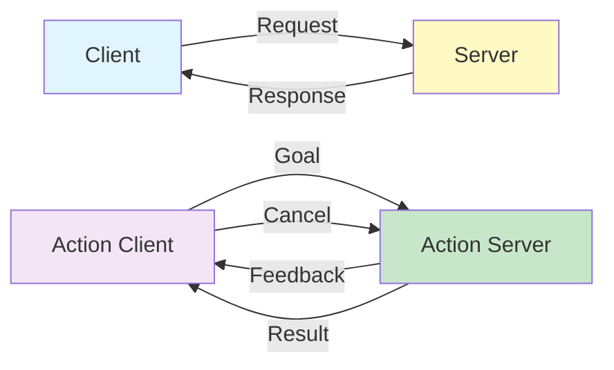

# Week 4: ROS 2 Services & Actions - Request-Response Communication

## Learning Objectives

By the end of this week, you will be able to:
- ✅ Understand the difference between topics, services, and actions
- ✅ Create custom service definitions
- ✅ Implement service servers and clients
- ✅ Create custom action definitions
- ✅ Implement action servers with feedback and cancellation

## Introduction

While **topics** provide asynchronous, many-to-many communication, **services** and **actions** enable synchronous request-response patterns:

- **Services**: Quick, one-time requests (e.g., "What's your battery level?")
- **Actions**: Long-running tasks with feedback (e.g., "Navigate to goal")



## Custom Service Definition

**srv/AddTwoInts.srv**:
```
int64 a
int64 b
---
int64 sum
```

## Service Server Implementation

import Tabs from '@theme/Tabs';
import TabItem from '@theme/TabItem';

<Tabs>
  <TabItem value="python" label="Python" default>

**add_two_ints_server.py**:
```python
import rclpy
from rclpy.node import Node
from example_interfaces.srv import AddTwoInts

class AddTwoIntsServer(Node):
    def __init__(self):
        super().__init__('add_two_ints_server')
        self.srv = self.create_service(
            AddTwoInts,
            'add_two_ints',
            self.add_two_ints_callback
        )
        self.get_logger().info('Add Two Ints Server ready')

    def add_two_ints_callback(self, request, response):
        response.sum = request.a + request.b
        self.get_logger().info(f'Request: {request.a} + {request.b} = {response.sum}')
        return response

def main(args=None):
    rclpy.init(args=args)
    node = AddTwoIntsServer()
    rclpy.spin(node)
    rclpy.shutdown()
```

  </TabItem>
  <TabItem value="cpp" label="C++">

**add_two_ints_server.cpp**:
```cpp
#include "rclcpp/rclcpp.hpp"
#include "example_interfaces/srv/add_two_ints.hpp"

class AddTwoIntsServer : public rclcpp::Node
{
public:
    AddTwoIntsServer() : Node("add_two_ints_server")
    {
        service_ = this->create_service<example_interfaces::srv::AddTwoInts>(
            "add_two_ints",
            std::bind(&AddTwoIntsServer::add, this, std::placeholders::_1, std::placeholders::_2));
        RCLCPP_INFO(this->get_logger(), "Add Two Ints Server ready");
    }

private:
    void add(
        const std::shared_ptr<example_interfaces::srv::AddTwoInts::Request> request,
        std::shared_ptr<example_interfaces::srv::AddTwoInts::Response> response)
    {
        response->sum = request->a + request->b;
        RCLCPP_INFO(this->get_logger(), "Request: %ld + %ld = %ld",
                    request->a, request->b, response->sum);
    }

    rclcpp::Service<example_interfaces::srv::AddTwoInts>::SharedPtr service_;
};

int main(int argc, char **argv)
{
    rclcpp::init(argc, argv);
    rclcpp::spin(std::make_shared<AddTwoIntsServer>());
    rclcpp::shutdown();
    return 0;
}
```

  </TabItem>
</Tabs>

## Service Client

<Tabs>
  <TabItem value="python" label="Python" default>

```python
import rclpy
from rclpy.node import Node
from example_interfaces.srv import AddTwoInts

class AddTwoIntsClient(Node):
    def __init__(self):
        super().__init__('add_two_ints_client')
        self.client = self.create_client(AddTwoInts, 'add_two_ints')

        # Wait for service to be available
        while not self.client.wait_for_service(timeout_sec=1.0):
            self.get_logger().info('Service not available, waiting...')

    def send_request(self, a, b):
        request = AddTwoInts.Request()
        request.a = a
        request.b = b

        future = self.client.call_async(request)
        rclpy.spin_until_future_complete(self, future)

        if future.result() is not None:
            self.get_logger().info(f'Result: {future.result().sum}')
            return future.result().sum
        else:
            self.get_logger().error('Service call failed')
            return None

def main(args=None):
    rclpy.init(args=args)
    client = AddTwoIntsClient()
    result = client.send_request(5, 7)
    client.destroy_node()
    rclpy.shutdown()
```

  </TabItem>
</Tabs>

## Custom Action Definition

**action/Fibonacci.action**:
```
# Goal
int32 order
---
# Result
int32[] sequence
---
# Feedback
int32[] partial_sequence
```

## Action Server Implementation

```python
import rclpy
from rclpy.action import ActionServer
from rclpy.node import Node
from example_interfaces.action import Fibonacci
import time

class FibonacciActionServer(Node):
    def __init__(self):
        super().__init__('fibonacci_action_server')
        self._action_server = ActionServer(
            self,
            Fibonacci,
            'fibonacci',
            self.execute_callback
        )

    def execute_callback(self, goal_handle):
        self.get_logger().info('Executing goal...')

        feedback_msg = Fibonacci.Feedback()
        feedback_msg.partial_sequence = [0, 1]

        for i in range(1, goal_handle.request.order):
            feedback_msg.partial_sequence.append(
                feedback_msg.partial_sequence[i] + feedback_msg.partial_sequence[i-1]
            )
            self.get_logger().info(f'Feedback: {feedback_msg.partial_sequence}')
            goal_handle.publish_feedback(feedback_msg)
            time.sleep(1)

        goal_handle.succeed()
        result = Fibonacci.Result()
        result.sequence = feedback_msg.partial_sequence
        return result
```

## Action Client with Cancel

```python
from rclpy.action import ActionClient

class FibonacciActionClient(Node):
    def __init__(self):
        super().__init__('fibonacci_action_client')
        self._action_client = ActionClient(self, Fibonacci, 'fibonacci')

    def send_goal(self, order):
        goal_msg = Fibonacci.Goal()
        goal_msg.order = order

        self._action_client.wait_for_server()
        self._send_goal_future = self._action_client.send_goal_async(
            goal_msg, feedback_callback=self.feedback_callback
        )
        self._send_goal_future.add_done_callback(self.goal_response_callback)

    def feedback_callback(self, feedback_msg):
        feedback = feedback_msg.feedback
        self.get_logger().info(f'Received feedback: {feedback.partial_sequence}')

    def goal_response_callback(self, future):
        goal_handle = future.result()
        if not goal_handle.accepted:
            self.get_logger().info('Goal rejected')
            return

        self.get_logger().info('Goal accepted')
        self._get_result_future = goal_handle.get_result_async()
        self._get_result_future.add_done_callback(self.get_result_callback)

    def get_result_callback(self, future):
        result = future.result().result
        self.get_logger().info(f'Result: {result.sequence}')
```

## Hardware Considerations

<Tabs>
  <TabItem value="rtx4090" label="RTX 4090 (Simulation)" default>

**Use Cases:**
- Complex inverse kinematics services
- High-frequency action feedback (100 Hz)
- Multiple concurrent actions

  </TabItem>
  <TabItem value="jetson" label="Jetson Orin Nano (Edge)">

**Optimization:**
- Reduce action feedback frequency (10 Hz)
- Use services for quick queries
- Implement cancellation for battery conservation

  </TabItem>
</Tabs>

## Key Takeaways

- ✅ Services provide synchronous request-response communication
- ✅ Actions support long-running tasks with feedback and cancellation
- ✅ Custom definitions require .srv and .action files
- ✅ Clients can cancel actions mid-execution
- ✅ Use services for quick queries, actions for processes

## Resources

- [ROS 2 Services Tutorial](https://docs.ros.org/en/humble/Tutorials/Beginner-Client-Libraries/Writing-A-Simple-Py-Service-And-Client.html)
- [ROS 2 Actions Tutorial](https://docs.ros.org/en/humble/Tutorials/Intermediate/Writing-an-Action-Server-Client/Py.html)

---

**🎓 Quiz**: [Week 4 Quiz](./quiz.md)
**💻 Challenge**: [Service & Action Challenge](./challenge.md)
