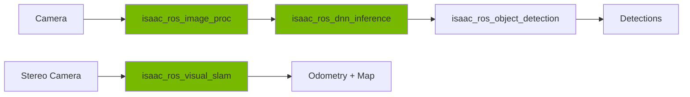

# Week 9: Isaac ROS - Hardware-Accelerated Perception

## Learning Objectives

By the end of this week, you will be able to:
- ✅ Install and configure Isaac ROS packages
- ✅ Use hardware-accelerated perception pipelines
- ✅ Implement AprilTag detection for localization
- ✅ Deploy visual SLAM with NVIDIA accelerated stereo
- ✅ Optimize perception workloads for Jetson and RTX GPUs

## Introduction to Isaac ROS

Isaac ROS provides GPU-accelerated ROS 2 packages for perception, featuring 10-100x speedups over CPU implementations.

**Key Packages:**
- `isaac_ros_apriltag` - AprilTag detection
- `isaac_ros_visual_slam` - Visual odometry and SLAM
- `isaac_ros_image_proc` - GPU image processing
- `isaac_ros_dnn_inference` - Deep learning inference
- `isaac_ros_object_detection` - Object detection



## Installation

import Tabs from '@theme/Tabs';
import TabItem from '@theme/TabItem';

### Docker-Based Installation (Recommended)

<Tabs>
  <TabItem value="x86" label="x86_64 (RTX GPU)" default>

```bash
# Clone Isaac ROS Common
cd ~/workspaces
git clone https://github.com/NVIDIA-ISAAC-ROS/isaac_ros_common.git

# Build Docker image
cd isaac_ros_common
./scripts/run_dev.sh

# Inside Docker container
cd /workspaces/isaac_ros-dev
colcon build --symlink-install
source install/setup.bash
```

  </TabItem>
  <TabItem value="jetson" label="Jetson (ARM64)">

```bash
# Install JetPack 5.1.1
sudo apt install nvidia-jetpack

# Clone Isaac ROS Common
cd ~/workspaces
git clone https://github.com/NVIDIA-ISAAC-ROS/isaac_ros_common.git

# Build for Jetson
cd isaac_ros_common
./scripts/run_dev.sh --platform jetson

# Build packages
cd /workspaces/isaac_ros-dev
colcon build --symlink-install --packages-up-to isaac_ros_apriltag
```

  </TabItem>
</Tabs>

## AprilTag Detection

### Install isaac_ros_apriltag

```bash
# Clone repository
cd /workspaces/isaac_ros-dev/src
git clone https://github.com/NVIDIA-ISAAC-ROS/isaac_ros_apriltag.git

# Build
cd /workspaces/isaac_ros-dev
colcon build --packages-select isaac_ros_apriltag
source install/setup.bash
```

### Launch AprilTag Detection

<Tabs>
  <TabItem value="realsense" label="RealSense Camera" default>

```bash
# Install RealSense ROS 2
sudo apt install ros-humble-realsense2-camera

# Launch camera
ros2 launch realsense2_camera rs_launch.py

# Launch AprilTag detector
ros2 launch isaac_ros_apriltag isaac_ros_apriltag.launch.py
```

  </TabItem>
  <TabItem value="custom" label="Custom Camera">

**apriltag_detection.launch.py**:
```python
from launch import LaunchDescription
from launch_ros.actions import Node

def generate_launch_description():
    apriltag_node = Node(
        package='isaac_ros_apriltag',
        executable='isaac_ros_apriltag',
        parameters=[{
            'size': 0.162,  # Tag size in meters
            'max_tags': 64,
            'tile_size': 4,
            'family': '36h11'  # AprilTag family
        }],
        remappings=[
            ('image', '/camera/image_raw'),
            ('camera_info', '/camera/camera_info')
        ]
    )

    return LaunchDescription([apriltag_node])
```

  </TabItem>
</Tabs>

### Subscribe to Detections

```python
import rclpy
from rclpy.node import Node
from isaac_ros_apriltag_interfaces.msg import AprilTagDetectionArray

class AprilTagListener(Node):
    def __init__(self):
        super().__init__('apriltag_listener')
        self.subscription = self.create_subscription(
            AprilTagDetectionArray,
            'tag_detections',
            self.detection_callback,
            10
        )

    def detection_callback(self, msg):
        for detection in msg.detections:
            self.get_logger().info(
                f'Tag ID: {detection.id}, '
                f'Position: ({detection.pose.pose.pose.position.x:.2f}, '
                f'{detection.pose.pose.pose.position.y:.2f}, '
                f'{detection.pose.pose.pose.position.z:.2f})'
            )

def main(args=None):
    rclpy.init(args=args)
    node = AprilTagListener()
    rclpy.spin(node)
```

## Visual SLAM

### Install isaac_ros_visual_slam

```bash
cd /workspaces/isaac_ros-dev/src
git clone https://github.com/NVIDIA-ISAAC-ROS/isaac_ros_visual_slam.git

colcon build --packages-select isaac_ros_visual_slam
source install/setup.bash
```

### Launch Visual SLAM

<Tabs>
  <TabItem value="stereo" label="Stereo Camera" default>

```bash
# Launch stereo camera (RealSense D435i)
ros2 launch realsense2_camera rs_launch.py \
  enable_depth:=true \
  enable_infra1:=true \
  enable_infra2:=true

# Launch Visual SLAM
ros2 launch isaac_ros_visual_slam isaac_ros_visual_slam.launch.py
```

  </TabItem>
  <TabItem value="mono" label="Monocular">

```bash
# Monocular SLAM (single camera + IMU)
ros2 launch isaac_ros_visual_slam isaac_ros_visual_slam_mono.launch.py
```

  </TabItem>
</Tabs>

### Visualize in RViz2

```bash
rviz2 -d $(ros2 pkg prefix isaac_ros_visual_slam)/share/isaac_ros_visual_slam/rviz/default.rviz

# Subscribe to topics:
# - /visual_slam/tracking/odometry (nav_msgs/Odometry)
# - /visual_slam/tracking/slam_path (nav_msgs/Path)
# - /visual_slam/vis/landmarks_cloud (sensor_msgs/PointCloud2)
```

## DNN Inference with TensorRT

### Install isaac_ros_dnn_inference

```bash
cd /workspaces/isaac_ros-dev/src
git clone https://github.com/NVIDIA-ISAAC-ROS/isaac_ros_dnn_inference.git

colcon build --packages-select isaac_ros_tensor_rt
source install/setup.bash
```

### Convert ONNX to TensorRT

```python
# Export PyTorch model to ONNX
import torch
import torchvision.models as models

model = models.resnet18(pretrained=True)
dummy_input = torch.randn(1, 3, 224, 224)

torch.onnx.export(
    model,
    dummy_input,
    "resnet18.onnx",
    opset_version=11,
    input_names=['input'],
    output_names=['output']
)
```

```bash
# Convert ONNX to TensorRT
/usr/src/tensorrt/bin/trtexec \
  --onnx=resnet18.onnx \
  --saveEngine=resnet18.plan \
  --fp16  # Enable FP16 precision
```

### Run Inference

```python
from launch import LaunchDescription
from launch_ros.actions import Node

def generate_launch_description():
    tensor_rt_node = Node(
        package='isaac_ros_tensor_rt',
        executable='isaac_ros_tensor_rt',
        parameters=[{
            'model_file_path': '/workspaces/models/resnet18.plan',
            'engine_file_path': '/tmp/resnet18.engine',
            'input_tensor_names': ['input'],
            'input_binding_names': ['input'],
            'output_tensor_names': ['output'],
            'output_binding_names': ['output'],
            'verbose': True
        }]
    )

    return LaunchDescription([tensor_rt_node])
```

## Performance Benchmarks

### AprilTag Detection

| Hardware | Resolution | FPS (CPU) | FPS (GPU) | Speedup |
|----------|-----------|-----------|-----------|---------|
| RTX 4090 | 1920x1080 | 15 | 300+ | 20x |
| RTX 3060 | 1920x1080 | 15 | 120 | 8x |
| Jetson Orin Nano | 1280x720 | 8 | 60 | 7.5x |

### Visual SLAM

| Hardware | Resolution | FPS | Power |
|----------|-----------|-----|-------|
| RTX 4090 | 1920x1080 | 200+ | 450W |
| Jetson Orin Nano | 1280x720 | 30 | 15W |

## Hardware Optimization

<Tabs>
  <TabItem value="rtx4090" label="RTX 4090" default>

**Configuration:**
```yaml
# Enable maximum performance
apriltag_node:
  ros__parameters:
    max_tags: 64
    tile_size: 4
    decoder_bit_depth: 2  # High accuracy

visual_slam_node:
  ros__parameters:
    enable_slam_visualization: true
    enable_localization_n_mapping: true
    enable_imu_fusion: true
```

  </TabItem>
  <TabItem value="jetson" label="Jetson Orin Nano">

**Power Mode:**
```bash
# Set to 15W mode (balanced)
sudo nvpmodel -m 2

# Monitor power
sudo tegrastats
```

**Optimization:**
```yaml
# Reduce computational load
apriltag_node:
  ros__parameters:
    max_tags: 16  # Reduce from 64
    tile_size: 2  # Reduce from 4

visual_slam_node:
  ros__parameters:
    enable_slam_visualization: false  # Disable viz
    enable_localization_n_mapping: true
    enable_imu_fusion: false  # Disable if no IMU
```

  </TabItem>
</Tabs>

## Key Takeaways

- ✅ Isaac ROS provides 10-100x GPU acceleration over CPU
- ✅ AprilTag detection runs at 300+ FPS on RTX GPUs
- ✅ Visual SLAM enables real-time localization and mapping
- ✅ TensorRT optimizes DNN inference for NVIDIA hardware
- ✅ Works on both RTX desktop GPUs and Jetson edge devices
- ✅ Docker-based workflow simplifies deployment

## Resources

- [Isaac ROS Documentation](https://nvidia-isaac-ros.github.io/)
- [Isaac ROS GitHub](https://github.com/NVIDIA-ISAAC-ROS)
- [TensorRT Documentation](https://docs.nvidia.com/deeplearning/tensorrt/)

---

**🎓 Quiz**: [Week 9 Quiz](./quiz.md)
**💻 Challenge**: [Visual SLAM Challenge](./challenge.md)
