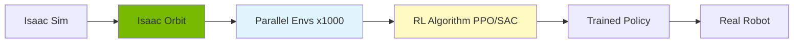

# Week 10: Isaac Orbit - RL for Robotics

## Learning Objectives

By the end of this week, you will be able to:
- ✅ Set up Isaac Orbit (formerly Isaac Gym/Isaac Lab)
- ✅ Create custom reinforcement learning environments
- ✅ Train manipulation policies with PPO/SAC
- ✅ Use GPU-accelerated parallel training
- ✅ Deploy trained policies on simulated and real robots

## Introduction to Isaac Orbit

Isaac Orbit is NVIDIA's unified framework for robot learning, combining Isaac Sim with GPU-accelerated RL training.

**Key Features:**
- **Massive parallelization** (1000+ environments)
- **End-to-end GPU** (sim + training)
- **Pre-built tasks** (locomotion, manipulation, navigation)
- **Sim-to-real transfer** tools



## Installation

import Tabs from '@theme/Tabs';
import TabItem from '@theme/TabItem';

```bash
# Clone Isaac Orbit
git clone https://github.com/isaac-sim/IsaacLab.git
cd IsaacLab

# Install dependencies
./isaaclab.sh --install

# Verify installation
./isaaclab.sh -p source/standalone/tutorials/00_sim/create_empty.py
```

## Creating Custom Environment

### Environment Structure

**cartpole_env.py**:
```python
import torch
from omni.isaac.lab.envs import DirectRLEnv, DirectRLEnvCfg
from omni.isaac.lab.scene import InteractiveSceneCfg
from omni.isaac.lab.sensors import ContactSensorCfg
from omni.isaac.lab.assets import ArticulationCfg, AssetBaseCfg

class CartpoleEnvCfg(DirectRLEnvCfg):
    # Simulation
    decimation = 2
    episode_length_s = 5.0

    # Scene
    scene: InteractiveSceneCfg = InteractiveSceneCfg(num_envs=4096, env_spacing=4.0)

    # Robot
    robot = ArticulationCfg(
        prim_path="/World/envs/env_.*/Robot",
        spawn=UsdFileCfg(
            usd_path="cartpole.usd",
            activate_contact_sensors=True,
        ),
    )

    # Observation space: 4 dims (cart_pos, cart_vel, pole_angle, pole_vel)
    observation_space = 4

    # Action space: 1 dim (force on cart)
    action_space = 1

    # Rewards
    pole_angle_reward_scale = -2.0
    cart_velocity_reward_scale = -0.01

class CartpoleEnv(DirectRLEnv):
    cfg: CartpoleEnvCfg

    def __init__(self, cfg: CartpoleEnvCfg, render_mode: str = None, **kwargs):
        super().__init__(cfg, render_mode, **kwargs)

    def _setup_scene(self):
        self.robot = Articulation(self.cfg.robot)
        self.scene.articulations["robot"] = self.robot

    def _pre_physics_step(self, actions: torch.Tensor):
        # Apply force to cart
        self.robot.set_joint_effort_target(actions, joint_ids=[0])

    def _get_observations(self) -> dict:
        # Get joint states
        cart_pos, cart_vel = self.robot.data.joint_pos[:, 0], self.robot.data.joint_vel[:, 0]
        pole_angle, pole_vel = self.robot.data.joint_pos[:, 1], self.robot.data.joint_vel[:, 1]

        obs = torch.cat([cart_pos, cart_vel, pole_angle, pole_vel], dim=-1)
        return {"policy": obs}

    def _get_rewards(self) -> torch.Tensor:
        pole_angle = self.robot.data.joint_pos[:, 1]
        cart_vel = self.robot.data.joint_vel[:, 0]

        # Reward for keeping pole upright
        pole_reward = self.cfg.pole_angle_reward_scale * torch.abs(pole_angle)

        # Penalty for cart movement
        cart_penalty = self.cfg.cart_velocity_reward_scale * torch.abs(cart_vel)

        return pole_reward + cart_penalty

    def _get_dones(self) -> tuple[torch.Tensor, torch.Tensor]:
        pole_angle = self.robot.data.joint_pos[:, 1]
        cart_pos = self.robot.data.joint_pos[:, 0]

        # Episode terminates if pole falls or cart goes too far
        terminated = (torch.abs(pole_angle) > 0.5) | (torch.abs(cart_pos) > 2.0)
        time_out = self.episode_length_buf >= self.max_episode_length

        return terminated, time_out

    def _reset_idx(self, env_ids: torch.Tensor):
        # Reset joint positions
        joint_pos = torch.zeros((len(env_ids), 2), device=self.device)
        joint_pos[:, 1] = torch.rand(len(env_ids), device=self.device) * 0.2 - 0.1  # Random pole angle

        self.robot.set_joint_position_target(joint_pos, env_ids=env_ids)
```

## Training with RL Libraries

### Using Stable-Baselines3

<Tabs>
  <TabItem value="ppo" label="PPO Algorithm" default>

**train_ppo.py**:
```python
from omni.isaac.lab_tasks.utils import parse_env_cfg
from omni.isaac.lab.envs import ManagerBasedRLEnv
import gymnasium as gym

# Register environment
gym.register(
    id="Isaac-Cartpole-v0",
    entry_point="cartpole_env:CartpoleEnv",
    kwargs={"env_cfg_entry_point": CartpoleEnvCfg}
)

# Create environment
env = gym.make("Isaac-Cartpole-v0", num_envs=4096)

# Train with Stable-Baselines3
from stable_baselines3 import PPO

model = PPO(
    "MlpPolicy",
    env,
    verbose=1,
    n_steps=2048,
    batch_size=512,
    n_epochs=10,
    learning_rate=3e-4,
    clip_range=0.2,
    ent_coef=0.0,
    vf_coef=0.5,
    max_grad_norm=0.5,
    tensorboard_log="./logs/"
)

# Train for 10M steps
model.learn(total_timesteps=10_000_000)

# Save model
model.save("cartpole_ppo")
```

  </TabItem>
  <TabItem value="sac" label="SAC Algorithm">

**train_sac.py**:
```python
from stable_baselines3 import SAC

model = SAC(
    "MlpPolicy",
    env,
    verbose=1,
    buffer_size=1_000_000,
    learning_starts=10_000,
    batch_size=256,
    tau=0.005,
    gamma=0.99,
    learning_rate=3e-4,
    tensorboard_log="./logs/"
)

model.learn(total_timesteps=5_000_000)
model.save("cartpole_sac")
```

  </TabItem>
</Tabs>

### Monitor Training

```bash
# Launch TensorBoard
tensorboard --logdir ./logs/

# Visit http://localhost:6006
```

## Pre-Built Tasks

### Franka Manipulation

```bash
# Train pick-and-place
./isaaclab.sh -p source/standalone/workflows/rsl_rl/train.py \
  --task Isaac-Reach-Franka-v0 \
  --num_envs 2048

# Eval policy
./isaaclab.sh -p source/standalone/workflows/rsl_rl/play.py \
  --task Isaac-Reach-Franka-v0 \
  --num_envs 32 \
  --checkpoint runs/rsl_rl/*/model_*.pt
```

### Quadruped Locomotion

```bash
# Train ANYmal quadruped
./isaaclab.sh -p source/standalone/workflows/rsl_rl/train.py \
  --task Isaac-Velocity-Flat-Anymal-C-v0 \
  --num_envs 4096 \
  --headless

# Play trained policy
./isaaclab.sh -p source/standalone/workflows/rsl_rl/play.py \
  --task Isaac-Velocity-Flat-Anymal-C-v0 \
  --num_envs 1
```

## Sim-to-Real Transfer

### Domain Randomization

```python
class ManipulationEnvCfg(DirectRLEnvCfg):
    # Randomize robot properties
    robot = ArticulationCfg(
        prim_path="/World/envs/env_.*/Robot",
        spawn=UsdFileCfg(usd_path="franka.usd"),
        init_state=ArticulationCfg.InitialStateCfg(
            pos=(0.0, 0.0, 0.0),
            joint_pos={
                ".*": RandomizationCfg.Uniform(-0.1, 0.1)  # Random initial joints
            },
        ),
    )

    # Randomize physics
    def apply_randomization(self, env_ids):
        # Randomize mass
        mass_range = (0.8, 1.2)
        self.robot.root_physx_view.set_masses(
            torch.rand(len(env_ids)) * (mass_range[1] - mass_range[0]) + mass_range[0],
            env_ids
        )

        # Randomize friction
        friction_range = (0.5, 1.5)
        self.robot.root_physx_view.set_friction(
            torch.rand(len(env_ids)) * (friction_range[1] - friction_range[0]) + friction_range[0],
            env_ids
        )
```

### Export Policy to ONNX

```python
import torch

# Load trained model
model = PPO.load("cartpole_ppo")

# Export policy network
dummy_obs = torch.randn(1, 4)
torch.onnx.export(
    model.policy,
    dummy_obs,
    "cartpole_policy.onnx",
    input_names=["observation"],
    output_names=["action"],
    opset_version=11
)
```

## Hardware Considerations

<Tabs>
  <TabItem value="rtx4090" label="RTX 4090" default>

**Performance:**
- 4096 parallel environments at 60 FPS
- Full PPO training in <1 hour
- Real-time policy evaluation

**Configuration:**
```python
env_cfg = CartpoleEnvCfg()
env_cfg.scene.num_envs = 8192  # Max out parallelism
env_cfg.sim.device = "cuda:0"
env_cfg.sim.physx.gpu_max_rigid_contact_count = 2**23
```

  </TabItem>
  <TabItem value="rtx3060" label="RTX 3060">

**Performance:**
- 2048 parallel environments at 40 FPS
- Training takes 2-3x longer

**Configuration:**
```python
env_cfg.scene.num_envs = 2048  # Reduce environments
env_cfg.decimation = 4  # Reduce physics frequency
```

  </TabItem>
  <TabItem value="jetson" label="Jetson Orin (Deployment)">

**Use Case:** Deploy trained policies

```python
# Run inference on Jetson
import tensorrt as trt
import pycuda.driver as cuda

# Load TensorRT engine
with open("cartpole_policy.engine", "rb") as f:
    engine = trt.Runtime(trt.Logger(trt.Logger.WARNING)).deserialize_cuda_engine(f.read())

# Run inference
with engine.create_execution_context() as context:
    # Allocate buffers
    # Execute inference at 30+ Hz
```

  </TabItem>
</Tabs>

## Key Takeaways

- ✅ Isaac Orbit enables massively parallel RL training (1000+ envs)
- ✅ GPU acceleration speeds training 10-100x over CPU
- ✅ Pre-built tasks for manipulation, locomotion, navigation
- ✅ Domain randomization improves sim-to-real transfer
- ✅ Export policies to ONNX/TensorRT for deployment
- ✅ Requires RTX GPU for training, Jetson for deployment

## Resources

- [Isaac Orbit/Lab Documentation](https://isaac-sim.github.io/IsaacLab/)
- [Stable-Baselines3](https://stable-baselines3.readthedocs.io/)
- [RSL-RL Library](https://github.com/leggedrobotics/rsl_rl)

---

**🎓 Quiz**: [Week 10 Quiz](./quiz.md)
**💻 Challenge**: [Custom RL Environment Challenge](./challenge.md)
