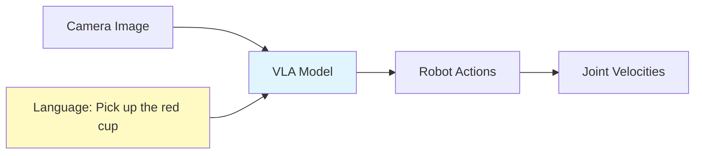

# Week 11: Vision-Language-Action Models - The Future of Robotics

## Learning Objectives

By the end of this week, you will be able to:
- ✅ Understand VLA (Vision-Language-Action) model architecture
- ✅ Use RT-1 and RT-2 models for robot control
- ✅ Integrate Gemini for multimodal robot instructions
- ✅ Implement language-conditioned manipulation
- ✅ Deploy VLA models on NVIDIA hardware

## Introduction to VLA Models

VLA models combine vision, language understanding, and action prediction, enabling robots to follow natural language instructions.

**Evolution:**
1. **Traditional**: Hard-coded behaviors
2. **Imitation Learning**: Learn from demonstrations
3. **VLA**: Generalize from language instructions



## RT-1: Robotics Transformer 1

### Architecture

- **Input**: RGB image + language instruction (tokenized)
- **Backbone**: EfficientNet + Transformer
- **Output**: 7-DOF action (xyz, rpy, gripper)
- **Training Data**: 130k robot demonstrations

### Inference with RT-1

import Tabs from '@theme/Tabs';
import TabItem from '@theme/TabItem';

```python
import tensorflow as tf
import numpy as np

# Load RT-1 model
model = tf.keras.models.load_model('rt1_model/')

def tokenize_instruction(instruction):
    """Tokenize natural language instruction"""
    # Use sentence-transformers or BERT tokenizer
    from sentence_transformers import SentenceTransformer
    encoder = SentenceTransformer('all-MiniLM-L6-v2')
    return encoder.encode(instruction)

def predict_action(image, instruction):
    """Predict robot action from image and instruction"""
    # Preprocess image (224x224)
    img = tf.image.resize(image, (224, 224))
    img = img / 255.0

    # Tokenize instruction
    lang_tokens = tokenize_instruction(instruction)

    # Run inference
    action = model.predict([
        np.expand_dims(img, axis=0),
        np.expand_dims(lang_tokens, axis=0)
    ])

    # action shape: (1, 7) -> [x, y, z, roll, pitch, yaw, gripper]
    return action[0]

# Example usage
import cv2
image = cv2.imread('robot_view.jpg')
instruction = "Pick up the red cup and place it on the table"

action = predict_action(image, instruction)
print(f"Predicted action: {action}")
```

## RT-2: VLM-Powered Robot Control

RT-2 uses vision-language models (PaLI-X, PaLM-E) as a backbone, enabling better generalization.

### Gemini Integration for RT-2-Style Control

<Tabs>
  <TabItem value="python" label="Python" default>

**gemini_vla.py**:
```python
import os
from openai import OpenAI
import base64
import json

class GeminiVLA:
    def __init__(self):
        self.client = OpenAI(
            base_url="https://generativelanguage.googleapis.com/v1beta/openai/",
            api_key=os.getenv("GEMINI_API_KEY")
        )

    def image_to_base64(self, image_path):
        with open(image_path, 'rb') as f:
            return base64.b64encode(f.read()).decode('utf-8')

    def predict_action(self, image_path, instruction, robot_state):
        """
        Use Gemini 2.5 Flash for VLA-style prediction

        Args:
            image_path: Path to robot camera image
            instruction: Natural language instruction
            robot_state: Current robot joint positions

        Returns:
            Predicted action as dict
        """
        img_base64 = self.image_to_base64(image_path)

        system_prompt = """You are a robot control system. Given:
1. An RGB image from the robot's camera
2. A natural language instruction
3. Current robot state (joint positions)

Predict the next action as a JSON object:
{
  "gripper_position": [x, y, z],  // in meters
  "gripper_orientation": [roll, pitch, yaw],  // in radians
  "gripper_open": true/false,
  "confidence": 0.0-1.0
}

Be precise and safe. If uncertain, return confidence < 0.5."""

        response = self.client.chat.completions.create(
            model="gemini-2.5-flash",
            messages=[
                {
                    "role": "system",
                    "content": system_prompt
                },
                {
                    "role": "user",
                    "content": [
                        {
                            "type": "image_url",
                            "image_url": {
                                "url": f"data:image/jpeg;base64,{img_base64}"
                            }
                        },
                        {
                            "type": "text",
                            "text": f"Instruction: {instruction}\n\nCurrent robot state:\n{json.dumps(robot_state, indent=2)}\n\nWhat should the robot do next?"
                        }
                    ]
                }
            ],
            temperature=0.3,
            response_format={"type": "json_object"}
        )

        action = json.loads(response.choices[0].message.content)
        return action

# Example usage
vla = GeminiVLA()

robot_state = {
    "joint_positions": [0.0, -0.785, 1.57, -0.785, -1.57, 0.0, 0.0],
    "gripper_state": "open",
    "ee_position": [0.3, 0.0, 0.5]
}

action = vla.predict_action(
    image_path="robot_camera.jpg",
    instruction="Pick up the red block",
    robot_state=robot_state
)

print(f"Predicted action: {json.dumps(action, indent=2)}")
```

  </TabItem>
  <TabItem value="ros2" label="ROS 2 Integration">

**vla_action_server.py**:
```python
import rclpy
from rclpy.node import Node
from rclpy.action import ActionServer
from sensor_msgs.msg import Image
from cv_bridge import CvBridge
from custom_interfaces.action import VLAControl
import cv2

class VLAActionServer(Node):
    def __init__(self):
        super().__init__('vla_action_server')
        self.vla = GeminiVLA()
        self.bridge = CvBridge()

        self._action_server = ActionServer(
            self,
            VLAControl,
            'vla_control',
            self.execute_callback
        )

        # Subscribe to camera
        self.image_sub = self.create_subscription(
            Image,
            '/camera/image_raw',
            self.image_callback,
            10
        )
        self.latest_image = None

    def image_callback(self, msg):
        self.latest_image = self.bridge.imgmsg_to_cv2(msg, "bgr8")

    def execute_callback(self, goal_handle):
        self.get_logger().info(f'Executing VLA: {goal_handle.request.instruction}')

        # Save current image
        cv2.imwrite('/tmp/robot_view.jpg', self.latest_image)

        # Get robot state (from /joint_states topic)
        robot_state = self.get_robot_state()

        # Predict action
        action = self.vla.predict_action(
            '/tmp/robot_view.jpg',
            goal_handle.request.instruction,
            robot_state
        )

        # Execute action
        if action['confidence'] > 0.7:
            # Send to robot controller
            self.execute_robot_action(action)
            goal_handle.succeed()

            result = VLAControl.Result()
            result.success = True
            result.final_pose = action['gripper_position']
            return result
        else:
            goal_handle.abort()
            result = VLAControl.Result()
            result.success = False
            return result

def main(args=None):
    rclpy.init(args=args)
    server = VLAActionServer()
    rclpy.spin(server)
```

  </TabItem>
</Tabs>

## Language-Conditioned Manipulation

### Prompt Engineering for Robotics

```python
def create_robot_prompt(task, context):
    """Create structured prompt for VLA models"""
    prompt = f"""Task: {task}

Scene Context:
- Objects visible: {context['objects']}
- Robot position: {context['robot_position']}
- Workspace bounds: {context['workspace']}

Constraints:
- Safety: Avoid collisions with workspace boundaries
- Precision: Grasp objects at their center of mass
- Efficiency: Use shortest path

Required Output Format:
1. Approach pose (xyz, rpy)
2. Grasp pose (xyz, rpy, gripper_width)
3. Retreat pose (xyz, rpy)
4. Place pose (xyz, rpy)

Generate motion plan:"""
    return prompt
```

### Chain-of-Thought for Robot Actions

```python
def chain_of_thought_vla(image, instruction):
    """Use CoT prompting for better reasoning"""

    system_prompt = """You are a robot planning system. For each instruction:

1. **Perception**: Describe what you see in the image
2. **Reasoning**: Explain how to accomplish the task
3. **Planning**: Break down into sub-actions
4. **Execution**: Predict precise action parameters

Be explicit about your reasoning."""

    response = client.chat.completions.create(
        model="gemini-2.5-flash",
        messages=[
            {"role": "system", "content": system_prompt},
            {"role": "user", "content": [
                {"type": "image_url", "image_url": {"url": f"data:image/jpeg;base64,{img_base64}"}},
                {"type": "text", "text": instruction}
            ]}
        ],
        temperature=0.2
    )

    # Parse step-by-step reasoning
    reasoning = response.choices[0].message.content
    print(f"Robot Reasoning:\n{reasoning}")

    # Extract final action from reasoning
    # (implement parsing logic)
```

## Hardware Considerations

<Tabs>
  <TabItem value="rtx4090" label="RTX 4090 (Training)" default>

**Use Cases:**
- Fine-tune RT-1/RT-2 on custom datasets
- Run Gemini Vision inference at 10+ Hz
- Real-time VLA prediction with video input

**Performance:**
```python
# Batch inference for data collection
batch_size = 32
images = [load_image(f"frame_{i}.jpg") for i in range(batch_size)]

# Predict actions for all frames
actions = vla.predict_batch(images, instruction)  # <100ms
```

  </TabItem>
  <TabItem value="jetson" label="Jetson Orin Nano (Deployment)">

**Optimization:**
- Convert Gemini/RT models to TensorRT
- Reduce image resolution (224x224 → 128x128)
- Cache language embeddings

**Inference Speed:**
```python
# TensorRT optimized inference
import tensorrt as trt

engine = load_tensorrt_engine("rt1_fp16.engine")
action = engine.infer(image, lang_embedding)  # 30 Hz on Jetson
```

  </TabItem>
</Tabs>

## Key Takeaways

- ✅ VLA models enable language-conditioned robot control
- ✅ RT-1/RT-2 generalize across tasks and environments
- ✅ Gemini provides multimodal understanding for robotics
- ✅ Chain-of-thought improves robot reasoning
- ✅ TensorRT enables real-time VLA on edge devices
- ✅ Future: Multimodal foundation models for robotics

## Resources

- [RT-1 Paper](https://robotics-transformer.github.io/)
- [RT-2 Paper](https://robotics-transformer2.github.io/)
- [Gemini API Documentation](https://ai.google.dev/gemini-api)
- [OpenAI Robotics Research](https://openai.com/research/robotics)

---

**🎓 Quiz**: [Week 11 Quiz](./quiz.md)
**💻 Challenge**: [VLA Integration Challenge](./challenge.md)
