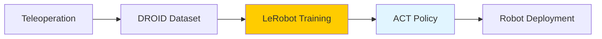

# Week 12: DROID & LeRobot - Open-Source Robot Learning

## Learning Objectives

By the end of this week, you will be able to:
- ✅ Set up LeRobot framework for robot learning
- ✅ Collect teleoperation demonstrations with DROID dataset format
- ✅ Train ACT (Action Chunking Transformer) policies
- ✅ Deploy policies on low-cost robot hardware
- ✅ Contribute to open-source robotics datasets

## Introduction to LeRobot

LeRobot (by Hugging Face) is an open-source framework for robot learning, inspired by transformer-based imitation learning.

**Key Features:**
- **ACT (Action Chunking Transformer)** - State-of-the-art imitation learning
- **DROID dataset format** - Standardized robot data
- **Hugging Face integration** - Share trained policies
- **Low-cost hardware support** - SO-100, Koch v1.1



## Installation

import Tabs from '@theme/Tabs';
import TabItem from '@theme/TabItem';

```bash
# Clone LeRobot
git clone https://github.com/huggingface/lerobot.git
cd lerobot

# Install dependencies
pip install -e .

# Verify installation
python lerobot/scripts/train.py --help
```

## Data Collection with Teleoperation

### SO-100 Robot Setup

**SO-100** is a $250 open-source robot arm for learning research.

```bash
# Install SO-100 driver
git clone https://github.com/TheRobotStudio/SO-ARM100.git
cd SO-ARM100

# Connect via serial
python scripts/teleop.py --device /dev/ttyUSB0
```

### DROID Data Collection

<Tabs>
  <TabItem value="collect" label="Data Collection" default>

**collect_demonstrations.py**:
```python
from lerobot.common.datasets.lerobot_dataset import LeRobotDataset
from lerobot.common.robot_devices.robots.manipulator import ManipulatorRobot
import numpy as np

# Initialize robot
robot = ManipulatorRobot(
    robot_type="so100",
    calibration_path="calibration.json"
)

# Create dataset
dataset = LeRobotDataset.create(
    repo_id="username/pick_place_task",
    fps=30,
    robot_type="so100",
    features={
        "observation.images.cam_high": {
            "shape": (480, 640, 3),
            "dtype": np.uint8
        },
        "observation.state": {
            "shape": (6,),  # 6-DOF joint positions
            "dtype": np.float32
        },
        "action": {
            "shape": (6,),  # 6-DOF target positions
            "dtype": np.float32
        }
    }
)

# Collect episodes
for episode_idx in range(50):  # Collect 50 demonstrations
    print(f"Recording episode {episode_idx + 1}/50")

    # Reset environment
    input("Reset the scene and press Enter to start recording...")

    episode_data = {
        "observation.images.cam_high": [],
        "observation.state": [],
        "action": []
    }

    # Record trajectory
    while not done:
        # Get current state
        state = robot.get_joint_positions()

        # Get teleop action
        action = robot.get_teleop_action()  # From leader arm

        # Get camera image
        image = robot.get_camera_image("cam_high")

        # Store data
        episode_data["observation.state"].append(state)
        episode_data["action"].append(action)
        episode_data["observation.images.cam_high"].append(image)

        # Execute action
        robot.send_action(action)

        # Check if episode complete
        done = input("Episode complete? (y/n): ").lower() == 'y'

    # Save episode
    dataset.add_episode(episode_data)
    print(f"Saved episode {episode_idx + 1}")

# Upload to Hugging Face
dataset.push_to_hub()
print(f"Dataset uploaded: https://huggingface.co/datasets/username/pick_place_task")
```

  </TabItem>
  <TabItem value="visualize" label="Visualize Data">

**visualize_dataset.py**:
```python
from lerobot.common.datasets.lerobot_dataset import LeRobotDataset
import matplotlib.pyplot as plt

# Load dataset
dataset = LeRobotDataset("username/pick_place_task")

# Visualize first episode
episode = dataset[0]

# Plot trajectory
fig, axes = plt.subplots(2, 3, figsize=(15, 10))

# Joint positions over time
for i in range(6):
    ax = axes[i // 3, i % 3]
    ax.plot(episode["observation.state"][:, i], label=f"Joint {i+1}")
    ax.plot(episode["action"][:, i], label=f"Target {i+1}", linestyle='--')
    ax.legend()
    ax.set_title(f"Joint {i+1} Trajectory")

plt.tight_layout()
plt.savefig("trajectory.png")

# Display images
for t in range(0, len(episode["observation.images.cam_high"]), 10):
    img = episode["observation.images.cam_high"][t]
    plt.figure()
    plt.imshow(img)
    plt.title(f"Timestep {t}")
    plt.savefig(f"frame_{t}.png")
```

  </TabItem>
</Tabs>

## Training ACT Policy

### ACT Architecture

ACT (Action Chunking Transformer) predicts a sequence of future actions conditioned on observation history.

**Key Innovations:**
- **Temporal ensembling** - Predict action chunks (e.g., next 100 timesteps)
- **CVAE** - Conditional Variational Autoencoder for multimodal actions
- **Transformer backbone** - Captures temporal dependencies

### Training Script

<Tabs>
  <TabItem value="train" label="Training" default>

**train_act.py**:
```python
from lerobot.common.policies.act.modeling_act import ACTPolicy
from lerobot.scripts.train import train

# Training configuration
config = {
    "policy": {
        "name": "act",
        "input_shapes": {
            "observation.images.cam_high": [3, 480, 640],
            "observation.state": [6]
        },
        "output_shapes": {
            "action": [6]
        },
        "n_action_steps": 100,  # Predict 100 future actions
        "chunk_size": 100,
        "n_obs_steps": 1,
        "dim_model": 512,
        "n_heads": 8,
        "dim_feedforward": 3200,
        "n_encoder_layers": 4,
        "n_decoder_layers": 7,
        "dropout": 0.1,
        "kl_weight": 10.0
    },
    "training": {
        "batch_size": 8,
        "lr": 1e-5,
        "n_epochs": 2000,
        "seed": 1000,
        "device": "cuda",
        "use_amp": True,  # Mixed precision training
        "grad_clip_norm": 10.0
    },
    "dataset_repo_id": "username/pick_place_task"
}

# Train
train(config)
```

  </TabItem>
  <TabItem value="monitor" label="Monitor Training">

```bash
# Launch TensorBoard
tensorboard --logdir outputs/train/

# Monitor metrics:
# - Loss (MSE + KL divergence)
# - Action prediction accuracy
# - Success rate (if evaluation enabled)
```

**Expected training time:**
- RTX 4090: 2-4 hours for 2000 epochs
- RTX 3060: 6-8 hours

  </TabItem>
</Tabs>

## Policy Deployment

### Inference

```python
from lerobot.common.policies.act.modeling_act import ACTPolicy
import torch

# Load trained policy
policy = ACTPolicy.from_pretrained("username/act_pick_place")
policy = policy.to("cuda")
policy.eval()

# Initialize action buffer
action_queue = []

# Robot control loop
for t in range(1000):
    # Get observation
    state = robot.get_joint_positions()
    image = robot.get_camera_image("cam_high")

    obs = {
        "observation.state": torch.tensor(state, dtype=torch.float32).unsqueeze(0).to("cuda"),
        "observation.images.cam_high": torch.tensor(image, dtype=torch.float32).permute(2, 0, 1).unsqueeze(0).to("cuda") / 255.0
    }

    # Predict actions every 100 timesteps
    if t % 100 == 0:
        with torch.no_grad():
            action_chunk = policy.select_action(obs)  # Shape: (100, 6)

        # Queue actions
        action_queue = action_chunk.cpu().numpy().tolist()

    # Execute next action from queue
    if action_queue:
        action = action_queue.pop(0)
        robot.send_action(action)

    # Run at 30 Hz
    time.sleep(1/30)
```

### Evaluation

```python
# Evaluate policy success rate
success_count = 0
total_episodes = 20

for episode in range(total_episodes):
    # Reset scene
    reset_scene()

    # Run policy
    done = False
    t = 0
    while not done and t < 300:  # Max 10 seconds at 30 Hz
        action = get_policy_action(policy, observation)
        robot.send_action(action)
        t += 1

        # Check success condition (e.g., object in target zone)
        if check_success():
            success_count += 1
            done = True

success_rate = success_count / total_episodes
print(f"Success Rate: {success_rate * 100:.1f}%")
```

## Hardware Considerations

<Tabs>
  <TabItem value="rtx4090" label="RTX 4090 (Training)" default>

**Performance:**
- Train 2000 epochs in 2-4 hours
- Batch size 16 (vs 8 on RTX 3060)
- Mixed precision (FP16) for 2x speedup

**Configuration:**
```python
config["training"]["batch_size"] = 16
config["training"]["use_amp"] = True
```

  </TabItem>
  <TabItem value="jetson" label="Jetson Orin Nano (Deployment)">

**Inference Optimization:**
- Convert to TensorRT FP16
- Reduce action chunk size (100 → 50)
- Lower image resolution (640x480 → 320x240)

**Performance:**
```python
# TensorRT inference on Jetson
engine = load_trt_engine("act_policy_fp16.engine")
action = engine.infer(observation)  # 20 Hz on Jetson
```

  </TabItem>
</Tabs>

## Key Takeaways

- ✅ LeRobot enables transformer-based imitation learning
- ✅ DROID dataset format standardizes robot data collection
- ✅ ACT predicts action chunks for smoother execution
- ✅ 50-100 demonstrations sufficient for simple tasks
- ✅ Open-source enables collaboration and reproducibility
- ✅ Low-cost hardware (SO-100) democratizes robot learning

## Resources

- [LeRobot Documentation](https://github.com/huggingface/lerobot)
- [ACT Paper](https://arxiv.org/abs/2304.13705)
- [DROID Dataset](https://droid-dataset.github.io/)
- [SO-100 Robot](https://github.com/TheRobotStudio/SO-ARM100)

---

**🎓 Quiz**: [Week 12 Quiz](./quiz.md)
**💻 Challenge**: [Collect & Train Challenge](./challenge.md)
