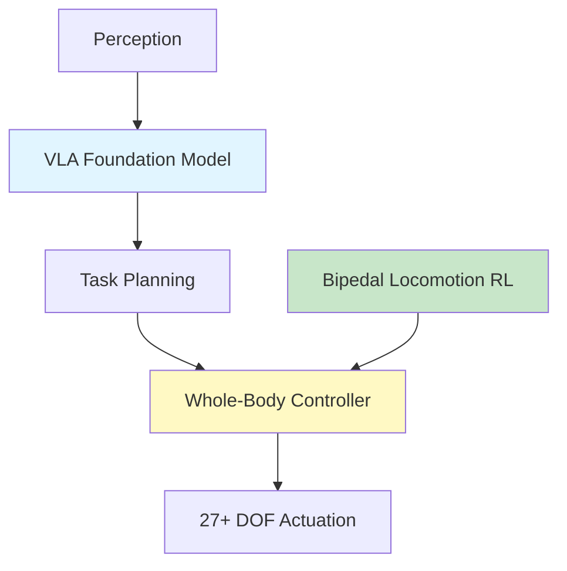

# Week 13: Humanoid Robotics - The Next Frontier

## Learning Objectives

By the end of this week, you will be able to:
- ✅ Understand humanoid robot kinematics and dynamics
- ✅ Implement whole-body control with MuJoCo
- ✅ Deploy RL policies for bipedal locomotion
- ✅ Use foundation models for humanoid task planning
- ✅ Explore commercial humanoid platforms (Figure 01, Tesla Optimus)

## Introduction to Humanoid Robotics

Humanoid robots represent the ultimate generalist platform, designed to operate in human environments.

**Why Humanoids?**
- Navigate human-designed spaces (stairs, doors)
- Use human tools (hammers, screwdrivers)
- Interact naturally with people
- Leverage VLA models trained on human video data



## Humanoid Robot Platforms

import Tabs from '@theme/Tabs';
import TabItem from '@theme/TabItem';

### Commercial Platforms

| Platform | DOF | Height | Weight | Payload | Cost |
|----------|-----|--------|--------|---------|------|
| **Figure 01** | 27 | 1.7m | 60kg | 20kg | $150k+ |
| **Tesla Optimus** | 28 | 1.73m | 57kg | 20kg | TBD |
| **Unitree H1** | 25 | 1.8m | 47kg | 15kg | $90k |
| **Fourier GR-1** | 40 | 1.65m | 55kg | 50kg | $200k+ |

### Open-Source Platforms

- **TALOS** (PAL Robotics) - Research platform
- **iCub** (IIT) - Child-sized, 53 DOF
- **NAO** (SoftBank) - Educational, 25 DOF

## MuJoCo Simulation

### Install MuJoCo

```bash
# Install MuJoCo
pip install mujoco

# Install MuJoCo Menagerie (robot models)
git clone https://github.com/google-deepmind/mujoco_menagerie.git
```

### Humanoid Model (Unitree H1)

<Tabs>
  <TabItem value="load" label="Load Model" default>

```python
import mujoco
import mujoco.viewer

# Load Unitree H1 model
model = mujoco.MjModel.from_xml_path('mujoco_menagerie/unitree_h1/h1.xml')
data = mujoco.MjData(model)

# Launch viewer
with mujoco.viewer.launch_passive(model, data) as viewer:
    while viewer.is_running():
        # Step simulation
        mujoco.mj_step(model, data)

        # Sync viewer
        viewer.sync()
```

  </TabItem>
  <TabItem value="control" label="Whole-Body Control">

**pd_controller.py**:
```python
import numpy as np

def compute_pd_control(q_desired, q_actual, qd_actual, kp, kd):
    """PD controller for joint-level control"""
    error = q_desired - q_actual
    error_derivative = -qd_actual  # Desired velocity is 0

    torque = kp * error + kd * error_derivative
    return torque

# Control gains
kp = np.array([200.0] * model.nu)  # Proportional gain
kd = np.array([20.0] * model.nu)   # Derivative gain

# Target pose (standing)
q_target = np.array([
    0, 0, 0.98,  # Base position (x, y, z)
    1, 0, 0, 0,  # Base orientation (quaternion)
    0, 0, -0.4, 0.8, -0.4, 0,  # Left leg
    0, 0, -0.4, 0.8, -0.4, 0,  # Right leg
    0, 0, 0, 0,  # Left arm
    0, 0, 0, 0   # Right arm
])

# Simulation loop
for t in range(10000):
    # Compute control
    torque = compute_pd_control(
        q_target[7:],  # Ignore base DOFs
        data.qpos[7:],
        data.qvel[6:],
        kp, kd
    )

    # Apply torque
    data.ctrl[:] = torque

    # Step
    mujoco.mj_step(model, data)
```

  </TabItem>
</Tabs>

## Bipedal Locomotion with RL

### PPO for Walking

**train_humanoid_walk.py**:
```python
import gymnasium as gym
from stable_baselines3 import PPO
from stable_baselines3.common.vec_env import SubprocVecEnv

# Create vectorized environments (parallel training)
def make_env():
    def _init():
        env = gym.make("Humanoid-v4")
        return env
    return _init

num_envs = 16
env = SubprocVecEnv([make_env() for _ in range(num_envs)])

# Train with PPO
model = PPO(
    "MlpPolicy",
    env,
    verbose=1,
    n_steps=2048,
    batch_size=64,
    n_epochs=10,
    gamma=0.99,
    gae_lambda=0.95,
    clip_range=0.2,
    ent_coef=0.0,
    learning_rate=3e-4,
    tensorboard_log="./logs/humanoid/"
)

# Train for 10M steps (~6-8 hours on RTX 4090)
model.learn(total_timesteps=10_000_000)

# Save model
model.save("humanoid_walk_ppo")
```

### Deployment

```python
# Load trained model
model = PPO.load("humanoid_walk_ppo")

# Test in simulation
env = gym.make("Humanoid-v4", render_mode="human")
obs, info = env.reset()

for _ in range(1000):
    action, _ = model.predict(obs, deterministic=True)
    obs, reward, terminated, truncated, info = env.step(action)

    if terminated or truncated:
        obs, info = env.reset()

env.close()
```

## VLA for Humanoid Task Planning

### Gemini-Based Task Decomposition

```python
from openai import OpenAI
import os

class HumanoidTaskPlanner:
    def __init__(self):
        self.client = OpenAI(
            base_url="https://generativelanguage.googleapis.com/v1beta/openai/",
            api_key=os.getenv("GEMINI_API_KEY")
        )

    def plan_task(self, instruction, scene_description):
        """
        Decompose high-level instruction into subtasks

        Example:
        "Pick up the box and place it on the shelf" →
        1. Navigate to box
        2. Bend down and grasp box
        3. Stand up
        4. Navigate to shelf
        5. Lift box to shelf height
        6. Release box
        7. Return to neutral pose
        """
        system_prompt = """You are a humanoid robot task planner. Given a high-level instruction and scene description, break it down into a sequence of executable subtasks.

Each subtask should be:
- Primitive (locomotion, manipulation, perception)
- Sequentially ordered
- Achievable by a humanoid robot

Output format (JSON):
{
  "task_plan": [
    {"id": 1, "action": "navigate", "target": "box", "params": {"speed": "slow"}},
    {"id": 2, "action": "grasp", "target": "box", "params": {"grip_force": 10}},
    ...
  ]
}"""

        response = self.client.chat.completions.create(
            model="gemini-2.5-flash",
            messages=[
                {"role": "system", "content": system_prompt},
                {"role": "user", "content": f"Instruction: {instruction}\n\nScene: {scene_description}"}
            ],
            temperature=0.3,
            response_format={"type": "json_object"}
        )

        plan = json.loads(response.choices[0].message.content)
        return plan

# Example usage
planner = HumanoidTaskPlanner()

plan = planner.plan_task(
    instruction="Pick up the box and place it on the shelf",
    scene_description="Box is on the floor 2m ahead. Shelf is 1m high, 3m to the right."
)

print(json.dumps(plan, indent=2))
```

### Execute Task Plan

```python
def execute_task_plan(robot, plan):
    """Execute task plan on humanoid robot"""
    for subtask in plan["task_plan"]:
        action = subtask["action"]
        target = subtask["target"]
        params = subtask["params"]

        if action == "navigate":
            # Use Nav2 for navigation
            robot.navigate_to(target, speed=params.get("speed", "normal"))

        elif action == "grasp":
            # Use whole-body IK + gripper control
            robot.reach_and_grasp(target, force=params.get("grip_force", 10))

        elif action == "lift":
            # Trajectory planning
            robot.lift_object(height=params.get("height", 0.5))

        elif action == "release":
            robot.open_gripper()

        # Wait for completion
        robot.wait_until_done()
```

## Hardware Deployment Considerations

<Tabs>
<TabItem value="sim" label="Simulation (MuJoCo)" default>

**Use Cases:**

- Algorithm development
- Safety testing
- Data generation for RL

**Performance:**

- RTX 4090: 1000+ FPS for policy rollout
- Enable parallel simulations for RL training

</TabItem>
<TabItem value="real" label="Real Humanoid">

**Challenges:**
- Sim-to-real gap (friction, latency, actuation)
- Safety (emergency stops, compliant control)
- Power management (battery life)

**Best Practices:**
- Start with teleoperation data collection
- Use domain randomization in sim
- Deploy with human supervisor
- Implement soft limits and emergency stops

**Example: Figure 01 Deployment**
```python
# Figure 01 ROS 2 interface (hypothetical)
from figure_sdk import Figure01Robot

robot = Figure01Robot()

# Set compliant mode
robot.set_compliance(stiffness=0.5)

# Execute action with safety checks
action = policy.predict(observation)
if robot.check_safety(action):
    robot.execute(action)
else:
    robot.emergency_stop()
```

  </TabItem>
</Tabs>

## Future Directions

### 2024-2025 Trends

1. **Foundation Models for Robotics**
   - RT-X (multi-robot training)
   - PaLM-E (embodied VLMs)
   - Gemini 1.5 Pro (multimodal reasoning)

2. **Humanoid Commercialization**
   - Figure AI + OpenAI partnership
   - Tesla Optimus Gen 2
   - 1X Technologies NEO

3. **Whole-Body Imitation Learning**
   - Teleoperation suits (full-body capture)
   - ACT for humanoids
   - Diffusion policies

4. **Sim-to-Real Improvements**
   - Physics-informed neural networks
   - Residual RL
   - System identification

## Key Takeaways

- ✅ Humanoids are the ultimate generalist robot platform
- ✅ Whole-body control requires sophisticated planning and control
- ✅ RL enables robust bipedal locomotion
- ✅ VLA models decompose high-level tasks into primitives
- ✅ Sim-to-real transfer remains a key challenge
- ✅ Commercial humanoids are becoming reality (2024-2025)

## Resources

- [Figure AI](https://www.figure.ai/)
- [Tesla Optimus](https://www.tesla.com/optimus)
- [Unitree Robotics](https://www.unitree.com/)
- [MuJoCo Menagerie](https://github.com/google-deepmind/mujoco_menagerie)
- [Humanoid-Gym](https://github.com/roboterax/humanoid-gym)

---

**🎓 Final Quiz**: [Week 13 Quiz](./quiz.md)
**💻 Capstone Challenge**: [Humanoid Task Execution Challenge](./challenge.md)

---

**Congratulations!** You've completed the Physical AI & Humanoid Robotics Textbook. You now have the knowledge to build, simulate, and deploy advanced robotic systems powered by AI.

**Next Steps:**
1. Complete the capstone project
2. Contribute to open-source robotics
3. Join robotics competitions (RoboCup, DARPA)
4. Pursue research or industry roles in robotics and AI
