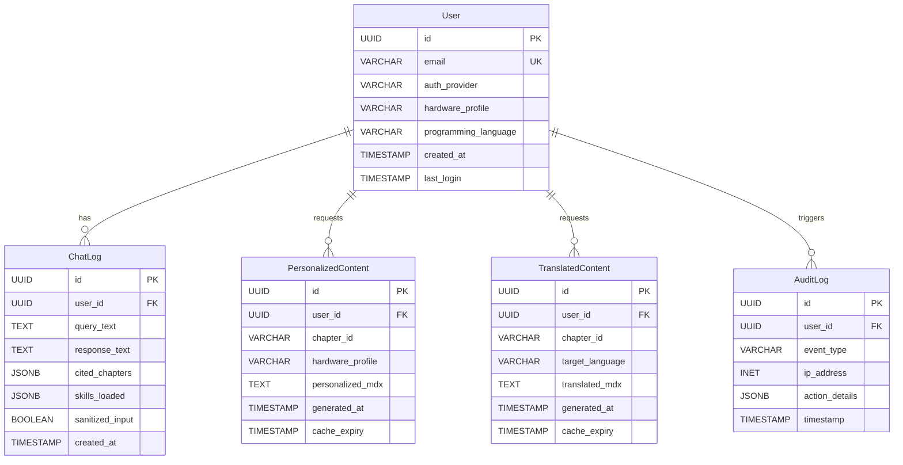
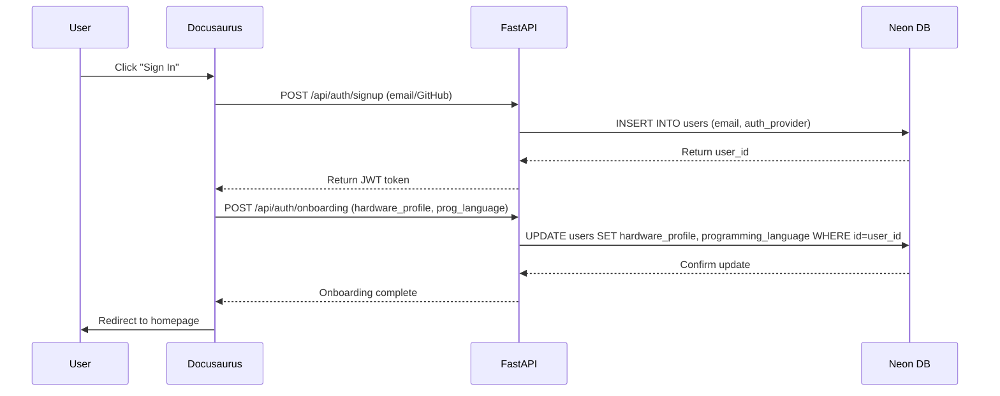
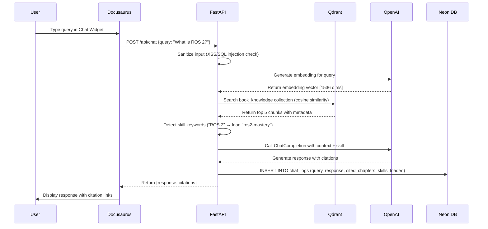
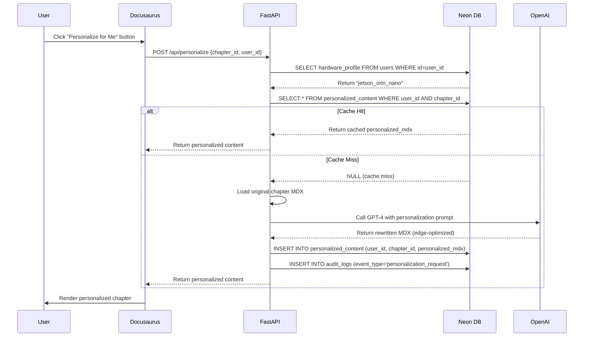

# Data Model: Physical AI & Humanoid Robotics Textbook Platform

**Feature**: 001-ai-textbook-platform
**Date**: 2025-12-05
**Phase**: Phase 1 - Data Architecture Design

## Overview

This document defines the complete data model for the Physical AI Textbook Platform, covering relational entities (Neon PostgreSQL), vector embeddings (Qdrant Cloud), and their relationships. All entities derive from functional requirements (FR-001 through FR-026) specified in `spec.md`.

---

## 1. Relational Entities (Neon PostgreSQL)

### 1.1 User Entity

**Purpose**: Represents authenticated learners and educators (FR-012, FR-013)

**Attributes**:
| Field | Type | Constraints | Description |
|-------|------|-------------|-------------|
| id | UUID | PRIMARY KEY, DEFAULT gen_random_uuid() | Unique user identifier |
| email | VARCHAR(255) | UNIQUE, NOT NULL | User email address |
| auth_provider | VARCHAR(50) | NOT NULL | Authentication method: 'email' or 'github' |
| hardware_profile | VARCHAR(50) | NULLABLE | Hardware setup: 'rtx_4090' or 'jetson_orin_nano' |
| programming_language | VARCHAR(20) | NULLABLE | Preferred language: 'python' or 'cpp' |
| created_at | TIMESTAMP | DEFAULT NOW() | Account creation timestamp |
| last_login | TIMESTAMP | NULLABLE | Last successful login |

**Relationships**:
- ONE User → MANY ChatLog (one user has many chat interactions)
- ONE User → MANY PersonalizedContent (one user has many personalized chapters)
- ONE User → MANY TranslatedContent (one user has many translated chapters)
- ONE User → MANY AuditLog (one user has many audit events)

**Validation Rules**:
- `email` MUST match regex: `^[a-zA-Z0-9._%+-]+@[a-zA-Z0-9.-]+\.[a-zA-Z]{2,}$`
- `auth_provider` MUST be IN ('email', 'github')
- `hardware_profile` MUST be IN ('rtx_4090', 'jetson_orin_nano') OR NULL
- `programming_language` MUST be IN ('python', 'cpp') OR NULL

**State Transitions**:
1. **Created** (after signup) → `hardware_profile` and `programming_language` are NULL
2. **Onboarded** (after onboarding quiz) → fields populated
3. **Active** (after login) → `last_login` updated

**SQL Schema**:
```sql
CREATE TABLE users (
  id UUID PRIMARY KEY DEFAULT gen_random_uuid(),
  email VARCHAR(255) UNIQUE NOT NULL,
  auth_provider VARCHAR(50) NOT NULL CHECK (auth_provider IN ('email', 'github')),
  hardware_profile VARCHAR(50) CHECK (hardware_profile IN ('rtx_4090', 'jetson_orin_nano')),
  programming_language VARCHAR(20) CHECK (programming_language IN ('python', 'cpp')),
  created_at TIMESTAMP DEFAULT NOW(),
  last_login TIMESTAMP
);

CREATE INDEX idx_users_email ON users(email);
CREATE INDEX idx_users_hardware_profile ON users(hardware_profile);
```

---

### 1.2 ChatLog Entity

**Purpose**: Records RAG chatbot interactions for audit trail (FR-009, FR-025)

**Attributes**:
| Field | Type | Constraints | Description |
|-------|------|-------------|-------------|
| id | UUID | PRIMARY KEY, DEFAULT gen_random_uuid() | Unique chat log identifier |
| user_id | UUID | FOREIGN KEY REFERENCES users(id), NULLABLE | User who asked question (NULL for anonymous) |
| query_text | TEXT | NOT NULL | Original user query |
| response_text | TEXT | NOT NULL | Chatbot response |
| cited_chapters | JSONB | NULLABLE | Array of chapter IDs cited in response |
| skills_loaded | JSONB | NULLABLE | Array of skill names loaded (Matrix Protocol) |
| sanitized_input | BOOLEAN | DEFAULT true | Whether input was sanitized |
| created_at | TIMESTAMP | DEFAULT NOW() | Query timestamp |

**Relationships**:
- MANY ChatLog → ONE User (many chats belong to one user)

**Validation Rules**:
- `query_text` MUST NOT be empty
- `response_text` MUST NOT be empty
- `cited_chapters` MUST be valid JSON array (e.g., `["week-01-ros2-basics", "week-03-urdf"]`)
- `skills_loaded` MUST be valid JSON array (e.g., `["ros2-mastery", "edge-computing"]`)

**SQL Schema**:
```sql
CREATE TABLE chat_logs (
  id UUID PRIMARY KEY DEFAULT gen_random_uuid(),
  user_id UUID REFERENCES users(id) ON DELETE SET NULL,
  query_text TEXT NOT NULL,
  response_text TEXT NOT NULL,
  cited_chapters JSONB,
  skills_loaded JSONB,
  sanitized_input BOOLEAN DEFAULT true,
  created_at TIMESTAMP DEFAULT NOW()
);

CREATE INDEX idx_chat_logs_user_id ON chat_logs(user_id);
CREATE INDEX idx_chat_logs_created_at ON chat_logs(created_at DESC);
CREATE INDEX idx_chat_logs_skills_loaded ON chat_logs USING GIN(skills_loaded);
```

---

### 1.3 PersonalizedContent Entity

**Purpose**: Caches hardware-specific personalized chapter content (FR-017, FR-018, FR-019)

**Attributes**:
| Field | Type | Constraints | Description |
|-------|------|-------------|-------------|
| id | UUID | PRIMARY KEY, DEFAULT gen_random_uuid() | Unique personalization identifier |
| user_id | UUID | FOREIGN KEY REFERENCES users(id), NOT NULL | User who requested personalization |
| chapter_id | VARCHAR(100) | NOT NULL | Docusaurus chapter identifier (e.g., "week-01-ros2-basics") |
| hardware_profile | VARCHAR(50) | NOT NULL | Hardware profile used for personalization |
| personalized_mdx | TEXT | NOT NULL | Rewritten MDX content |
| generated_at | TIMESTAMP | DEFAULT NOW() | Personalization generation time |
| cache_expiry | TIMESTAMP | DEFAULT NOW() + INTERVAL '7 days' | Cache expiration (7-day TTL) |

**Relationships**:
- MANY PersonalizedContent → ONE User (many personalizations belong to one user)

**Validation Rules**:
- `chapter_id` MUST match Docusaurus file naming convention: `week-[NN]-[slug]`
- `hardware_profile` MUST be IN ('rtx_4090', 'jetson_orin_nano')
- `personalized_mdx` MUST NOT be empty

**Cache Invalidation Strategy**:
- Auto-expire after 7 days (`cache_expiry`)
- Manual invalidation if source chapter is updated

**SQL Schema**:
```sql
CREATE TABLE personalized_content (
  id UUID PRIMARY KEY DEFAULT gen_random_uuid(),
  user_id UUID REFERENCES users(id) ON DELETE CASCADE NOT NULL,
  chapter_id VARCHAR(100) NOT NULL,
  hardware_profile VARCHAR(50) NOT NULL CHECK (hardware_profile IN ('rtx_4090', 'jetson_orin_nano')),
  personalized_mdx TEXT NOT NULL,
  generated_at TIMESTAMP DEFAULT NOW(),
  cache_expiry TIMESTAMP DEFAULT NOW() + INTERVAL '7 days'
);

CREATE INDEX idx_personalized_content_user_chapter ON personalized_content(user_id, chapter_id);
CREATE INDEX idx_personalized_content_cache_expiry ON personalized_content(cache_expiry);
```

---

### 1.4 TranslatedContent Entity

**Purpose**: Caches Urdu-translated chapter content (FR-021, FR-023)

**Attributes**:
| Field | Type | Constraints | Description |
|-------|------|-------------|-------------|
| id | UUID | PRIMARY KEY, DEFAULT gen_random_uuid() | Unique translation identifier |
| user_id | UUID | FOREIGN KEY REFERENCES users(id), NOT NULL | User who requested translation |
| chapter_id | VARCHAR(100) | NOT NULL | Docusaurus chapter identifier |
| target_language | VARCHAR(20) | NOT NULL | Translation target: 'roman_urdu' or 'formal_urdu' |
| translated_mdx | TEXT | NOT NULL | Translated MDX content (prose only, code preserved) |
| generated_at | TIMESTAMP | DEFAULT NOW() | Translation generation time |
| cache_expiry | TIMESTAMP | DEFAULT NOW() + INTERVAL '7 days' | Cache expiration (7-day TTL) |

**Relationships**:
- MANY TranslatedContent → ONE User (many translations belong to one user)

**Validation Rules**:
- `chapter_id` MUST match Docusaurus file naming convention
- `target_language` MUST be IN ('roman_urdu', 'formal_urdu')
- `translated_mdx` MUST preserve code blocks and Mermaid diagrams in English

**SQL Schema**:
```sql
CREATE TABLE translated_content (
  id UUID PRIMARY KEY DEFAULT gen_random_uuid(),
  user_id UUID REFERENCES users(id) ON DELETE CASCADE NOT NULL,
  chapter_id VARCHAR(100) NOT NULL,
  target_language VARCHAR(20) NOT NULL CHECK (target_language IN ('roman_urdu', 'formal_urdu')),
  translated_mdx TEXT NOT NULL,
  generated_at TIMESTAMP DEFAULT NOW(),
  cache_expiry TIMESTAMP DEFAULT NOW() + INTERVAL '7 days'
);

CREATE INDEX idx_translated_content_user_chapter_lang ON translated_content(user_id, chapter_id, target_language);
CREATE INDEX idx_translated_content_cache_expiry ON translated_content(cache_expiry);
```

---

### 1.5 AuditLog Entity

**Purpose**: Records security events and compliance actions (FR-025, FR-026)

**Attributes**:
| Field | Type | Constraints | Description |
|-------|------|-------------|-------------|
| id | UUID | PRIMARY KEY, DEFAULT gen_random_uuid() | Unique audit log identifier |
| event_type | VARCHAR(100) | NOT NULL | Event category (e.g., 'failed_auth', 'sanitized_input', 'rate_limit') |
| user_id | UUID | FOREIGN KEY REFERENCES users(id), NULLABLE | Associated user (NULL for system events) |
| ip_address | INET | NULLABLE | Client IP address |
| action_details | JSONB | NULLABLE | JSON object with event-specific data |
| timestamp | TIMESTAMP | DEFAULT NOW() | Event occurrence time |

**Relationships**:
- MANY AuditLog → ONE User (many audit events belong to one user)

**Event Types**:
- `failed_auth`: Failed login attempt
- `sanitized_input`: Malicious input detected and sanitized (XSS, SQL injection)
- `rate_limit`: API rate limit exceeded
- `personalization_request`: Content personalization triggered
- `translation_request`: Content translation triggered
- `skill_loaded`: Matrix Protocol skill dynamically loaded

**Validation Rules**:
- `event_type` MUST NOT be empty
- `action_details` MUST be valid JSON

**SQL Schema**:
```sql
CREATE TABLE audit_logs (
  id UUID PRIMARY KEY DEFAULT gen_random_uuid(),
  event_type VARCHAR(100) NOT NULL,
  user_id UUID REFERENCES users(id) ON DELETE SET NULL,
  ip_address INET,
  action_details JSONB,
  timestamp TIMESTAMP DEFAULT NOW()
);

CREATE INDEX idx_audit_logs_event_type ON audit_logs(event_type);
CREATE INDEX idx_audit_logs_user_id ON audit_logs(user_id);
CREATE INDEX idx_audit_logs_timestamp ON audit_logs(timestamp DESC);
```

---

## 2. Vector Entities (Qdrant Cloud)

### 2.1 ChapterEmbedding Collection

**Purpose**: Stores semantic embeddings of Docusaurus chapter content for RAG retrieval (FR-006, FR-007)

**Collection Name**: `book_knowledge`

**Vector Configuration**:
| Parameter | Value | Rationale |
|-----------|-------|-----------|
| Vector Size | 1536 | OpenAI `text-embedding-ada-002` output dimension |
| Distance Metric | Cosine | Optimal for semantic similarity (range: -1 to 1) |
| On-Disk Storage | Enabled | Reduces memory footprint for free tier |

**Payload Schema**:
| Field | Type | Indexed | Description |
|-------|------|---------|-------------|
| chapter_id | keyword | Yes | Docusaurus chapter identifier (e.g., "week-01-ros2-basics") |
| section_id | keyword | Yes | Section within chapter (e.g., "nodes-and-topics") |
| part_number | integer | Yes | Course part (1-4): Nervous System, Digital Twin, Brain, VLA |
| week_number | integer | Yes | Week number (1-13) |
| content_text | text | No | Original MDX content chunk (500 words) |
| content_type | keyword | Yes | Content category: 'prose', 'code', 'mermaid' |
| hardware_context | keyword | Yes | Hardware relevance: 'rtx_4090', 'jetson_orin', 'both' |
| chunk_index | integer | No | Position of chunk within chapter (0-based) |

**Qdrant Configuration**:
```python
from qdrant_client import QdrantClient
from qdrant_client.models import Distance, VectorParams, PayloadSchemaType

client = QdrantClient(url="<QDRANT_CLOUD_URL>", api_key="<QDRANT_API_KEY>")

client.create_collection(
    collection_name="book_knowledge",
    vectors_config=VectorParams(size=1536, distance=Distance.COSINE, on_disk=True),
    payload_schema={
        "chapter_id": PayloadSchemaType.KEYWORD,
        "section_id": PayloadSchemaType.KEYWORD,
        "part_number": PayloadSchemaType.INTEGER,
        "week_number": PayloadSchemaType.INTEGER,
        "content_type": PayloadSchemaType.KEYWORD,
        "hardware_context": PayloadSchemaType.KEYWORD,
    }
)
```

**Ingestion Process**:
1. Parse Docusaurus MDX file frontmatter to extract `chapter_id`, `part_number`, `week_number`
2. Split content into 500-word chunks with 50-word overlap
3. Generate OpenAI embedding for each chunk
4. Upsert to Qdrant with payload metadata

**Retrieval Process**:
1. Generate embedding for user query
2. Perform vector search with filters (e.g., `hardware_context: 'both' OR 'rtx_4090'` if user has RTX 4090)
3. Return top 5 chunks with cosine similarity > 0.75
4. Extract `chapter_id` from payload for citation generation

---

## 3. Entity Relationship Diagram (ERD)



---

## 4. Data Flow Diagrams

### 4.1 User Onboarding Flow



---

### 4.2 RAG Chatbot Query Flow



---

### 4.3 Content Personalization Flow



---

## 5. Data Migration Strategy

### 5.1 Schema Migrations (Neon PostgreSQL)

**Tool**: Alembic (SQLAlchemy migration tool)

**Migration Files**:
- `migrations/001_create_users.sql`: Create `users` table
- `migrations/002_create_chat_logs.sql`: Create `chat_logs` table
- `migrations/003_create_personalized_content.sql`: Create `personalized_content` table
- `migrations/004_create_translated_content.sql`: Create `translated_content` table
- `migrations/005_create_audit_logs.sql`: Create `audit_logs` table

**Rollback Strategy**: Each migration includes `DOWN` SQL for reverting changes

---

### 5.2 Vector Index Migrations (Qdrant Cloud)

**Initial Setup**: `apps/api/scripts/init_qdrant.py` creates `book_knowledge` collection

**Re-indexing Strategy**:
- If Docusaurus content is updated, delete old vectors by `chapter_id` filter and re-upsert
- Qdrant Cloud auto-scales storage; no manual index tuning required

---

## 6. Data Validation & Constraints Summary

| Entity | Validation Rules | Enforced By |
|--------|------------------|-------------|
| User | Email regex, auth_provider enum, hardware_profile enum | PostgreSQL CHECK constraints + Pydantic models |
| ChatLog | Non-empty query/response, valid JSON arrays | PostgreSQL CHECK constraints + Pydantic models |
| PersonalizedContent | Valid chapter_id format, hardware_profile enum | PostgreSQL CHECK constraints + Pydantic models |
| TranslatedContent | Valid chapter_id format, target_language enum | PostgreSQL CHECK constraints + Pydantic models |
| AuditLog | Non-empty event_type, valid JSON | PostgreSQL CHECK constraints + Pydantic models |
| ChapterEmbedding (Qdrant) | Vector size 1536, indexed payload fields | Qdrant schema validation |

---

## 7. Performance Considerations

### 7.1 Database Indexing

**Neon PostgreSQL Indexes**:
- `idx_users_email`: Speed up login queries
- `idx_users_hardware_profile`: Filter users by hardware for analytics
- `idx_chat_logs_user_id`: Retrieve user's chat history
- `idx_chat_logs_created_at`: Sort logs by recency
- `idx_personalized_content_user_chapter`: Cached personalization lookup
- `idx_translated_content_user_chapter_lang`: Cached translation lookup

**Qdrant Indexes**:
- `chapter_id`, `section_id`, `content_type`, `hardware_context`: Filtered vector search

---

### 7.2 Caching Strategy

**Cache Layers**:
1. **Application Cache (Redis - Optional)**: Cache frequently accessed user profiles (5-minute TTL)
2. **Database Cache (Neon)**: `personalized_content` and `translated_content` tables (7-day TTL)
3. **CDN Cache (GitHub Pages)**: Static Docusaurus pages cached by CloudFlare

**Cache Invalidation**:
- **Time-based**: 7-day TTL for personalized/translated content
- **Event-based**: Invalidate cache when source chapter is updated (detect via Docusaurus build hook)

---

## 8. Security Considerations

### 8.1 Data Encryption

**At Rest**:
- Neon PostgreSQL: AES-256 encryption for all data at rest (Neon Cloud default)
- Qdrant Cloud: Encrypted storage volumes

**In Transit**:
- All API communication over HTTPS/TLS 1.3
- Neon connection string uses `sslmode=require`

---

### 8.2 PII Handling

**Personal Identifiable Information**:
- `users.email`: Hashed before logging in audit_logs
- `audit_logs.ip_address`: Anonymized after 30 days (GDPR compliance)

**Retention Policy**:
- `chat_logs`: Retained for 90 days, then auto-deleted
- `audit_logs`: Retained for 1 year for security compliance

---

## Conclusion

This data model supports all functional requirements (FR-001 to FR-026) and success criteria (SC-001 to SC-010) specified in `spec.md`. It balances performance (sub-second retrieval, 7-day caching), security (input sanitization, PII encryption), and scalability (Neon auto-scaling, Qdrant free tier).

**Next Steps**:
1. Generate API contracts in `/contracts/` (OpenAPI schema for endpoints)
2. Create `quickstart.md` with local development setup instructions
3. Run `.specify/scripts/bash/update-agent-context.sh claude` to update agent context
