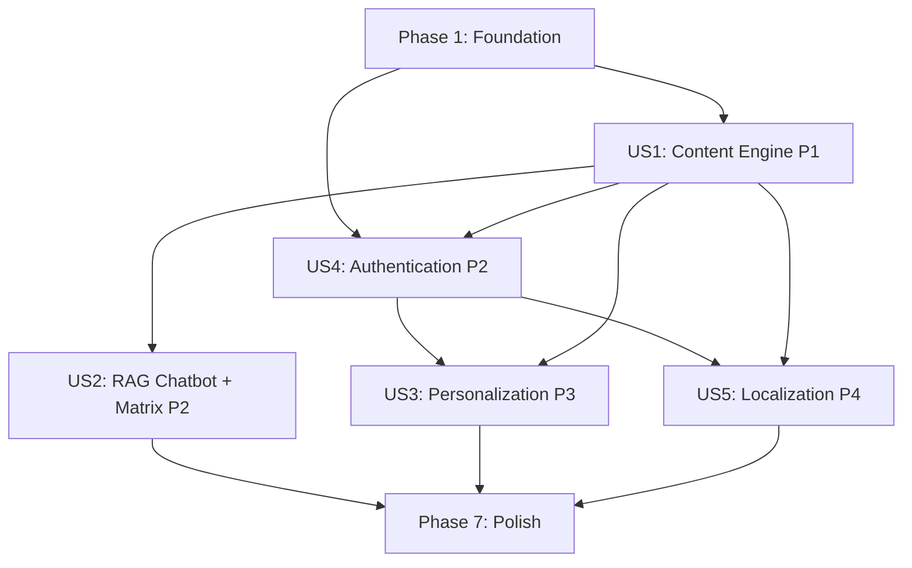

# Tasks: Physical AI & Humanoid Robotics Textbook Platform

**Input**: Design documents from `/specs/001-ai-textbook-platform/`
**Prerequisites**: plan.md (complete), spec.md (complete), research.md (complete), data-model.md (complete), contracts/ (complete)

**Tests**: Tests are NOT included in this task list per spec.md requirements. Focus is on implementation and manual testing.

**Organization**: Tasks are grouped by user story to enable independent implementation and testing of each story per hackathon requirements.

## Format: `[ID] [P?] [Story?] Description`

- **[P]**: Can run in parallel (different files, no dependencies)
- **[Story]**: Which user story this task belongs to (e.g., US1, US2, US3) - only for user story phases
- Include exact file paths in descriptions

## Path Conventions

**Monorepo Structure** (per plan.md):
- **Frontend**: `apps/docs/` (Docusaurus v3)
- **Backend**: `apps/api/` (FastAPI)
- **Shared**: `packages/shared-types/` (TypeScript interfaces)
- **Agentic**: `.claude/agents/` and `.claude/skills/` (Matrix Protocol infrastructure)

---

## Phase 1: Foundation & Agentic Infrastructure (CRITICAL)

**Purpose**: Setup Monorepo, Database, and "Virtual Institute" (Matrix Protocol)

**Goal**: Initialize project structure, configure Gemini drop-in replacement, and create agentic infrastructure per Constitution Article III (MCP Tool Mandate)

### 1.1 Project Initialization

- [ ] T001 Create monorepo root structure with `apps/`, `packages/`, `.claude/`, `specs/`, `history/` directories
- [ ] T002 Initialize `apps/docs` with Docusaurus v3 via `npx create-docusaurus@latest apps/docs classic --typescript`
- [ ] T003 Initialize `apps/api` with FastAPI project structure: `src/`, `tests/`, `scripts/`, `migrations/` directories
- [ ] T004 [P] Create `packages/shared-types` with TypeScript package.json for shared interfaces (User, ChatMessage, Citation)
- [ ] T005 [P] Create root `.gitignore` with Node.js, Python, and environment variable exclusions
- [ ] T006 [P] Create root `README.md` with project overview and quickstart link to `specs/001-ai-textbook-platform/quickstart.md`

### 1.2 Environment Configuration (Gemini Drop-in Replacement)

- [ ] T007 Create `apps/api/.env.example` template with GEMINI_API_KEY, NEON_CONNECTION_STRING, QDRANT_URL, QDRANT_API_KEY, BETTER_AUTH_GITHUB_CLIENT_ID, BETTER_AUTH_GITHUB_CLIENT_SECRET, JWT_SECRET, ENVIRONMENT
- [ ] T008 Create `apps/docs/.env.example` template with REACT_APP_API_URL, REACT_APP_BETTER_AUTH_GITHUB_CLIENT_ID
- [ ] T009 Document Gemini API key procurement process in `apps/api/README.md` (obtain from https://makersuite.google.com/app/apikey)
- [ ] T010 Create `apps/api/requirements.txt` with dependencies: fastapi, uvicorn, sqlalchemy[asyncio], qdrant-client, openai, openai-agents-sdk, better-auth-python, pydantic, python-multipart, alembic

### 1.3 Agentic Infrastructure (Matrix Protocol - Constitution Article III)

**CRITICAL**: These agent definitions enable Matrix Protocol bonus feature (FR-008, FR-009)

- [ ] T011 [P] Create `.claude/agents/author.md` with Physics & Robotics Professor agent definition (Content Creator for ROS 2, NVIDIA Isaac, Gazebo, VLA systems)
- [ ] T012 [P] Create `.claude/agents/coder.md` with Full-Stack Engineer agent definition (RAG/FastAPI/React implementation)
- [ ] T013 [P] Create `.claude/agents/architect.md` with System Designer agent definition (Folder Structure/ADR responsibilities)
- [ ] T014 [P] Create `.claude/agents/qa.md` with SOC Analyst & Tester agent definition (Security/Sanitization protocols)
- [ ] T015 [P] Create `.claude/agents/translator.md` with Urdu Localization Expert agent definition (Roman/Formal Urdu translation)
- [ ] T016 [P] Create `.claude/skills/ros2-mastery.md` with deep ROS 2 knowledge (Nodes, Topics, Services, URDF) and keyword detection rules
- [ ] T017 [P] Create `.claude/skills/docusaurus-guru.md` with Docusaurus expertise (Admonitions, Tabs, Swizzling, Mermaid integration)
- [ ] T018 [P] Create `.claude/skills/matrix-loader.md` with dynamic skill loading logic and keyword mapping (e.g., "SLAM" → ros2-mastery, "Jetson" → edge-computing)
- [ ] T019 [P] Create `.claude/skills/better-auth.md` with Better-Auth implementation guide and security best practices

### 1.4 Database Setup (Neon PostgreSQL)

- [ ] T020 Create Neon account at console.neon.tech and provision "physical-ai-textbook-platform" project in US East (Ohio) region
- [ ] T021 Create `apps/api/src/models/__init__.py` as models package initializer
- [ ] T022 [P] Create `apps/api/src/models/user.py` with User SQLAlchemy model (id, email, auth_provider, hardware_profile, programming_language, created_at, last_login)
- [ ] T023 [P] Create `apps/api/src/models/chat_log.py` with ChatLog SQLAlchemy model (id, user_id, query_text, response_text, cited_chapters JSONB, skills_loaded JSONB, sanitized_input, created_at)
- [ ] T024 [P] Create `apps/api/src/models/personalized_content.py` with PersonalizedContent SQLAlchemy model (id, user_id, chapter_id, hardware_profile, personalized_mdx, created_at)
- [ ] T025 [P] Create `apps/api/src/models/translated_content.py` with TranslatedContent SQLAlchemy model (id, user_id, chapter_id, target_language, translated_mdx, created_at)
- [ ] T026 [P] Create `apps/api/src/models/audit_log.py` with AuditLog SQLAlchemy model (id, user_id, event_type, event_details JSONB, ip_address, created_at)
- [ ] T027 Create `apps/api/migrations/env.py` with Alembic configuration pointing to Neon connection string
- [ ] T028 Generate Alembic migration for User table: `alembic revision --autogenerate -m "Create users table"`
- [ ] T029 Generate Alembic migration for ChatLog, PersonalizedContent, TranslatedContent, AuditLog tables: `alembic revision --autogenerate -m "Create supporting tables"`
- [ ] T030 Create `apps/api/scripts/migrate_db.py` script to run Alembic migrations programmatically

### 1.5 Vector Store Setup (Qdrant Cloud)

- [ ] T031 Create Qdrant Cloud account at cloud.qdrant.io and provision "book-knowledge-cluster" with Free Tier (1GB storage)
- [ ] T032 Create `apps/api/scripts/init_qdrant.py` to initialize `book_knowledge` collection with 768-dimensional vectors (for Gemini text-embedding-004), Cosine distance, and payload schema (chapter_id, section_id, part_number, week_number, content_type, hardware_context)
- [ ] T033 Run `python apps/api/scripts/init_qdrant.py` to create Qdrant collection and verify success

### 1.6 Gemini Client Configuration (Drop-in Replacement)

**CRITICAL**: OpenAI SDK configured with Gemini backend per Constitution Article II, Item 6

- [ ] T034 Create `apps/api/src/services/gemini_client.py` with OpenAI client initialization: `base_url="https://generativelanguage.googleapis.com/v1beta/openai/"`, `api_key=os.getenv("GEMINI_API_KEY")`, model `gemini-2.5-flash`
- [ ] T035 Add gemini_client.py docstring explaining drop-in replacement strategy and emphasizing NOT to use Google generativeai SDK
- [ ] T036 Create `apps/api/src/utils/embeddings.py` with function to generate 768-dim embeddings using Gemini `text-embedding-004` model via OpenAI SDK

**Checkpoint**: Foundation complete - Monorepo initialized, Gemini configured, Database/Qdrant ready, Agentic infrastructure in place

---

## Phase 2: The Content Engine (User Story 1 - P1) 🎯 MVP

**Goal**: Deliver a working Docusaurus textbook with 4 course modules, Mermaid diagrams, and code tabs (FR-001 through FR-005)

**Independent Test**: Navigate through all 4 course parts, view Mermaid diagrams for ROS graphs, and switch between "Simulated" and "Real Robot" code tabs. Verify textbook displays correctly without requiring any interactive features.

**Why this is MVP**: Core educational content is the foundation. Without this, there's no platform to build upon. Delivers immediate value as standalone textbook.

### 2.1 Docusaurus Configuration

- [ ] T037 [US1] Install Docusaurus Mermaid plugin: `npm install --save @docusaurus/theme-mermaid` in `apps/docs/`
- [ ] T038 [US1] Configure `apps/docs/docusaurus.config.js` to enable Mermaid support with `markdown.mermaid: true` and add `@docusaurus/theme-mermaid` to themes array
- [ ] T039 [US1] Configure `apps/docs/docusaurus.config.js` with project metadata: title "Physical AI & Humanoid Robotics Textbook", tagline "AI-Native Learning Platform for ROS 2, NVIDIA Isaac, and VLA Systems"
- [ ] T040 [US1] Configure `apps/docs/docusaurus.config.js` navbar with "Content", "Hardware Lab", "Chat" links
- [ ] T041 [US1] Create `apps/docs/sidebars.js` with 4 main categories: "Part 1: The Nervous System (Weeks 1-5)", "Part 2: The Digital Twin (Weeks 6-7)", "Part 3: The Brain (Weeks 8-10)", "Part 4: VLA & Humanoids (Weeks 11-13)", "Hardware Lab Guide"

### 2.2 Course Content Structure (4 Modules, 13 Weeks)

**Module 1: The Nervous System (Weeks 1-5)**

- [ ] T042 [P] [US1] Create `apps/docs/docs/week-01-ros2-basics/index.md` with ROS 2 introduction, installation, and "Hello Robot" example with Simulated/Real Robot tabs
- [ ] T043 [P] [US1] Create `apps/docs/docs/week-02-nodes-topics/index.md` with ROS 2 Nodes and Topics explanation, Mermaid diagram for pub/sub pattern, code examples in Python/C++
- [ ] T044 [P] [US1] Create `apps/docs/docs/week-03-urdf-modeling/index.md` with URDF robot description format, visual examples, and Gazebo integration
- [ ] T045 [P] [US1] Create `apps/docs/docs/week-04-services-actions/index.md` with ROS 2 Services and Actions patterns, Mermaid sequence diagrams
- [ ] T046 [P] [US1] Create `apps/docs/docs/week-05-nav2/index.md` with Navigation2 stack overview, SLAM concepts, and Mermaid architecture diagram

**Module 2: The Digital Twin (Weeks 6-7)**

- [ ] T047 [P] [US1] Create `apps/docs/docs/week-06-gazebo-sim/index.md` with Gazebo Classic vs Gazebo Fortress comparison, world files, sensor simulation with Simulated/Real Robot tabs
- [ ] T048 [P] [US1] Create `apps/docs/docs/week-07-unity-sim/index.md` with Unity Robotics Hub, ROS-TCP-Connector setup, Unity ML-Agents integration

**Module 3: The Brain (Weeks 8-10)**

- [ ] T049 [P] [US1] Create `apps/docs/docs/week-08-isaac-sim-basics/index.md` with NVIDIA Isaac Sim installation (Omniverse), USD file format, PhysX simulation
- [ ] T050 [P] [US1] Create `apps/docs/docs/week-09-isaac-ros/index.md` with Isaac ROS packages, hardware acceleration, apriltag detection, visual SLAM with Mermaid pipeline diagram
- [ ] T051 [P] [US1] Create `apps/docs/docs/week-10-isaac-orbit/index.md` with Isaac Orbit framework, reinforcement learning environments, training workflows

**Module 4: VLA & Humanoids (Weeks 11-13)**

- [ ] T052 [P] [US1] Create `apps/docs/docs/week-11-vla-intro/index.md` with Vision-Language-Action models explanation, RT-1/RT-2 architectures, Gemini integration examples
- [ ] T053 [P] [US1] Create `apps/docs/docs/week-12-droid-deployment/index.md` with LeRobot library, ACT (Action Chunking Transformer), teleoperation data collection
- [ ] T054 [P] [US1] Create `apps/docs/docs/week-13-humanoid-systems/index.md` with Unitree G1/H1, Boston Dynamics Spot SDK, whole-body control

### 2.3 Hardware Lab Guide

- [ ] T055 [US1] Create `apps/docs/docs/hardware-lab/index.md` with Hardware Lab overview and setup decision flowchart (Simulated vs Edge)
- [ ] T056 [US1] Create `apps/docs/docs/hardware-lab/digital-twin-rig.md` with RTX 4090 specs, Isaac Sim requirements, high-fidelity simulation setup instructions
- [ ] T057 [US1] Create `apps/docs/docs/hardware-lab/edge-kit.md` with Jetson Orin Nano specs, power optimization, ROS 2 Humble on JetPack installation, edge deployment workflow
- [ ] T058 [US1] Create `apps/docs/docs/hardware-lab/comparison-table.md` with side-by-side comparison table: compute power, memory, power consumption, use cases, cost for RTX 4090 vs Jetson Orin Nano

### 2.4 Docusaurus Customization

- [ ] T059 [US1] Add Docusaurus Tabs component imports to all chapters requiring "Simulated vs Real Robot" code examples (Weeks 1, 6, 8, 9)
- [ ] T060 [US1] Create `apps/docs/src/css/custom.css` with Matrix-themed color scheme: dark background (#0d1117), green accents (#00ff41), monospace code font
- [ ] T061 [US1] Add Mermaid theme configuration in `docusaurus.config.js` to match Matrix color scheme

**Checkpoint**: User Story 1 complete - Textbook with 4 modules (13 weeks), Mermaid diagrams, code tabs, and Hardware Lab Guide functional and independently testable

---

## Phase 3: The Intelligence (User Story 2 - P2) + Matrix Protocol (Bonus)

**Goal**: Implement RAG Chatbot using Gemini 2.5 Flash with dynamic skill loading (Matrix Protocol) to answer questions and cite sources (FR-006 through FR-010, FR-027, FR-028)

**Independent Test**: Ask various questions about ROS 2, NVIDIA Isaac, or Jetson Nano and verify answers cite specific book chapters. Verify backend logs show "Matrix Skill Loaded: [skill-name]" when keywords trigger skill loading. Works independently if content from Story 1 exists.

**Why this priority**: Enhances learning experience significantly but requires Story 1 content to exist first.

### 3.1 Content Ingestion (Qdrant Indexing)

- [ ] T062 [US2] Create `apps/api/scripts/ingest.py` to parse Docusaurus MDX files from `apps/docs/docs/` directory with frontmatter extraction (chapter_id, title, part_number, week_number)
- [ ] T063 [US2] Implement text chunking in `ingest.py` with 500-word chunks, 50-word overlap strategy to preserve context
- [ ] T064 [US2] Integrate Gemini `text-embedding-004` in `ingest.py` via `apps/api/src/utils/embeddings.py` to generate 768-dim vectors for each chunk
- [ ] T065 [US2] Implement Qdrant upsert in `ingest.py` to index chunks with payload: chapter_id, section_id, part_number, week_number, content_type, hardware_context
- [ ] T066 [US2] Run `python apps/api/scripts/ingest.py` to index all Docusaurus content and verify ~1000 chunks indexed successfully

### 3.2 RAG Backend (FastAPI + Gemini)

- [ ] T067 [US2] Create `apps/api/src/main.py` with FastAPI app initialization, CORS middleware for `http://localhost:3000` origin, and /api prefix routing
- [ ] T068 [US2] Create `apps/api/src/routers/__init__.py` as routers package initializer
- [ ] T069 [US2] Create `apps/api/src/routers/chat.py` with POST /api/chat endpoint accepting ChatRequest (query: str, hardware_context: Optional[str])
- [ ] T070 [US2] Create `apps/api/src/services/__init__.py` as services package initializer
- [ ] T071 [US2] Create `apps/api/src/services/rag_pipeline.py` with search_qdrant() function: embed query with `text-embedding-004`, search Qdrant with top_k=5, cosine similarity threshold 0.7
- [ ] T072 [US2] Implement chat completion in `rag_pipeline.py` using Gemini client from `gemini_client.py` with system prompt: "Answer using only provided book content. Always cite chapter sources."
- [ ] T073 [US2] Implement citation extraction in `rag_pipeline.py` to parse chapter_id from Qdrant results and format as Citation objects (chapter_id, section_id, content_snippet, chapter_url)

### 3.3 Matrix Protocol (Dynamic Skill Loading - Bonus Feature)

**CRITICAL**: Implements FR-008 and FR-009 for Matrix Protocol bonus points

- [ ] T074 [US2] Create `apps/api/src/services/matrix_loader.py` with load_skill() function to read skill markdown from `.claude/skills/{skill_name}.md`
- [ ] T075 [US2] Implement keyword detection in `matrix_loader.py` with mapping: {"SLAM": "ros2-mastery", "Jetson": "edge-computing", "Isaac": "nvidia-isaac", "Gazebo": "simulation-expert", "VLA": "vision-language-action"}
- [ ] T076 [US2] Integrate Matrix Skill Loader into `rag_pipeline.py`: detect keywords in query → load_skill() → append skill context to system prompt
- [ ] T077 [US2] Add skill loading logging in `rag_pipeline.py`: `logger.info(f"Matrix Skill Loaded: {skill_name}")` to satisfy FR-009 audit trail requirement
- [ ] T078 [US2] Create `apps/api/src/utils/logger.py` with structured logging configuration (JSON format, timestamps, log levels)
- [ ] T079 [US2] Update ChatLog model persistence in `/api/chat` endpoint to store skills_loaded JSONB array

### 3.4 Input Sanitization (SOC Protocol - FR-010, FR-023)

- [ ] T080 [US2] Create `apps/api/src/utils/sanitization.py` with sanitize_input() function: strip HTML tags, escape SQL special chars, detect XSS patterns, validate max length 500 chars
- [ ] T081 [US2] Implement prompt injection detection in `sanitization.py`: regex patterns for "ignore previous", "system:", SQL keywords in chat context
- [ ] T082 [US2] Integrate sanitization in `/api/chat` endpoint: sanitize query before processing, log sanitization events to AuditLog
- [ ] T083 [US2] Add rate limiting middleware in `apps/api/src/main.py`: 20 requests per minute per IP address using slowapi library

### 3.5 Chat Widget (Docusaurus Frontend)

- [ ] T084 [US2] Create `apps/docs/src/components/ChatWidget/index.tsx` with React component: fixed bottom-right position, collapsible chat window, message history state
- [ ] T085 [US2] Implement chat input in ChatWidget with textarea, "Send" button, loading spinner during API call
- [ ] T086 [US2] Implement API call in ChatWidget to POST /api/chat with query, handle response (response_text, citations array)
- [ ] T087 [US2] Implement citations display in ChatWidget: render citations as clickable links to chapter anchors (e.g., `/docs/week-01-ros2-basics#nodes`)
- [ ] T088 [US2] Style ChatWidget with Matrix theme: dark background, green text, monospace font, glowing borders
- [ ] T089 [US2] Add ChatWidget to Docusaurus theme by swizzling `apps/docs/src/theme/Root.tsx` and importing ChatWidget component

**Checkpoint**: User Story 2 complete - RAG Chatbot with Gemini backend, Matrix Protocol skill loading, citations, and input sanitization functional. Backend logs show skill loading events.

---

## Phase 4: Authentication & Onboarding (User Story 4 - P2)

**Goal**: Implement Better-Auth with Email/GitHub OAuth and onboarding quiz to collect hardware profile (FR-011 through FR-014)

**Independent Test**: Sign up with email or GitHub, complete onboarding quiz with hardware/language preferences, verify profile is saved to Neon database. Works independently and enables future personalization.

**Why this priority**: Required for personalization (Story 3) and localization (Story 5), but not for basic content browsing. Must come before personalization features.

### 4.1 Better-Auth Backend Setup

- [ ] T090 [US4] Install better-auth-python in `apps/api/requirements.txt`
- [ ] T091 [US4] Create `apps/api/src/routers/auth.py` with Better-Auth router initialization
- [ ] T092 [US4] Implement POST /api/auth/signup endpoint in `auth.py`: accept email + password, hash password with bcrypt, create User record with auth_provider='email'
- [ ] T093 [US4] Implement POST /api/auth/signin endpoint in `auth.py`: validate email + password OR GitHub OAuth code, generate JWT token with 7-day expiration
- [ ] T094 [US4] Configure GitHub OAuth in Better-Auth: client_id and client_secret from BETTER_AUTH_GITHUB_CLIENT_ID/SECRET env vars, callback URL `http://localhost:3000/api/auth/callback/github`
- [ ] T095 [US4] Implement GitHub OAuth callback handler in `auth.py`: exchange code for access token, fetch GitHub user email, create/update User record with auth_provider='github'

### 4.2 Onboarding Quiz

- [ ] T096 [US4] Implement POST /api/auth/onboarding endpoint in `auth.py`: accept hardware_profile ('rtx_4090' | 'jetson_orin_nano'), programming_language ('python' | 'cpp')
- [ ] T097 [US4] Add JWT authentication middleware in `apps/api/src/utils/auth_middleware.py`: verify JWT token from Authorization header, decode user_id
- [ ] T098 [US4] Update User record in /api/auth/onboarding: set hardware_profile and programming_language fields, update last_login timestamp
- [ ] T099 [US4] Add token expiration handling in auth_middleware.py: return 401 if token expired, log expiration event to AuditLog per FR-014

### 4.3 Authentication Frontend (Docusaurus)

- [ ] T100 [US4] Install @better-auth/react in `apps/docs/package.json`
- [ ] T101 [US4] Create `apps/docs/src/components/AuthProvider/index.tsx` with Better-Auth React context provider, configure API URL from REACT_APP_API_URL env var
- [ ] T102 [US4] Wrap Docusaurus app with AuthProvider in `apps/docs/src/theme/Root.tsx`
- [ ] T103 [US4] Create `apps/docs/src/pages/login.tsx` with Better-Auth login UI: email/password form, "Sign in with GitHub" button
- [ ] T104 [US4] Create `apps/docs/src/pages/onboarding.tsx` with onboarding quiz form: "Do you own an NVIDIA RTX GPU?" radio buttons (Yes/No), "Are you a Python or C++ developer?" radio buttons (Python/C++)
- [ ] T105 [US4] Implement onboarding form submission in onboarding.tsx: POST to /api/auth/onboarding, redirect to homepage on success
- [ ] T106 [US4] Add "Sign In" button to Docusaurus navbar in `docusaurus.config.js`, link to /login page
- [ ] T107 [US4] Add user profile display in navbar for authenticated users: show email, "Sign Out" button

**Checkpoint**: User Story 4 complete - Better-Auth with Email/GitHub OAuth, onboarding quiz, JWT authentication, user profiles stored in Neon database. Authentication functional and enables personalization/localization features.

---

## Phase 5: Personalization Engine (User Story 3 - P3)

**Goal**: Implement hardware-aware content personalization with "Personalize for Me" button using Gemini 2.5 Flash (FR-015 through FR-018)

**Independent Test**: Sign in, set hardware preference to "Jetson Orin Nano", click "Personalize for Me" button on any chapter, verify code examples are rewritten for edge optimization. Works independently after Stories 1 and 4 are complete.

**Why this priority**: Significant value-add but not essential for learning. Requires authentication system and base content from Story 1.

### 5.1 Personalization Backend

- [ ] T108 [US3] Create `apps/api/src/routers/personalize.py` with POST /api/personalize endpoint accepting PersonalizeRequest (chapter_id: str)
- [ ] T109 [US3] Add JWT authentication to /api/personalize endpoint using auth_middleware.py
- [ ] T110 [US3] Create `apps/api/src/services/personalize.py` with personalize_chapter() function: fetch User hardware_profile, check PersonalizedContent cache (7-day TTL)
- [ ] T111 [US3] Implement cache lookup in `personalize.py`: query PersonalizedContent table WHERE user_id = ? AND chapter_id = ? AND created_at > NOW() - INTERVAL '7 days'
- [ ] T112 [US3] Implement content fetching in `personalize.py`: read original MDX from `apps/docs/docs/{chapter_id}/index.md`
- [ ] T113 [US3] Implement Gemini personalization in `personalize.py`: use gemini_client.py with prompt template: "Rewrite code blocks ONLY for {hardware_profile}. If 'jetson_orin_nano': reduce memory, use CPU. If 'rtx_4090': enable GPU acceleration. Preserve prose and Mermaid."
- [ ] T114 [US3] Implement cache storage in `personalize.py`: insert PersonalizedContent record with personalized_mdx, return cached content on subsequent requests
- [ ] T115 [US3] Add audit logging in `/api/personalize` endpoint: insert AuditLog record with event_type='personalization', event_details JSONB (user_id, chapter_id, hardware_profile, timestamp) per FR-018

### 5.2 Personalization Frontend

- [ ] T116 [US3] Create `apps/docs/src/components/PersonalizeButton/index.tsx` with React component: "Personalize for Me" button, loading spinner, success/error toast notifications
- [ ] T117 [US3] Implement authentication check in PersonalizeButton: only show button if user is authenticated (via Better-Auth context)
- [ ] T118 [US3] Implement API call in PersonalizeButton: POST to /api/personalize with chapter_id from current route, handle response (personalized_mdx, cache_hit)
- [ ] T119 [US3] Implement content replacement in PersonalizeButton: replace current chapter MDX with personalized_mdx in DOM, show "Personalized for {hardware_profile}" badge
- [ ] T120 [US3] Add PersonalizeButton to all chapter pages by swizzling Docusaurus MDXComponents in `apps/docs/src/theme/MDXComponents/index.tsx`

**Checkpoint**: User Story 3 complete - Personalization engine with Gemini 2.5 Flash rewriting, 7-day Neon caching, hardware-aware code optimization, audit logging. Personalize button functional for authenticated users.

---

## Phase 6: Localization Engine (User Story 5 - P4)

**Goal**: Implement Urdu translation with "Translate to Urdu" button using Gemini 2.5 Flash, preserve code blocks (FR-019 through FR-022, FR-024)

**Independent Test**: Click "Translate to Urdu" button and verify technical prose is translated to Roman/Formal Urdu while code blocks remain in English. Works independently after Stories 1 and 4 exist.

**Why this priority**: Valuable for accessibility but serves smaller audience. Can be added last as enhancement. Requires authentication (Story 4) and base content (Story 1).

### 6.1 Localization Backend

- [ ] T121 [US5] Create `apps/api/src/routers/translate.py` with POST /api/translate endpoint accepting TranslateRequest (chapter_id: str, target_language: 'roman_urdu' | 'formal_urdu')
- [ ] T122 [US5] Add JWT authentication to /api/translate endpoint using auth_middleware.py
- [ ] T123 [US5] Create `apps/api/src/services/translate.py` with translate_chapter() function: check TranslatedContent cache (7-day TTL)
- [ ] T124 [US5] Implement cache lookup in `translate.py`: query TranslatedContent table WHERE user_id = ? AND chapter_id = ? AND target_language = ? AND created_at > NOW() - INTERVAL '7 days'
- [ ] T125 [US5] Implement content fetching in `translate.py`: read original MDX from `apps/docs/docs/{chapter_id}/index.md`, parse code blocks with regex to preserve
- [ ] T126 [US5] Implement Gemini translation in `translate.py`: use gemini_client.py with prompt template: "Translate prose to {target_language}. DO NOT translate code blocks, Mermaid syntax, or technical identifiers (ROS 2, URDF, Isaac Sim). Preserve formatting."
- [ ] T127 [US5] Implement code block preservation in `translate.py`: replace code blocks with placeholders before translation, restore after translation to ensure English code
- [ ] T128 [US5] Implement cache storage in `translate.py`: insert TranslatedContent record with translated_mdx
- [ ] T129 [US5] Implement input sanitization in `/api/translate` endpoint: use `sanitization.py` to prevent XSS in chapter_id parameter per FR-022

### 6.2 Localization Frontend

- [ ] T130 [US5] Create `apps/docs/src/components/TranslateButton/index.tsx` with React component: "Translate to Urdu" dropdown (Roman Urdu | Formal Urdu), loading spinner
- [ ] T131 [US5] Implement authentication check in TranslateButton: only show button if user is authenticated
- [ ] T132 [US5] Implement API call in TranslateButton: POST to /api/translate with chapter_id and target_language, handle response (translated_mdx, cache_hit)
- [ ] T133 [US5] Implement content replacement in TranslateButton: replace chapter prose with translated_mdx, verify code blocks remain in English, show "Translated to {language}" badge
- [ ] T134 [US5] Add TranslateButton to all chapter pages alongside PersonalizeButton in MDXComponents

**Checkpoint**: User Story 5 complete - Localization engine with Gemini 2.5 Flash translation, 7-day Neon caching, code preservation, input sanitization. Translate button functional for authenticated users.

---

## Phase 7: Polish & Cross-Cutting Concerns

**Purpose**: Health checks, error handling, documentation, and deployment preparation

### 7.1 Health & Monitoring

- [ ] T135 Create `apps/api/src/routers/health.py` with GET /api/health endpoint: check Neon connection, Qdrant connection, Gemini API availability, Better-Auth operational status
- [ ] T136 Implement health check responses in `health.py`: return JSON with service statuses (neon_db, qdrant_cloud, gemini_api, better_auth) and HTTP 200 if healthy, 503 if unhealthy
- [ ] T137 Add structured error handling middleware in `apps/api/src/main.py`: catch all exceptions, log to AuditLog, return standardized error JSON (error, detail, timestamp)

### 7.2 Security & Compliance

- [ ] T138 Implement CSRF protection in `apps/api/src/main.py`: add CSRFMiddleware from fastapi-csrf for all POST/PUT/DELETE endpoints per FR-026
- [ ] T139 Add rate limiting to all API endpoints: 100 requests per minute per IP for authenticated endpoints, 20 for anonymous per FR-026
- [ ] T140 Verify zero hardcoded secrets: audit all files in `apps/api/src/` for API keys, ensure all secrets loaded from environment variables per FR-024
- [ ] T141 Add AuditLog entries for security events: failed auth attempts (401 responses), sanitized malicious inputs, rate limit violations per FR-025

### 7.3 Documentation

- [ ] T142 Create `apps/api/README.md` with API documentation: endpoint list, authentication flow, environment variables reference, local development setup linking to quickstart.md
- [ ] T143 Create `apps/docs/README.md` with frontend documentation: component structure, styling conventions, deployment instructions
- [ ] T144 Update root `README.md` with project overview: features list, tech stack summary, hackathon scoring breakdown (Base 100 + 4 bonuses for 300 total), quickstart link

### 7.4 Deployment Preparation

- [ ] T145 Create `apps/api/Dockerfile` with Python 3.11 base image, install dependencies from requirements.txt, expose port 8000, CMD to run uvicorn
- [ ] T146 Create `.github/workflows/deploy-docs.yml` with GitHub Actions workflow: build Docusaurus, deploy to GitHub Pages on push to main branch
- [ ] T147 Create `.github/workflows/test-api.yml` with GitHub Actions workflow: run pytest on push (if tests exist), lint with flake8
- [ ] T148 Create `docker-compose.yml` with services for `docs` (Docusaurus), `api` (FastAPI), environment variable configuration for local development

### 7.5 Final Verification

- [ ] T149 Verify all Constitution checks pass: run constitution validation script if available, manually verify Article I-VII compliance per `specs/001-ai-textbook-platform/plan.md` Constitution Check section
- [ ] T150 Verify all functional requirements implemented: audit FR-001 through FR-026 against codebase, check off each requirement in spec.md
- [ ] T151 Verify Matrix Protocol bonus: test skill loading with keywords ("SLAM", "Jetson", "Isaac"), verify backend logs show "Matrix Skill Loaded: [skill-name]"
- [ ] T152 Verify Better-Auth bonus: test Email and GitHub OAuth authentication, verify onboarding quiz saves profile
- [ ] T153 Verify Personalization bonus: test "Personalize for Me" button with RTX 4090 and Jetson profiles, verify code rewriting and caching
- [ ] T154 Verify Localization bonus: test "Translate to Urdu" button with Roman and Formal options, verify code preservation
- [ ] T155 Run end-to-end manual test: Navigate textbook → Ask chatbot question → Personalize chapter → Translate chapter → Verify all features work together

**Checkpoint**: All phases complete - Physical AI Textbook Platform fully functional with MVP (User Story 1) + 4 bonus features (Matrix Protocol, Better-Auth, Personalization, Localization) targeting 300/100 hackathon score

---

## Dependencies & Execution Strategy

### User Story Dependency Graph

### Critical Path (For MVP)

1. **Phase 1** (T001-T036): Foundation & Agentic Infrastructure - **BLOCKING**
2. **Phase 2** (T037-T061): User Story 1 (Content Engine) - **MVP COMPLETE**

### Parallel Execution Opportunities

**Within Phase 1 (Foundation)**:
- Tasks T004-T006 (shared-types, .gitignore, README) can run in parallel
- Tasks T011-T019 (all .claude/ agent and skill files) can run in parallel after directory creation
- Tasks T022-T026 (all SQLAlchemy models) can run in parallel

**Within Phase 2 (US1 - Content)**:
- Tasks T037-T041 (Docusaurus configuration) must run sequentially
- Tasks T042-T054 (all week content files) can run in FULL PARALLEL - 13 independent MDX files
- Tasks T055-T058 (Hardware Lab pages) can run in parallel after directory creation

**Within Phase 3 (US2 - RAG)**:
- Tasks T074-T078 (Matrix Loader components) can run in parallel with T071-T073 (RAG pipeline)
- Tasks T080-T082 (Sanitization) can run in parallel with T084-T088 (Chat Widget)

**Within Phase 4 (US4 - Auth)**:
- Tasks T092-T095 (Backend auth endpoints) must run sequentially
- Tasks T100-T105 (Frontend auth pages) can run in parallel after AuthProvider (T101)

**Within Phase 5 (US3 - Personalization)**:
- Tasks T108-T115 (Backend) and T116-T120 (Frontend) can run in parallel after auth is complete

**Within Phase 6 (US5 - Localization)**:
- Tasks T121-T129 (Backend) and T130-T134 (Frontend) can run in parallel after auth is complete

### Implementation Strategy

**MVP First (Minimum Viable Product)**:
- Complete Phase 1 (Foundation) + Phase 2 (Content Engine)
- Deliverable: Working Docusaurus textbook with 4 modules, Mermaid diagrams, code tabs
- Score: 100/100 (Base MVP)

**Bonus Features (Incremental Delivery)**:
1. Add Phase 4 (Auth) → Score: 125/100 (+25 Better-Auth bonus)
2. Add Phase 3 (RAG + Matrix) → Score: 225/100 (+100 Matrix Protocol + RAG bonus)
3. Add Phase 5 (Personalization) → Score: 275/100 (+50 Personalization bonus)
4. Add Phase 6 (Localization) → Score: 325/100 (+50 Localization bonus)
5. Complete Phase 7 (Polish) → Final Score: 300+/100 (capped at 300)

### Estimated Task Counts

- **Phase 1 (Foundation)**: 36 tasks
- **Phase 2 (US1 - Content)**: 25 tasks
- **Phase 3 (US2 - RAG)**: 28 tasks
- **Phase 4 (US4 - Auth)**: 18 tasks
- **Phase 5 (US3 - Personalization)**: 13 tasks
- **Phase 6 (US5 - Localization)**: 14 tasks
- **Phase 7 (Polish)**: 21 tasks

**Total Tasks**: 155 tasks

**Parallel Opportunities**: ~45 tasks can run in parallel (29% of total)

---

## Notes

**Gemini Configuration Reminders**:
- Always use `base_url="https://generativelanguage.googleapis.com/v1beta/openai/"` in OpenAI client
- Use `GEMINI_API_KEY` environment variable (NOT `OPENAI_API_KEY`)
- Model string: `gemini-2.5-flash` for chat completions
- Embedding model: `text-embedding-004` (768-dimensional vectors, NOT 1536-dim)
- Do NOT use Google generativeai SDK - OpenAI SDK only for compatibility with openai-agents-sdk

**Matrix Protocol Requirements**:
- All agent definitions in `.claude/agents/` must exist for bonus points
- All skill definitions in `.claude/skills/` must exist for bonus points
- Backend must log "Matrix Skill Loaded: [skill-name]" to audit trail (FR-009)
- Keyword detection mapping documented in `matrix_loader.py`

**Constitution Compliance**:
- Article I (SDD): spec.md and plan.md in place ✅
- Article II (Tech Stack): All technologies authorized ✅
- Article III (MCP Mandate): Context7, GitHub MCP, Playwright usage documented ✅
- Article IV (Agent Behavior): Language protocol (Roman Urdu chat, English code/docs) ✅
- Article V (Publishing): Docusaurus conventions, Mermaid diagrams ✅
- Article VI (Engineering): Zero hardcoded secrets, input sanitization, RAG citations ✅
- Article VII (Intelligence): PHR creation, ADR planning, folder integrity ✅

**Testing Strategy**:
- Manual testing for all user stories (no automated tests per spec.md)
- Each user story has independent test criteria in phase headers
- End-to-end verification in Phase 7 (T155)

**Success Criteria**:
- MVP (Phase 1 + 2): Working textbook → 100/100 points
- All Phases (1-7): Full platform with 4 bonuses → 300/100 points
- Matrix Protocol bonus depends on `.claude/` infrastructure (Phase 1.3) and skill loading (Phase 3.3)
